# Architecture Diagram Guide

A guide to creating architecture diagrams using ArcKit and Mermaid.

---

## What are Architecture Diagrams?

Architecture diagrams visualize system structure, components, and relationships using standardized notation. ArcKit generates diagrams using **Mermaid** syntax, which renders beautifully in markdown.

### Why Create Diagrams?

Without diagrams:
- ❌ Architecture discussions lack shared visual reference
- ❌ New team members struggle to understand system structure
- ❌ Design reviews focus on text instead of visuals
- ❌ Stakeholders can't visualize the solution

With diagrams:
- ✅ Shared understanding of architecture
- ✅ Faster onboarding for new team members
- ✅ Visual design reviews
- ✅ Stakeholder alignment on solution approach

---

## When to Create Diagrams

```bash
/arckit.diagram Create [diagram type] diagram for [your project]
```

**Create diagrams at these points:**
- **Discovery/Alpha** - Context diagram to show system boundaries
- **Alpha/Beta** - Container and component diagrams for HLD
- **Beta** - Deployment diagram for infrastructure
- **Design reviews** - Visual aids for HLD/DLD reviews
- **Documentation** - Architecture documentation repository

---

## Diagram Types (C4 Model)

ArcKit uses the **C4 Model** for architecture diagrams:

### 1. Context Diagram (Level 1)

**Purpose**: Show the system in its environment

**Audience**: Everyone (stakeholders, users, developers)

**Shows**:
- Your system (single box)
- External systems it integrates with
- Users/actors who interact with it
- High-level relationships

**Example**:
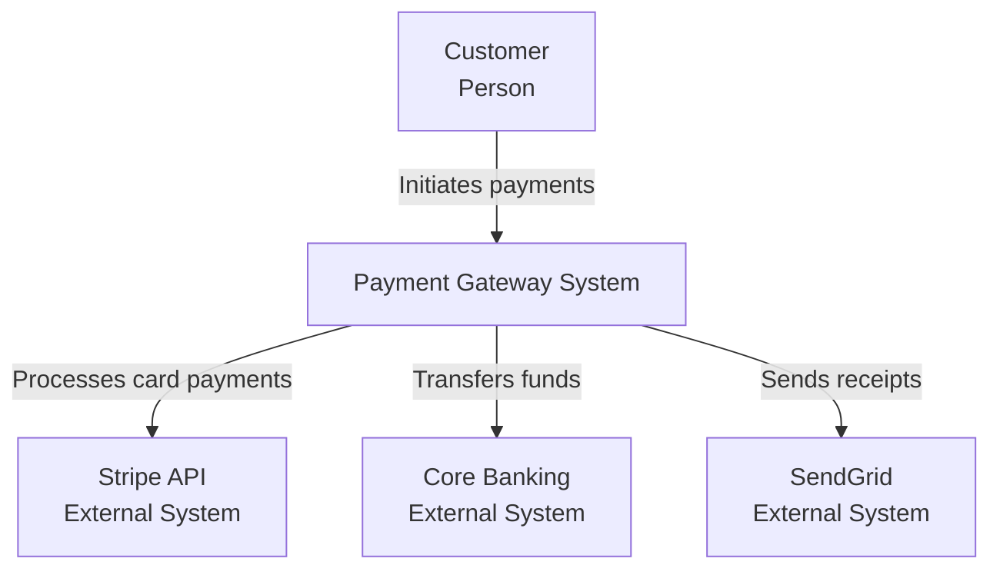

**When to use**: Discovery, Alpha - to define system boundaries

---

### 2. Container Diagram (Level 2)

**Purpose**: Show major technology containers (apps, databases, services)

**Audience**: Technical team, architects, senior stakeholders

**Shows**:
- Web applications
- Mobile apps
- API services
- Databases
- Message queues
- Technology choices

**Example**:
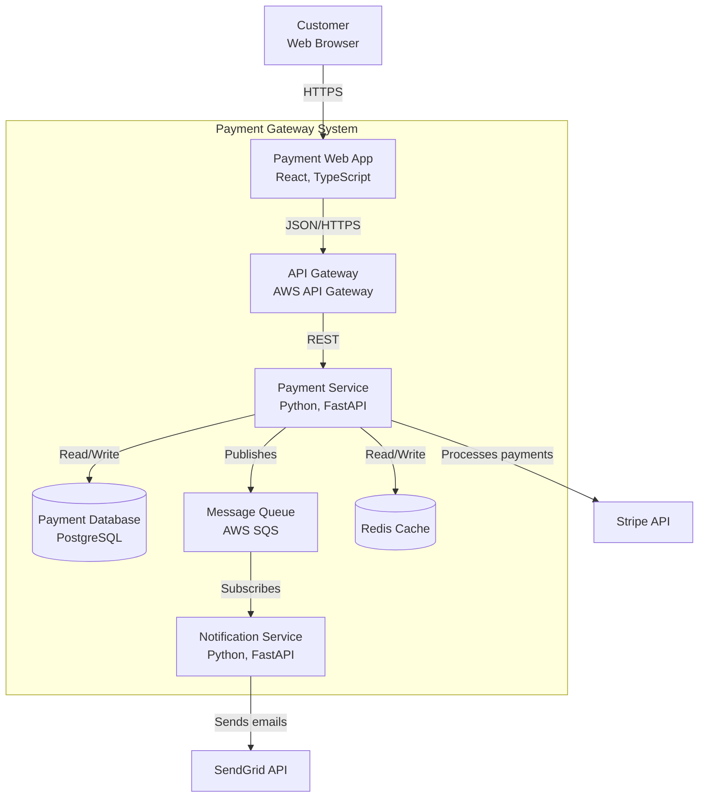

**When to use**: Alpha, Beta - for HLD documentation

---

### 3. Component Diagram (Level 3)

**Purpose**: Show internal structure of a container

**Audience**: Developers, technical leads

**Shows**:
- Components within a service
- Controllers, services, repositories
- Internal dependencies
- Design patterns

**Example**:
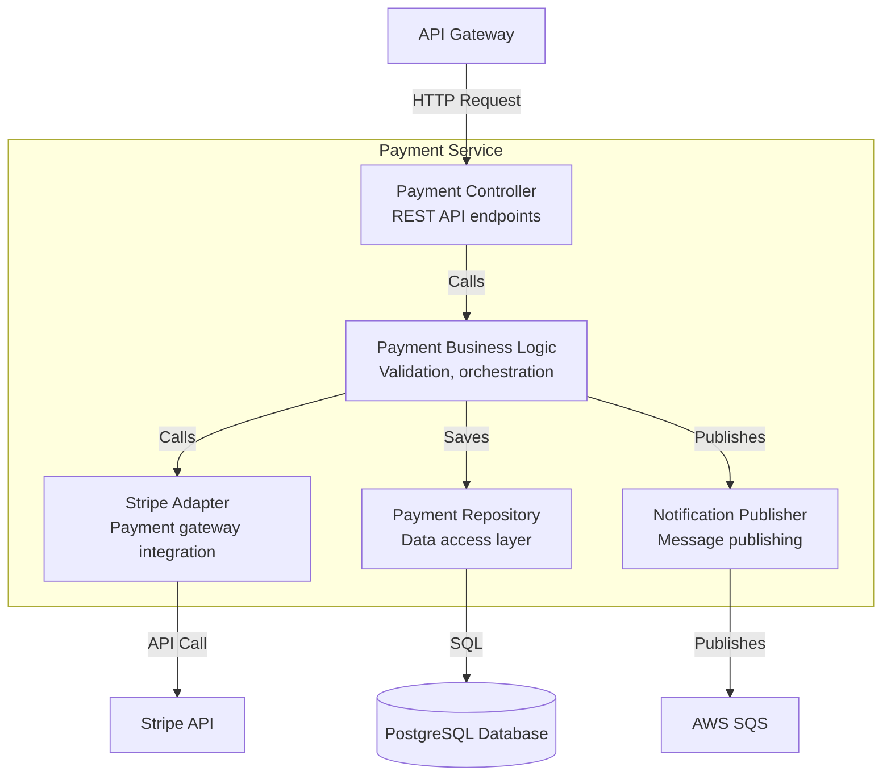

**When to use**: Beta - for DLD documentation

---

### 4. Deployment Diagram (Level 4)

**Purpose**: Show physical/virtual infrastructure

**Audience**: DevOps, infrastructure team, operations

**Shows**:
- Servers/containers/instances
- Networks and subnets
- Load balancers
- Databases (instances)
- Availability zones/regions

**Example**:
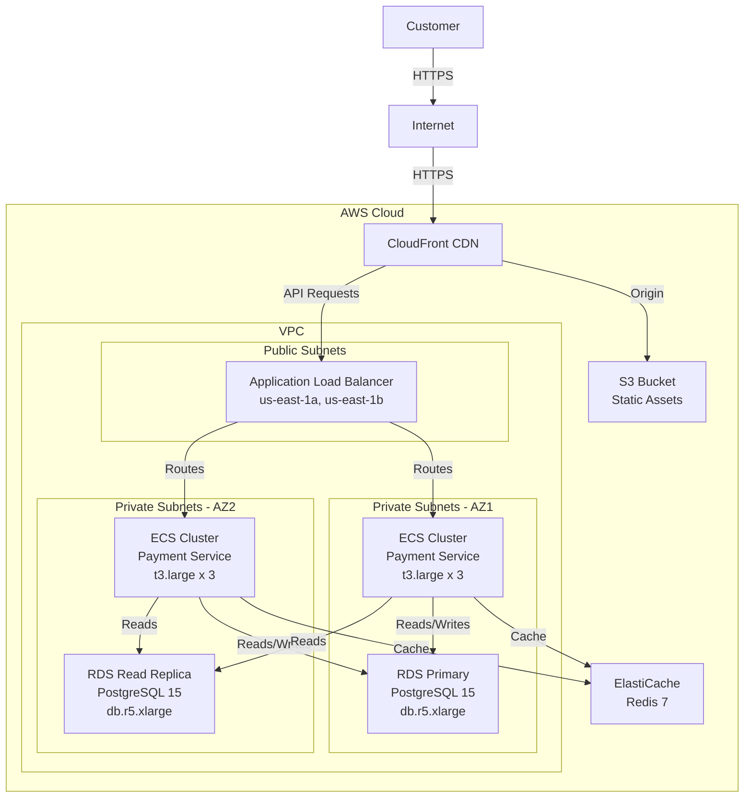

**When to use**: Beta, Live - for deployment planning and ops documentation

---

## Mermaid Syntax

### Basic Flowchart

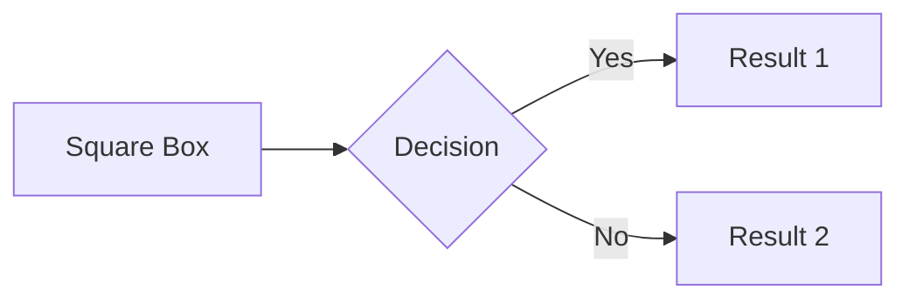

### Entity Relationship Diagram (ERD)

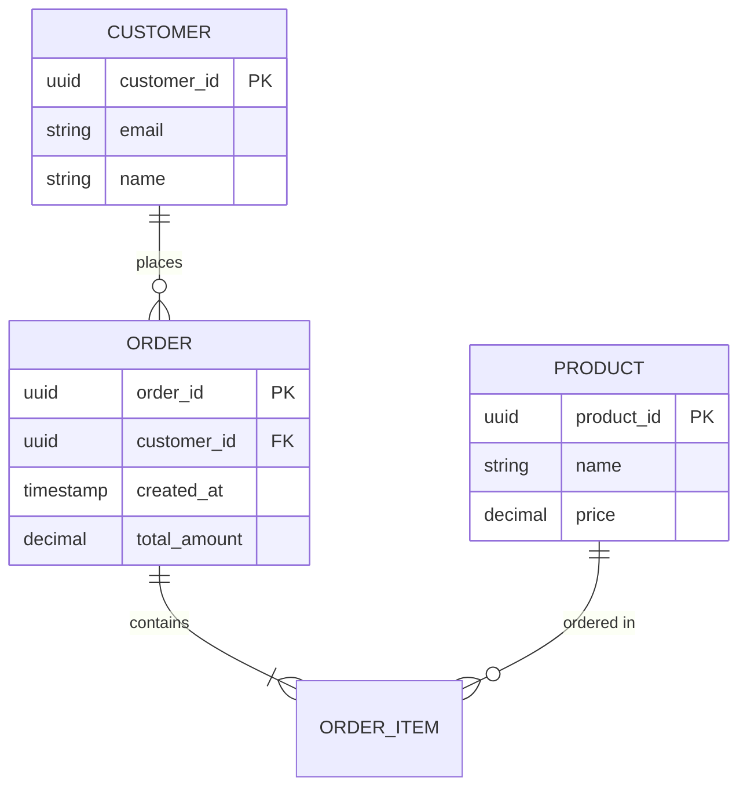

### Sequence Diagram

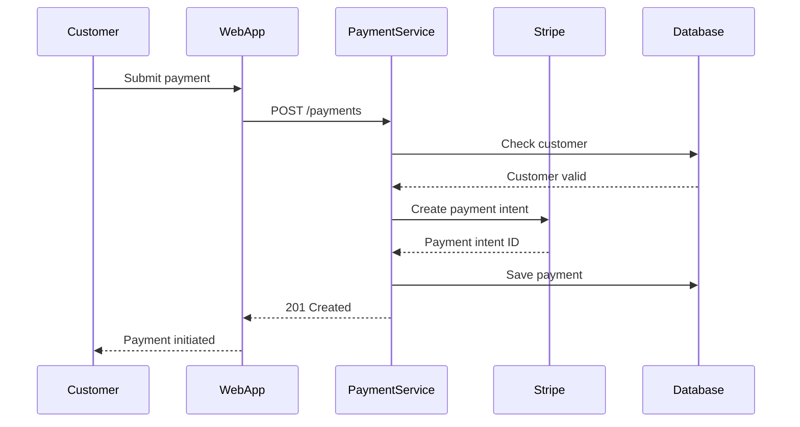

### State Diagram

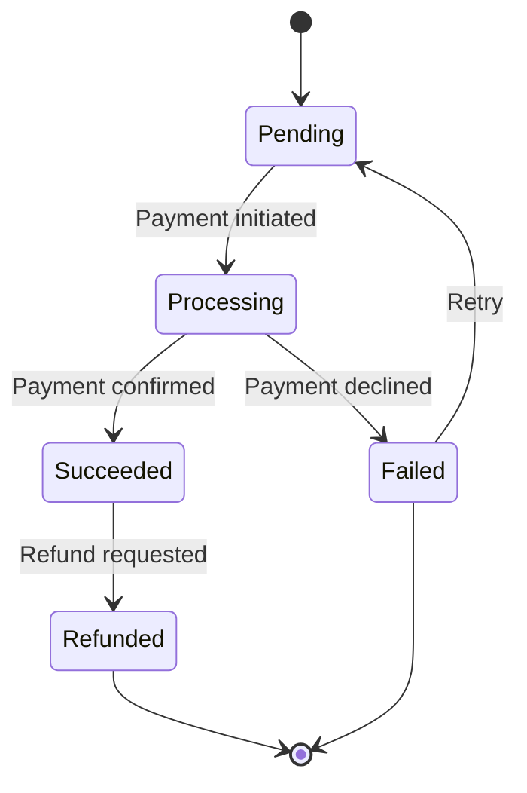

---

## Best Practices

### 1. Use the Right Level of Abstraction

- **Context**: Don't show internal details, only boundaries
- **Container**: Don't show classes, only major deployable units
- **Component**: Don't show every class, only significant components
- **Deployment**: Show actual infrastructure, not logical

### 2. Keep Diagrams Simple

- **7±2 rule**: Maximum 5-9 boxes per diagram
- If more complex, split into multiple diagrams
- Focus on what's important for the audience

### 3. Use Consistent Notation

- Solid lines: Synchronous calls
- Dashed lines: Asynchronous messages
- Colors: Same technology/layer same color
- Shape: Rectangles for systems, cylinders for databases

### 4. Label Relationships

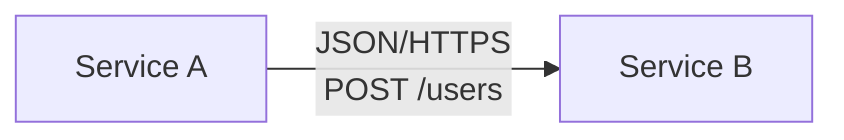

Better than:
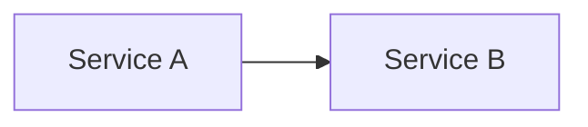

### 5. Update Diagrams with Code

- Diagrams are documentation - keep them current
- Store diagrams in git with code
- Review diagrams in PRs
- Automate diagram generation where possible

---

## Common Diagram Patterns

### Microservices Architecture

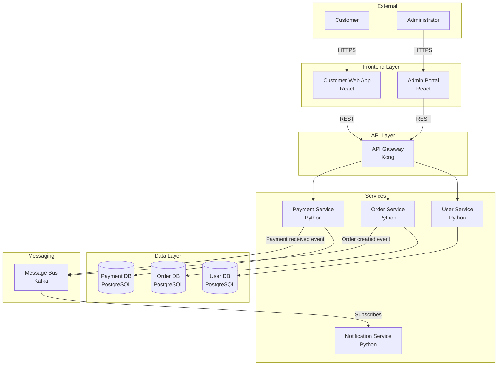

### Event-Driven Architecture

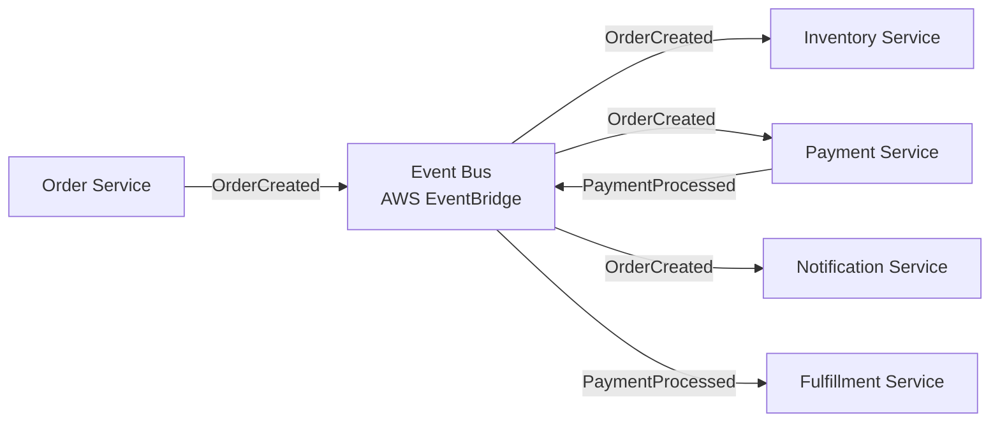

### CQRS Pattern

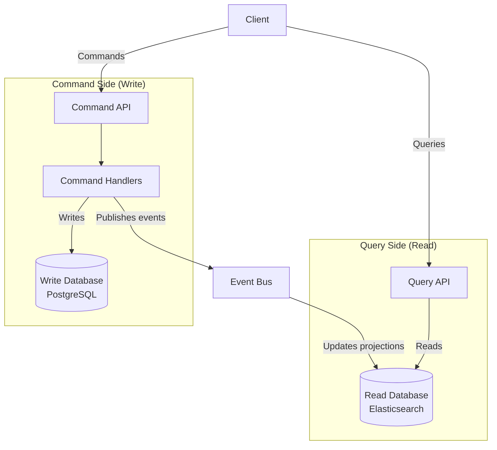

---

## Integration with ArcKit Workflow

### 1. After Principles Definition
Create **Context Diagram** showing system boundaries

### 2. During HLD
Create **Container Diagram** showing major services and datastores

### 3. During DLD
Create **Component Diagrams** for each complex service

### 4. Before Deployment
Create **Deployment Diagram** showing infrastructure

### 5. Design Reviews
Use diagrams as visual aids for `/arckit.hld-review` and `/arckit.dld-review`

---

## Diagram Checklist

### Context Diagram
- [ ] System boundary clearly defined
- [ ] All external systems shown
- [ ] All user types/actors shown
- [ ] Relationships labeled with purpose
- [ ] Technology choices NOT shown (too detailed for context)

### Container Diagram
- [ ] All deployable units shown (apps, services, databases)
- [ ] Technology stack labeled (language, framework)
- [ ] Communication protocols specified (HTTP, gRPC, messaging)
- [ ] Data stores shown separately
- [ ] Internal vs external systems distinguished

### Component Diagram
- [ ] Significant components only (not every class)
- [ ] Component responsibilities clear
- [ ] Dependencies shown
- [ ] Design patterns evident (adapter, repository, etc.)
- [ ] Interfaces/APIs labeled

### Deployment Diagram
- [ ] Infrastructure components shown (servers, containers, networks)
- [ ] Availability zones / regions shown
- [ ] Load balancers, caches, CDNs included
- [ ] Instance types/sizes specified
- [ ] Network security boundaries (VPC, subnets, security groups)

---

## Tools and Rendering

### Mermaid Renderers

**GitHub/GitLab**: Native rendering in markdown
**VS Code**: Mermaid Preview extension
**Online**: mermaid.live for testing
**Documentation**: Docusaurus, MkDocs support Mermaid

### Alternative Tools

**For complex diagrams**:
- draw.io (diagrams.net)
- Lucidchart
- PlantUML
- Structurizr (C4 model tooling)

**Best practice**: Start with Mermaid (code-based, version control friendly). Use visual tools only if Mermaid can't represent complexity.

---

## Related Documentation

- [Design Review Guide](design-review.md) - Using diagrams in HLD/DLD reviews
- [Principles Guide](principles.md) - Architecture principles that inform diagrams
- [Data Model Guide](data-model.md) - Creating ERD diagrams for data models
- [Requirements Guide](requirements.md) - Deriving architecture from requirements

---

## Support

For issues or questions:
- GitHub Issues: https://github.com/tractorjuice/arc-kit/issues
- Mermaid Documentation: https://mermaid.js.org/
- C4 Model: https://c4model.com/

---

**Last updated**: 2025-10-28
**ArcKit Version**: 0.3.6
