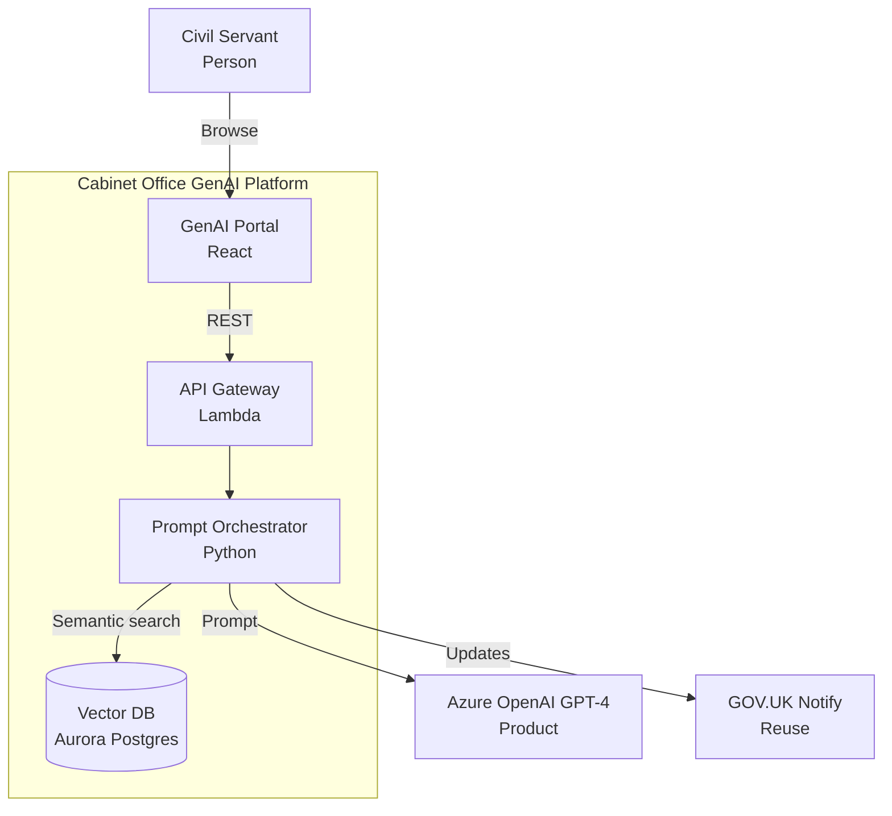

# Architecture Diagram Guide

`/arckit.diagram` converts architecture artefacts into Mermaid or PlantUML C4 diagrams for visual architecture documentation.

---

## Supported Diagram Types

| Command | Diagram | Use When | Output Highlights |
|---------|---------|----------|-------------------|
| `/arckit.diagram context` | C4 Level 1 | Discovery / stakeholder briefings | Users, external systems, boundaries |
| `/arckit.diagram container` | C4 Level 2 | HLD reviews | Services, databases, queues, technology stack |
| `/arckit.diagram component` | C4 Level 3 | DLD & developer handover | Internal modules, repos, adapters |
| `/arckit.diagram deployment` | Infrastructure | Cloud First evidence, cost modelling | Regions, VPCs, subnets, HA/DR |
| `/arckit.diagram sequence` | Interaction | API design, integration workshops | Request/response steps, actors |
| `/arckit.diagram dataflow` | Data privacy | GDPR/DPIA, audit | PII flows, encryption, retention |

Run without a suffix to auto-detect (`/arckit.diagram Describe architecture...`).

---

## Output Format

For C4 diagram types (Context, Container, Component), you can choose between two output formats:

| | Mermaid (Default) | PlantUML C4 |
|---|---|---|
| **Best for** | Diagrams with 12 or fewer elements | Diagrams with more than 12 elements |
| **Layout control** | Declaration order only | Directional hints (`Rel_Right`, `Rel_Down`, `Lay_Right`) |
| **Renders in** | GitHub, VS Code, mermaid.live, ArcKit Pages | PlantUML Server, VS Code (extension), CLI |
| **GitHub rendering** | Automatic | Not supported |

Specify the format in arguments: `/arckit.diagram context plantuml` or select when prompted.

Deployment and Data Flow diagrams use Mermaid only. Sequence diagrams support both Mermaid and PlantUML.

---

## Example Output (Excerpt)



Paste into [https://mermaid.live](https://mermaid.live) for PNG/SVG export.

### PlantUML C4 Example (Excerpt)

```plantuml
@startuml
!include https://raw.githubusercontent.com/plantuml-stdlib/C4-PlantUML/master/C4_Container.puml

title Container Diagram - Cabinet Office GenAI Platform

Person(civil_servant, "Civil Servant", "Uses GenAI tools")

System_Boundary(platform, "GenAI Platform") {
    Container(web, "GenAI Portal", "React", "User interface")
    Container(api, "API Gateway", "Lambda", "Request routing")
    Container(orch, "Prompt Orchestrator", "Python", "LLM integration")
    ContainerDb(vectordb, "Vector DB", "Aurora Postgres", "Embeddings")
}

System_Ext(gpt4, "Azure OpenAI GPT-4", "LLM provider")
System_Ext(notify, "GOV.UK Notify", "Notifications")

Rel_Down(civil_servant, web, "Browse", "HTTPS")
Rel_Right(web, api, "Calls", "REST")
Rel_Right(api, orch, "Routes")
Rel_Down(orch, vectordb, "Semantic search")
Rel_Right(orch, gpt4, "Prompt", "API")
Rel_Right(orch, notify, "Updates", "API")

Lay_Right(web, api)
Lay_Right(api, orch)

@enduml
```

Paste into [https://www.plantuml.com/plantuml/uml/](https://www.plantuml.com/plantuml/uml/) to render.

---

## Review Checklist

- Components and integrations reference requirement IDs where relevant.
- Compliance call-outs (GOV.UK Pay/Notify, Cloud First, GDPR) appear in annotations.
- Evolution tags from Wardley Maps show build/buy decisions when needed.
- Deployment diagrams include regions, availability zones, and failover notes.
- Dataflow diagrams highlight lawful basis, retention, and subject rights.

---

## Tips

- Re-run diagrams whenever the design review highlights changes to avoid drift.
- Embed diagrams in HLD/DLD outputs and service assessments for consistent visuals.
- Pair `/arckit.diagram` with `/arckit.servicenow` so operations inherit the same component hierarchy.
- Use PlantUML C4 for complex diagrams (more than 12 elements) where Mermaid's auto-layout produces too many edge crossings — directional hints give precise control over element placement.
