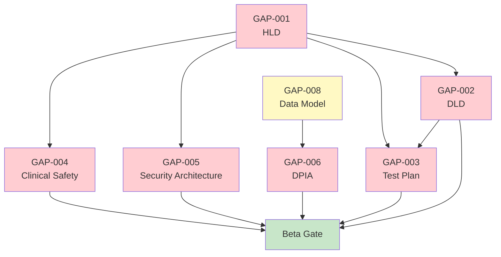

# Gap Analysis and Remediation Plan: NHS Digital Appointment Booking Service

> **Template Status**: Live | **Version**: 2.21.0 | **Command**: `/arckit.traceability`

## Document Control

| Field | Value |
|-------|-------|
| **Document ID** | ARC-001-GAPS-v1.0 |
| **Document Type** | Traceability Gap Analysis |
| **Project** | NHS Digital Appointment Booking Service (Project 001) |
| **Classification** | OFFICIAL |
| **Status** | DRAFT |
| **Version** | 1.0 |
| **Created Date** | 2026-03-01 |
| **Last Modified** | 2026-03-01 |
| **Review Cycle** | Monthly |
| **Next Review Date** | 2026-03-31 |
| **Owner** | Product Owner, NHS Digital |
| **Reviewed By** | [PENDING] |
| **Approved By** | [PENDING] |
| **Distribution** | Project Team, Architecture Team, Clinical Safety Team |

## Revision History

| Version | Date | Author | Changes | Approved By | Approval Date |
|---------|------|--------|---------|-------------|---------------|
| 1.0 | 2026-03-01 | ArcKit AI | Initial creation from `/arckit.traceability` command | [PENDING] | [PENDING] |

## Document Purpose

This document details all traceability gaps identified in the NHS Digital Appointment Booking Service project, categorised by severity and type, with a concrete remediation plan for each gap. It serves as the primary action tracker for achieving full traceability coverage before Beta assessment.

---

## 1. Gap Summary

### 1.1 Overall Gap Statistics

| Gap Category | Count | Severity |
|-------------|-------|----------|
| Requirements without design (HLD/DLD) | 47/47 | CRITICAL |
| Requirements without test coverage | 47/47 | CRITICAL |
| Requirements without research coverage | 2/47 | LOW |
| Missing architecture decisions (ADR) | ~5-8 expected | HIGH |
| Missing prerequisite artifacts | 6 | HIGH |
| Orphan design components | 0 | N/A |
| Orphan test cases | 0 | N/A |

### 1.2 Root Cause

The project is in the **late Alpha / pre-Beta phase**. Research and technology investigation is substantially complete (96%), but no vendor has yet submitted design documents. The traceability chain breaks at the Research → Design boundary:

```
Requirements ──✅──> Research ──❌──> Design ──❌──> Implementation ──❌──> Tests
    (47)              (45/47)          (0/47)          (0/47)              (0/47)
```

---

## 2. CRITICAL Gaps (Blocking — Must Fix Before Beta)

### GAP-001: No High-Level Design Document

| Field | Value |
|-------|-------|
| **Gap ID** | GAP-001 |
| **Severity** | CRITICAL |
| **Requirements Affected** | All 47 requirements |
| **Impact** | Cannot validate architecture against requirements; cannot proceed to Beta assessment; cannot begin implementation |
| **Root Cause** | HLD not yet created — vendor procurement may still be in progress |

**Remediation Plan**:

| Step | Action | Owner | Target Date | Dependency |
|------|--------|-------|-------------|------------|
| 1 | Vendor submits HLD based on ARC-001-REQ-v1.0 and ARC-001-RSCH-v1.0 | Vendor | [PENDING] | SOW issued |
| 2 | Run `/arckit:hld-review` to review HLD against requirements and principles | Enterprise Architect | [PENDING] | Step 1 |
| 3 | Vendor addresses HLD review findings | Vendor | [PENDING] | Step 2 |
| 4 | Re-run `/arckit:traceability` to update design coverage | Architect | [PENDING] | Step 3 |

**Acceptance Criteria**: HLD maps all 47 requirements to system components with clear design rationale.

---

### GAP-002: No Detailed Design Document

| Field | Value |
|-------|-------|
| **Gap ID** | GAP-002 |
| **Severity** | CRITICAL |
| **Requirements Affected** | All 47 requirements |
| **Impact** | Cannot validate implementation approach; no specification for developers |
| **Root Cause** | DLD dependent on HLD approval |

**Remediation Plan**:

| Step | Action | Owner | Target Date | Dependency |
|------|--------|-------|-------------|------------|
| 1 | Vendor submits DLD following approved HLD | Vendor | [PENDING] | GAP-001 resolved |
| 2 | Run `/arckit:dld-review` to review DLD for implementation readiness | Technical Lead | [PENDING] | Step 1 |
| 3 | Vendor addresses DLD review findings | Vendor | [PENDING] | Step 2 |

**Acceptance Criteria**: DLD specifies module-level design for all CRITICAL and MUST requirements with API contracts, data flows, and error handling.

---

### GAP-003: No Test Plan or Test Cases

| Field | Value |
|-------|-------|
| **Gap ID** | GAP-003 |
| **Severity** | CRITICAL |
| **Requirements Affected** | All 47 requirements |
| **Impact** | Cannot verify any requirement is correctly implemented; cannot demonstrate compliance to GDS assessors |
| **Root Cause** | Test plan dependent on design documents |

**Remediation Plan**:

| Step | Action | Owner | Target Date | Dependency |
|------|--------|-------|-------------|------------|
| 1 | Create test strategy document covering all requirement types | QA Lead | [PENDING] | GAP-001 resolved |
| 2 | Define test cases for all 36 CRITICAL/MUST requirements | QA Lead | [PENDING] | Step 1 |
| 3 | Define performance test plan (NFR-P-001 to NFR-P-003) | Performance Engineer | [PENDING] | Step 1 |
| 4 | Define security test plan (NFR-SEC-001 to NFR-SEC-006) | Security Tester | [PENDING] | Step 1 |
| 5 | Define accessibility test plan (NFR-U-002) | Accessibility Tester | [PENDING] | Step 1 |
| 6 | Define clinical safety test plan (NFR-C-002) | Clinical Safety Officer | [PENDING] | GAP-004 |

**Acceptance Criteria**: Every CRITICAL and MUST requirement has at least one test case with clear pass/fail criteria.

---

### GAP-004: No Clinical Safety Case (DCB0129)

| Field | Value |
|-------|-------|
| **Gap ID** | GAP-004 |
| **Severity** | CRITICAL |
| **Requirements Affected** | BR-005, NFR-C-002 |
| **Impact** | **LEGAL BLOCKER** — Cannot deploy patient-facing NHS system without DCB0129 approval |
| **Root Cause** | Clinical Safety Case requires design documentation to perform hazard analysis |

**Remediation Plan**:

| Step | Action | Owner | Target Date | Dependency |
|------|--------|-------|-------------|------------|
| 1 | Appoint Clinical Safety Officer (if not done) | Programme Manager | [PENDING] | None |
| 2 | Begin initial hazard identification from requirements | Clinical Safety Officer | [PENDING] | None |
| 3 | Complete hazard analysis once HLD available | Clinical Safety Officer | [PENDING] | GAP-001 |
| 4 | Submit Clinical Safety Case for approval | Clinical Safety Officer | [PENDING] | Step 3 |

**Acceptance Criteria**: DCB0129 Clinical Safety Case approved by designated body before any patient-facing deployment.

---

### GAP-005: No Security Architecture Design

| Field | Value |
|-------|-------|
| **Gap ID** | GAP-005 |
| **Severity** | CRITICAL |
| **Requirements Affected** | NFR-SEC-001, NFR-SEC-002, NFR-SEC-003, NFR-SEC-004, NFR-SEC-005, NFR-SEC-006 |
| **Impact** | Cannot demonstrate DSPT compliance; cannot pass security assessment; patient data at risk if design is flawed |
| **Root Cause** | Security architecture is part of HLD/DLD — not yet created |

**Remediation Plan**:

| Step | Action | Owner | Target Date | Dependency |
|------|--------|-------|-------------|------------|
| 1 | Security architecture section required in HLD | Security Architect | [PENDING] | GAP-001 |
| 2 | Run `/arckit:secure` for Secure by Design assessment | Security Architect | [PENDING] | Step 1 |
| 3 | Complete DSPT self-assessment | IG Lead | [PENDING] | Step 1 |
| 4 | Commission penetration test (CHECK-approved) | Security Lead | [PENDING] | Implementation |

**Acceptance Criteria**: Security architecture covers all 6 NFR-SEC requirements with explicit controls mapped to NCSC CAF and Cyber Essentials Plus.

---

### GAP-006: No GDPR / Data Protection Design

| Field | Value |
|-------|-------|
| **Gap ID** | GAP-006 |
| **Severity** | CRITICAL |
| **Requirements Affected** | NFR-C-001, NFR-C-003 |
| **Impact** | **LEGAL BLOCKER** — Cannot process patient data without DPIA and data protection controls |
| **Root Cause** | DPIA and data protection design depend on system architecture |

**Remediation Plan**:

| Step | Action | Owner | Target Date | Dependency |
|------|--------|-------|-------------|------------|
| 1 | Run `/arckit:data-model` to formalise entity design | Data Architect | [PENDING] | None |
| 2 | Run `/arckit:dpia` for Data Protection Impact Assessment | IG Lead | [PENDING] | Step 1 |
| 3 | Design audit logging architecture (8-year immutable retention) | Technical Lead | [PENDING] | GAP-001 |
| 4 | Implement data subject rights processes (access, deletion) | Development Team | [PENDING] | GAP-002 |

**Acceptance Criteria**: DPIA completed and approved by DPO; audit logging architecture meets NFR-C-003 requirements.

---

## 3. HIGH Gaps (Important — Fix Before Beta Gate)

### GAP-007: No Architecture Decision Records (ADRs)

| Field | Value |
|-------|-------|
| **Gap ID** | GAP-007 |
| **Severity** | HIGH |
| **Requirements Affected** | Indirect — all requirements benefit from documented decisions |
| **Impact** | Key decisions from research phase undocumented; risk of decision reversal; audit trail gap |

**Decisions Requiring ADRs** (identified from research):

| Decision | Source | Recommended ADR |
|----------|--------|----------------|
| AWS as primary cloud platform | ARC-001-RSCH-v1.0 | ADR-001: Cloud Platform Selection |
| HAPI FHIR as FHIR server | hapi-fhir.md, ARC-001-RSCH-v1.0 | ADR-002: FHIR Server Selection |
| Aurora PostgreSQL Serverless v2 as database | aws-aurora-postgresql.md | ADR-003: Database Technology Selection |
| Grafana OSS for observability | grafana-oss-observability.md | ADR-004: Observability Stack |
| Event-driven architecture (SQS/EventBridge) | ARC-001-RSCH-v1.0 | ADR-005: Messaging Architecture |
| GP-first MVP phased delivery | ARC-001-REQ-v1.0 (Conflict C-001) | ADR-006: Delivery Phasing Strategy |

**Remediation**: Run `/arckit:adr` for each decision above.

---

### GAP-008: No Data Model Document

| Field | Value |
|-------|-------|
| **Gap ID** | GAP-008 |
| **Severity** | HIGH |
| **Requirements Affected** | NFR-S-002, NFR-C-001, NFR-C-003, all data entities in REQ |
| **Impact** | Entity relationships, GDPR classification, and data governance not formalised |

**Remediation**: Run `/arckit:data-model` — the REQ document already defines 4 data entities (Appointment, Citizen, Organisation, AuditLog) with attributes, types, and classifications.

---

### GAP-009: No Stakeholder Analysis

| Field | Value |
|-------|-------|
| **Gap ID** | GAP-009 |
| **Severity** | HIGH |
| **Requirements Affected** | All BR requirements (stakeholder traceability) |
| **Impact** | Stakeholder power/interest grid, RACI matrix, and communication plan missing |

**Remediation**: Run `/arckit:stakeholders` to formalise stakeholder analysis from REQ stakeholder table.

---

### GAP-010: No Risk Register

| Field | Value |
|-------|-------|
| **Gap ID** | GAP-010 |
| **Severity** | HIGH |
| **Requirements Affected** | All requirements (risk-based prioritisation) |
| **Impact** | Risks identified in REQ (R-001 to R-006) not formalised in Orange Book register |

**Remediation**: Run `/arckit:risk` to create formal risk register from REQ risk table.

---

### GAP-011: Performance Test Plan Missing

| Field | Value |
|-------|-------|
| **Gap ID** | GAP-011 |
| **Severity** | HIGH |
| **Requirements Affected** | NFR-P-001 (page load < 3s), NFR-P-002 (API < 2s), NFR-P-003 (500 bookings/min) |
| **Impact** | Cannot validate system meets performance targets; risk of production performance issues |

**Remediation Plan**:

| Step | Action | Owner | Target Date |
|------|--------|-------|-------------|
| 1 | Define load test scenarios based on NFR targets | Performance Engineer | [PENDING] |
| 2 | Define peak load profiles (50K concurrent users) | Performance Engineer | [PENDING] |
| 3 | Identify load testing tools (e.g., k6, Gatling) | Technical Lead | [PENDING] |
| 4 | Execute load tests against staging environment | Performance Engineer | [PENDING] |

---

### GAP-012: Accessibility Test Plan Missing

| Field | Value |
|-------|-------|
| **Gap ID** | GAP-012 |
| **Severity** | HIGH |
| **Requirements Affected** | NFR-U-002 (WCAG 2.2 AA — NON-NEGOTIABLE) |
| **Impact** | Cannot demonstrate accessibility compliance; legal risk under Equality Act 2010 |

**Remediation Plan**:

| Step | Action | Owner | Target Date |
|------|--------|-------|-------------|
| 1 | Integrate axe-core into CI/CD pipeline | Development Team | [PENDING] |
| 2 | Define manual accessibility test plan (screen readers, keyboard navigation) | Accessibility Lead | [PENDING] |
| 3 | Commission independent accessibility audit | Accessibility Lead | [PENDING] |
| 4 | User testing with disabled users | UX Research | [PENDING] |

---

## 4. MEDIUM Gaps (Address Before Live)

### GAP-013: Research Gap — NFR-M-002 (Documentation) and NFR-M-003 (Runbooks)

| Field | Value |
|-------|-------|
| **Gap ID** | GAP-013 |
| **Severity** | MEDIUM |
| **Requirements Affected** | NFR-M-002, NFR-M-003 |
| **Impact** | No technology research on documentation tooling or runbook standards |

**Remediation**: Address as part of operational readiness planning. Run `/arckit:operationalize` to define documentation and runbook standards.

---

### GAP-014: No Strategic Outline Business Case (SOBC)

| Field | Value |
|-------|-------|
| **Gap ID** | GAP-014 |
| **Severity** | MEDIUM |
| **Requirements Affected** | BR-003 (cost/benefit), BR-006 (capacity planning) |
| **Impact** | No formal Green Book business case for programme governance |

**Remediation**: Run `/arckit:sobc` to create 5-case model business case.

---

### GAP-015: No Statement of Work (SOW)

| Field | Value |
|-------|-------|
| **Gap ID** | GAP-015 |
| **Severity** | MEDIUM |
| **Requirements Affected** | All — SOW defines contractual scope for vendor |
| **Impact** | No formal procurement document if vendor engagement is needed |

**Remediation**: Run `/arckit:sow` if vendor procurement path confirmed.

---

## 5. LOW Gaps (Track for Future Sprints)

### GAP-016: FR-009 Waitlist Management (COULD_HAVE) — No Design

| Field | Value |
|-------|-------|
| **Gap ID** | GAP-016 |
| **Severity** | LOW |
| **Requirements Affected** | FR-009 |
| **Impact** | Optional feature — can be deferred to post-MVP |

**Remediation**: Include in backlog for Phase 2 consideration. Wardley map positions Waitlist Manager at Genesis (0.25) — novel for NHS, high uncertainty.

---

### GAP-017: FR-008 Proxy Booking — External Dependency

| Field | Value |
|-------|-------|
| **Gap ID** | GAP-017 |
| **Severity** | LOW |
| **Requirements Affected** | FR-008 |
| **Impact** | NHS Login Proxy Service API still in development — timeline TBC |

**Remediation**: Confirm proxy service availability with NHS Digital. Plan FR-008 for Phase 2 if proxy API not ready for MVP.

---

## 6. Remediation Priority Matrix

### 6.1 BLOCKING Gaps (Must Fix for Beta Gate)

| Priority | Gap ID | Description | Estimated Effort | Dependency Chain |
|----------|--------|-------------|------------------|-----------------|
| 1 | GAP-001 | Create HLD | 4-6 weeks (vendor) | None |
| 2 | GAP-005 | Security architecture in HLD | Included in GAP-001 | GAP-001 |
| 3 | GAP-004 | Clinical Safety Case (draft) | 2-3 weeks | GAP-001 (hazard analysis) |
| 4 | GAP-006 | DPIA and data protection | 2 weeks | GAP-008 (data model) |
| 5 | GAP-002 | Create DLD | 6-8 weeks (vendor) | GAP-001 |
| 6 | GAP-003 | Create Test Plan | 3-4 weeks | GAP-001, GAP-002 |

### 6.2 Important Gaps (Fix Before Beta Assessment)

| Priority | Gap ID | Description | Estimated Effort | ArcKit Command |
|----------|--------|-------------|------------------|----------------|
| 7 | GAP-007 | Create ADRs (6 decisions) | 1-2 days per ADR | `/arckit:adr` |
| 8 | GAP-008 | Create Data Model | 1-2 days | `/arckit:data-model` |
| 9 | GAP-009 | Stakeholder Analysis | 1 day | `/arckit:stakeholders` |
| 10 | GAP-010 | Risk Register | 1 day | `/arckit:risk` |
| 11 | GAP-011 | Performance Test Plan | 1-2 weeks | Manual |
| 12 | GAP-012 | Accessibility Test Plan | 1-2 weeks | Manual |

### 6.3 Non-Blocking Gaps (Fix Before Live)

| Priority | Gap ID | Description | Estimated Effort | ArcKit Command |
|----------|--------|-------------|------------------|----------------|
| 13 | GAP-013 | Operational documentation | 1-2 weeks | `/arckit:operationalize` |
| 14 | GAP-014 | Business Case (SOBC) | 2-3 days | `/arckit:sobc` |
| 15 | GAP-015 | Statement of Work | 2-3 days | `/arckit:sow` |

---

## 7. Dependency Graph



**Critical Path**: GAP-001 (HLD) → GAP-002 (DLD) → GAP-003 (Test Plan) → Beta Gate

**Parallel Path**: GAP-008 (Data Model) → GAP-006 (DPIA) can run in parallel with HLD development.

---

## 8. Monitoring and Re-Assessment

### 8.1 Re-Assessment Schedule

| Milestone | Action | Expected Coverage Change |
|-----------|--------|--------------------------|
| HLD Approved | Re-run `/arckit:traceability` | Design coverage: 0% → 80%+ |
| DLD Approved | Re-run `/arckit:traceability` | Design coverage: 80% → 100% |
| Test Plan Created | Re-run `/arckit:traceability` | Test coverage: 0% → 80%+ |
| Beta Gate | Full traceability review | All coverages > 95% |

### 8.2 Success Criteria for Beta Gate

| Metric | Target | Current |
|--------|--------|---------|
| CRITICAL requirement design coverage | 100% | 0% |
| MUST requirement design coverage | 100% | 0% |
| CRITICAL requirement test coverage | 100% | 0% |
| MUST requirement test coverage | 100% | 0% |
| Clinical Safety Case status | Approved | Not started |
| DPIA status | Completed | Not started |
| DSPT self-assessment | Standards Met | Not started |
| Traceability score | > 85/100 | 19/100 |

---

## 9. Review and Approval

### 9.1 Review Checklist

- [x] All gaps identified and categorised by severity
- [x] Remediation plan defined for each gap with owner and dependencies
- [x] Critical path to Beta gate identified
- [x] Dependency graph created
- [ ] Gap owners confirmed and agreed — **[PENDING]**
- [ ] Target dates agreed with programme — **[PENDING]**

### 9.2 Approval

| Role | Name | Review Date | Approval | Signature | Date |
|------|------|-------------|----------|-----------|------|
| Programme Manager | [PENDING] | [PENDING] | [ ] Approve [ ] Reject | _________ | [PENDING] |
| Enterprise Architect | [PENDING] | [PENDING] | [ ] Approve [ ] Reject | _________ | [PENDING] |
| Clinical Safety Officer | [PENDING] | [PENDING] | [ ] Approve [ ] Reject | _________ | [PENDING] |

---

**Generated by**: ArcKit `/arckit.traceability` command
**Generated on**: 2026-03-01 12:00 GMT
**ArcKit Version**: 2.21.0
**Project**: NHS Digital Appointment Booking Service (Project 001)
**AI Model**: claude-opus-4-6
**Generation Context**: Gap analysis derived from traceability of 47 requirements. 17 gaps identified (6 CRITICAL, 6 HIGH, 3 MEDIUM, 2 LOW). Critical path: HLD → DLD → Test Plan → Beta Gate.
