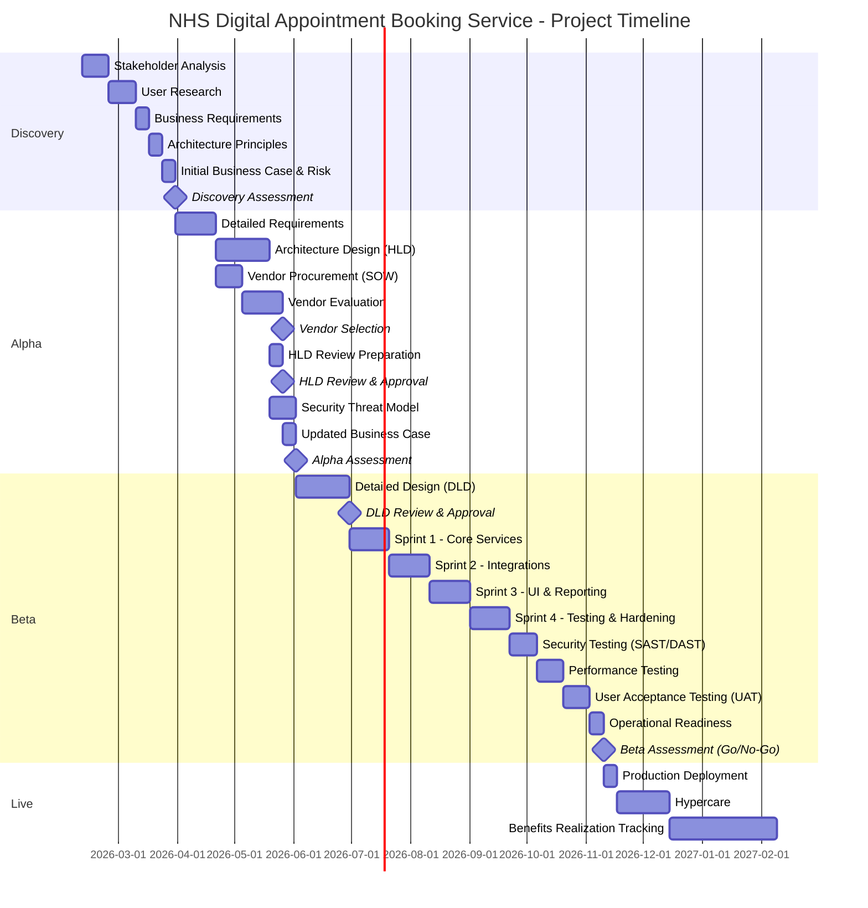
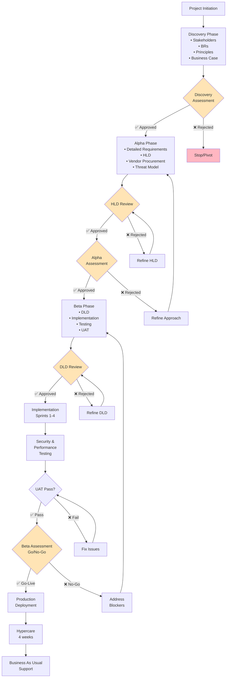

# Project Plan: NHS Digital Appointment Booking Service

> **Template Status**: Generated by ArcKit | **Version**: 2.2.0 | **Command**: `/arckit:plan`

## Document Control

| Field | Value |
|-------|-------|
| **Document ID** | ARC-001-PLAN-v1.0 |
| **Document Type** | Project Plan |
| **Project** | NHS Digital Appointment Booking Service (Project 001) |
| **Classification** | OFFICIAL |
| **Status** | DRAFT |
| **Version** | 1.0 |
| **Created Date** | 2026-02-10 |
| **Last Modified** | 2026-02-10 |
| **Review Cycle** | On-Demand |
| **Next Review Date** | 2026-03-10 |
| **Owner** | [PENDING] |
| **Reviewed By** | [PENDING] |
| **Approved By** | [PENDING] |
| **Distribution** | Project Team, Architecture Team |

## Revision History

| Version | Date | Author | Changes | Approved By | Approval Date |
|---------|------|--------|---------|-------------|---------------|
| 1.0 | 2026-02-10 | ArcKit AI | Initial creation from `/arckit:plan` command | [PENDING] | [PENDING] |

---

## Executive Summary

**Project**: NHS Digital Appointment Booking Service
**Duration**: 46 weeks (approx. 11 months)
**Budget**: TBD (pending Business Case)
**Team**: 8 FTE average (Discovery: 5, Alpha: 8, Beta: 12, Live: 4)
**Delivery Model**: GDS Agile Delivery (Discovery → Alpha → Beta → Live)

**Objective**: To deliver a modern, accessible, and secure digital appointment booking service that enables citizens to book, manage, and cancel NHS appointments across primary, secondary, and community care services.

**Success Criteria**:
- 80% citizen satisfaction rating within 12 months of launch
- 25% reduction in Did Not Attend rates within 12 months
- 60% of eligible appointments booked digitally within 18 months

**Key Milestones**:
- Discovery Complete: Week 6
- Alpha Complete (HLD approved): Week 16
- Beta Complete (Go-Live approved): Week 34
- Production Launch: Week 35

---

## Gantt Timeline

---

## Workflow & Gates

---

## Discovery Phase (Weeks 1-6)

**Objective**: Understand user needs, define the problem, and establish a feasible approach.

### Activities & Timeline

| Week | Activity | ArcKit Command | Deliverable |
|------|----------|----------------|-------------|
| 1-2 | Stakeholder Analysis | `/arckit:stakeholders` | Stakeholder map, drivers, goals |
| 3-4 | User Research | Manual | User needs, pain points, personas |
| 5 | Business Requirements | `/arckit:requirements` | BRs with acceptance criteria |
| 5 | Architecture Principles | `/arckit:principles` | Governance principles |
| 6 | Initial Business Case | `/arckit:business-case` | Cost/benefit analysis |
| 6 | Initial Risk Register | `/arckit:risk` | Top 10 risks |

### Gate: Discovery Assessment (Week 6)

**Approval Criteria**:
- [ ] Problem clearly defined and validated with user research.
- [ ] Business Requirements defined and agreed.
- [ ] Architecture principles aligned with enterprise standards.
- [ ] Initial business case shows potential value.
- [ ] No critical unmitigated risks.

**Approvers**: SRO, Architecture Board, Product Owner

---

## Alpha Phase (Weeks 7-16)

**Objective**: Build prototypes, test solutions with users, and create a detailed technical design.

### Activities & Timeline

| Week | Activity | ArcKit Command | Deliverable |
|------|----------|----------------|-------------|
| 7-9 | Detailed Requirements | `/arckit:requirements` | FRs, NFRs, INTs, DRs |
| 10-13 | Architecture Design (HLD) | `/arckit:diagram` | C4 Model, HLD Document |
| 9-10 | Vendor SOW/RFP | `/arckit:sow` | Statement of Work |
| 11-13| Vendor Evaluation | `/arckit:evaluate` | Vendor Scorecard |
| 14 | HLD Review | `/arckit:hld-review` | HLD Approval |
| 14-15| Security Threat Model | `/arckit:secure` | Threat Model |
| 16 | Updated Business Case | `/arckit:business-case` | Refined budget and ROI |

### Gate: Alpha Assessment (Week 16)

**Approval Criteria**:
- [ ] Prototype validated with users.
- [ ] HLD is approved, technically feasible, and meets principles.
- [ ] Preferred vendor selected (if applicable).
- [ ] Updated business case is robust.
- [ ] Full delivery team is in place.

**Approvers**: SRO, Architecture Board, Security Team

---

## Beta Phase (Weeks 17-34)

**Objective**: Build and test a production-ready service with a limited set of users.

### Activities & Timeline

| Week | Activity | ArcKit Command | Deliverable |
|------|----------|----------------|-------------|
| 17-20| Detailed Design (DLD) | `/arckit:diagram` | DLD Document |
| 21 | DLD Review | `/arckit:dld-review` | DLD Approval |
| 21-26| Implementation Sprints 1-2 | Manual | Core service features |
| 27-32| Implementation Sprints 3-4 | Manual | UI, integrations, testing |
| 33-34| Security & Performance Testing | `/arckit:analyze` | Test Results |
| 33-34| UAT & Operational Readiness | Manual | UAT Sign-off |

### Gate: Beta Assessment (Go/No-Go) (Week 34)

**Approval Criteria**:
- [ ] Service is fully functional and tested.
- [ ] Meets all NFRs for performance and security.
- [ ] DCB0129 Clinical Safety case approved.
- [ ] UAT passed by users.
- [ ] Operational support model is in place.

**Approvers**: SRO, Clinical Safety Officer, Security Lead

---

## Live Phase (Weeks 35-46)

**Objective**: Deploy the service to the public, provide support, and measure benefits.

### Activities & Timeline

| Week | Activity | ArcKit Command | Deliverable |
|------|----------|----------------|-------------|
| 35 | Production Deployment | Manual | Live Service |
| 35-38| Hypercare Support | Manual | Stable service |
| 39-46| Benefits Realization | `/arckit:business-case` | Benefits Report |
| Quarterly | Risk Review | `/arckit:risk` | Updated Risk Register |

---

## ArcKit Commands in Project Flow

### Discovery Phase
- **Week 1-2**: `/arckit:stakeholders` - To understand who has an interest in the project.
- **Week 5**: `/arckit:requirements` - To capture initial business requirements.
- **Week 5**: `/arckit:principles` - To define the governing rules for the architecture.
- **Week 6**: `/arckit:business-case` - To create the initial justification for the project.
- **Week 6**: `/arckit:risk` - To identify initial high-level risks.

### Alpha Phase
- **Week 7-9**: `/arckit:requirements` - To detail out FRs, NFRs, etc.
- **Week 10-13**: `/arckit:diagram` - To create the High-Level Design (C4 model).
- **Week 9-10**: `/arckit:sow` - To generate a Statement of Work for vendors.
- **Week 11-13**: `/arckit:evaluate` - To score and select a vendor.
- **Week 14**: `/arckit:hld-review` - To conduct the formal HLD approval gate.
- **Week 14-15**: `/arckit:secure` - To create a STRIDE threat model.
- **Week 16**: `/arckit:business-case` - To update the business case with refined costs.

### Beta Phase
- **Week 17-20**: `/arckit:diagram` - To create the Detailed-Level Design.
- **Week 21**: `/arckit:dld-review` - To conduct the formal DLD approval gate.
- **Week 33-34**: `/arckit:analyze` - To check code quality and test coverage.
- **If AI**: `/arckit:ai-playbook`, `/arckit:atrs` - For AI compliance.

### Live Phase
- **Quarterly**: `/arckit:risk` - To update operational risks.
- **Annually**: `/arckit:business-case` - To track benefits realization.

---

## Timeline Estimates

This plan is based on a **Medium** complexity project.
- **Discovery**: 6 weeks
- **Alpha**: 10 weeks
- **Beta**: 18 weeks
- **Total Duration**: 34 weeks to Go-Live, 46 weeks total.

This timeline is an estimate and should be reviewed at the end of each phase.

## Risks and Assumptions

**Key Risks**:
- Hospital trust integration delays may impact the timeline for secondary care features.
- Low citizen adoption could undermine the project's value proposition.
- Performance under national-scale load is a significant technical risk.

**Key Assumptions**:
- NHS login and GP Connect APIs will be stable and available.
- Hospital trusts will adopt standardized integration APIs.
- The project will be funded sufficiently based on the business case.

---

**Generated by**: ArcKit `/arckit:plan` command
**Generated on**: 2026-02-10
**ArcKit Version**: 2.2.0
**Project**: NHS Digital Appointment Booking Service (Project 001)
**AI Model**: gemini-1.5-flash-001
**Generation Context**: Based on ARC-001-REQ-v1.0.md and ARC-000-PRIN-v1.1.md
