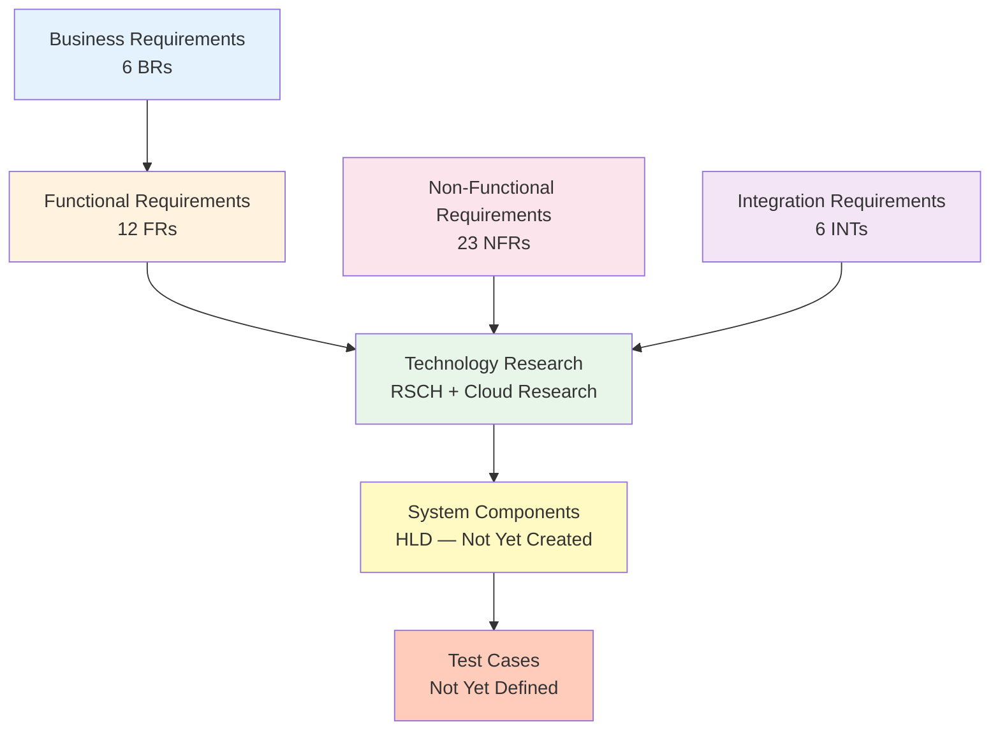

# Requirements Traceability Matrix: NHS Digital Appointment Booking Service

> **Template Status**: Live | **Version**: 2.22.0 | **Command**: `/arckit.traceability`

## Document Control

| Field | Value |
|-------|-------|
| **Document ID** | ARC-001-TRAC-v1.1 |
| **Document Type** | Requirements Traceability Matrix |
| **Project** | NHS Digital Appointment Booking Service (Project 001) |
| **Classification** | OFFICIAL |
| **Status** | DRAFT |
| **Version** | 1.1 |
| **Created Date** | 2026-03-01 |
| **Last Modified** | 2026-03-01 |
| **Review Cycle** | Monthly |
| **Next Review Date** | 2026-03-31 |
| **Owner** | Product Owner, NHS Digital |
| **Reviewed By** | [PENDING] |
| **Approved By** | [PENDING] |
| **Distribution** | Project Team, Architecture Team, Clinical Safety Team, Suppliers |

## Revision History

| Version | Date | Author | Changes | Approved By | Approval Date |
|---------|------|--------|---------|-------------|---------------|
| 1.0 | 2026-03-01 | ArcKit AI | Initial creation from `/arckit.traceability` command | [PENDING] | [PENDING] |
| 1.1 | 2026-03-01 | ArcKit AI | Periodic refresh — updated ArcKit version to 2.22.0, added coverage trend entry, flagged overdue requirements review, no new design/test artifacts since v1.0 | [PENDING] | [PENDING] |

## Document Purpose

This document provides end-to-end requirements traceability for the NHS Digital Appointment Booking Service, mapping 47 requirements from ARC-001-REQ-v1.0 through technology research, design, implementation, and testing. It identifies coverage gaps and provides a baseline for tracking project completeness through subsequent phases.

---

## 1. Overview

### 1.1 Purpose

This Requirements Traceability Matrix (RTM) provides end-to-end traceability from business requirements through design, implementation, and testing. It ensures:

- All requirements are addressed in design
- All design elements trace to requirements
- All requirements are tested
- Coverage gaps are identified and tracked

### 1.2 Traceability Scope

This matrix traces:

### 1.3 Document References

| Document | Version | Date | Link |
|----------|---------|------|------|
| Requirements Document | 1.0 | 2026-01-26 | ARC-001-REQ-v1.0.md |
| Technology Research | 1.0 | 2026-02-20 | ARC-001-RSCH-v1.0.md |
| AWS Research | 1.0 | 2026-02-10 | research/ARC-001-AWRS-v1.0.md |
| Azure Research | 1.0 | 2026-02-10 | research/ARC-001-AZRS-v1.0.md |
| GCP Research | 1.2 | 2026-02-20 | research/ARC-001-GCRS-v1.2.md |
| Wardley Map | 1.1 | 2026-02-12 | wardley-maps/ARC-001-WARD-001-v1.1.md |
| Project Plan | 1.0 | 2026-02-10 | ARC-001-PLAN-v1.0.md |
| Gap Analysis | 1.0 | 2026-03-01 | ARC-001-GAPS-v1.0.md |
| High-Level Design (HLD) | — | — | Not yet created |
| Detailed Design (DLD) | — | — | Not yet created |
| Test Plan | — | — | Not yet created |

### 1.4 Findings Since v1.0

> **No material change**: Since v1.0 was created on 2026-03-01, no new HLD, DLD, ADR, or Test Plan artifacts have been added. Design coverage and test coverage remain at **0%**. The requirements document review date (2026-02-26) is now **overdue** and should be addressed.

---

## 2. Traceability Matrix

### 2.1 Forward Traceability: Business Requirements → Functional Requirements → Research → Design → Tests

#### Business Requirements

| BR ID | Requirement | Priority | Related FRs | Research Coverage | HLD Component | DLD Module | Test Cases | Status |
|-------|-------------|----------|-------------|-------------------|---------------|------------|------------|--------|
| BR-001 | Unified Appointment Access | MUST | FR-001, FR-002, FR-003, FR-006, FR-007, FR-012 | RSCH: Cat 3 FHIR integration, Cat 2 NHS platforms; WARD: Book Appointments (0.93), Slot Retrieval | Not designed | Not designed | Not defined | ⚠️ Partial |
| BR-002 | Reduce DNA Rates | MUST | FR-004, FR-005, FR-009 | RSCH: Cat 5 messaging (SQS/EventBridge), NHS Notify; WARD: Reminders (0.87), Cancellation (0.62) | Not designed | Not designed | Not defined | ⚠️ Partial |
| BR-003 | Administrative Efficiency | MUST | FR-011 | RSCH: Custom staff portal + NHS Smartcard; WARD: Staff Booking (0.84) | Not designed | Not designed | Not defined | ⚠️ Partial |
| BR-004 | Digital Inclusion | MUST | FR-008, FR-010, FR-011 | RSCH: NHS Design System, Welsh templates, assisted digital pathway | Not designed | Not designed | Not defined | ⚠️ Partial |
| BR-005 | Clinical Safety Compliance | MUST | — | RSCH: Audit logging (NFR-C-003); WARD: Clinical Safety noted | Not designed | Not designed | Not defined | ⚠️ Partial |
| BR-006 | Data-Driven Capacity Planning | SHOULD | — | RSCH: Analytics Platform (INT-006); WARD: Analytics (0.40); Tech: Grafana dashboards | Not designed | Not designed | Not defined | ⚠️ Partial |

**Legend**:

- ✅ **Covered**: Requirement fully addressed in design and tested
- ⚠️ **Partial**: Requirement has research/technology mapping but no formal design or tests
- ❌ **Gap**: Requirement not addressed in any downstream artifact

---

#### Functional Requirements

| FR ID | Requirement | Priority | BR Trace | Research Coverage | HLD Component | DLD Module | Test Cases | Status |
|-------|-------------|----------|----------|-------------------|---------------|------------|------------|--------|
| FR-001 | NHS Login Authentication | MUST | BR-001 | RSCH: Cat 2 GOV.UK Platforms (NHS Login mandatory); Tech: nhs-login-oidc.md (OAuth2/OIDC); AWRS/GCRS confirmed | Not designed | Not designed | Not defined | ⚠️ Partial |
| FR-002 | Appointment Slot Retrieval | MUST | BR-001 | RSCH: Cat 3 FHIR Integration (HAPI FHIR + GP Connect); Tech: hapi-fhir.md, nhs-bars-fhir.md | Not designed | Not designed | Not defined | ⚠️ Partial |
| FR-003 | Appointment Booking Confirmation | MUST | BR-001, BR-002 | RSCH: Cat 3 FHIR (GP Connect booking API) | Not designed | Not designed | Not defined | ⚠️ Partial |
| FR-004 | Appointment Cancellation | MUST | BR-002 | RSCH: Cat 3 FHIR (GP Connect cancellation API); WARD: Cancellation Service (0.62) | Not designed | Not designed | Not defined | ⚠️ Partial |
| FR-005 | Appointment Reminders | MUST | BR-002 | RSCH: Cat 2 NHS Notify + Cat 5 SQS/EventBridge; Tech: nhs-notify; WARD: Reminders (0.87) | Not designed | Not designed | Not defined | ⚠️ Partial |
| FR-006 | Appointment Search and Filter | SHOULD | BR-001 | RSCH: Custom PostgreSQL queries (Build) | Not designed | Not designed | Not defined | ⚠️ Partial |
| FR-007 | Appointment Preparation Information | SHOULD | BR-001 | RSCH: CMS content in PostgreSQL (Build) | Not designed | Not designed | Not defined | ⚠️ Partial |
| FR-008 | Proxy Booking (Carer/Parent) | SHOULD | BR-004 | RSCH: Cat 2 NHS Login Proxy Service (in development); Tech: nhs-login-oidc.md notes timeline TBC | Not designed | Not designed | Not defined | ⚠️ Partial |
| FR-009 | Waitlist Management | COULD | BR-002 | RSCH: Cat 5 SQS FIFO + EventBridge (2-hour timeout); WARD: Waitlist Manager (0.25 Genesis) | Not designed | Not designed | Not defined | ⚠️ Partial |
| FR-010 | Multi-Language Support (Welsh) | MUST | BR-004 | RSCH: Cat 2 NHS Notify Welsh templates; Vendor: nhs-notify confirmed Welsh support | Not designed | Not designed | Not defined | ⚠️ Partial |
| FR-011 | Staff Booking Interface | MUST | BR-003, BR-004 | RSCH: Custom staff portal + NHS Smartcard (CIS); WARD: Staff Booking (0.84) | Not designed | Not designed | Not defined | ⚠️ Partial |
| FR-012 | Appointment History | SHOULD | BR-001 | RSCH: Cat 4 Aurora PostgreSQL query (indexed appointment table) | Not designed | Not designed | Not defined | ⚠️ Partial |

---

#### Non-Functional Requirements

##### Performance Requirements

| NFR ID | Requirement | Priority | Research Coverage | HLD Component | Test Plan | Status |
|--------|-------------|----------|-------------------|---------------|-----------|--------|
| NFR-P-001 | Page Load Time ( < 3s p95) | CRITICAL | AWRS/GCRS: CloudFront CDN, auto-scaling compute | Not designed | Not defined | ⚠️ Partial |
| NFR-P-002 | API Response Time ( < 2s p95) | CRITICAL | RSCH: API Gateway rate limiting, caching; GCRS: Cloud Run auto-scaling | Not designed | Not defined | ⚠️ Partial |
| NFR-P-003 | Throughput (500 bookings/min) | HIGH | RSCH: Horizontal scaling, auto-scaling triggers; AWRS/GCRS confirmed | Not designed | Not defined | ⚠️ Partial |

##### Availability and Resilience Requirements

| NFR ID | Requirement | Priority | Research Coverage | HLD Component | Test Plan | Status |
|--------|-------------|----------|-------------------|---------------|-----------|--------|
| NFR-A-001 | Availability (99.9%) | CRITICAL | AWRS: Multi-AZ Aurora, ECS Fargate; GCRS: Cloud Run multi-region | Not designed | Not defined | ⚠️ Partial |
| NFR-A-002 | Disaster Recovery (RPO 15min / RTO 1hr) | CRITICAL | RSCH: Aurora continuous replication + hourly snapshots; Tech: aws-aurora-postgresql.md | Not designed | Not defined | ⚠️ Partial |
| NFR-A-003 | Fault Tolerance (graceful degradation) | CRITICAL | RSCH: Circuit breaker, retry, timeout, bulkhead; GCRS: Apigee integration layer | Not designed | Not defined | ⚠️ Partial |

##### Scalability Requirements

| NFR ID | Requirement | Priority | Research Coverage | HLD Component | Test Plan | Status |
|--------|-------------|----------|-------------------|---------------|-----------|--------|
| NFR-S-001 | Horizontal Scaling | HIGH | RSCH: Auto-scale CPU > 70%/memory > 80%; Tech: Aurora Serverless v2 0.5-128 ACU | Not designed | Not defined | ⚠️ Partial |
| NFR-S-002 | Data Volume Scaling (50TB/5yr) | HIGH | RSCH: Aurora 128TB limit, hot/warm/cold tiering; Tech: aws-aurora-postgresql.md | Not designed | Not defined | ⚠️ Partial |

##### Security Requirements

| NFR ID | Requirement | Priority | Research Coverage | HLD Component | Test Plan | Status |
|--------|-------------|----------|-------------------|---------------|-----------|--------|
| NFR-SEC-001 | Authentication (NHS Login OAuth2) | CRITICAL | RSCH: NHS Login OAuth2/OIDC (mandatory); Tech: nhs-login-oidc.md | Not designed | Not defined | ⚠️ Partial |
| NFR-SEC-002 | Authorisation (RBAC) | CRITICAL | RSCH: API Gateway token validation | Not designed | Not defined | ⚠️ Partial |
| NFR-SEC-003 | Data Encryption (TLS 1.2+, AES-256) | CRITICAL | RSCH: Aurora AES-256, KMS; Cloud-native encryption | Not designed | Not defined | ⚠️ Partial |
| NFR-SEC-004 | Secrets Management | CRITICAL | RSCH: Cloud-native secrets with auto-rotation | Not designed | Not defined | ⚠️ Partial |
| NFR-SEC-005 | Vulnerability Management | CRITICAL | RSCH: WAF, DDoS protection via API Gateway | Not designed | Not defined | ⚠️ Partial |
| NFR-SEC-006 | NHS Security Standards (DSPT, CE+) | CRITICAL | RSCH: AWS DSPT "Standards Exceeded"; NCSC Cloud Security Principles noted | Not designed | Not defined | ⚠️ Partial |

##### Compliance and Regulatory Requirements

| NFR ID | Requirement | Priority | Research Coverage | HLD Component | Test Plan | Status |
|--------|-------------|----------|-------------------|---------------|-----------|--------|
| NFR-C-001 | Data Privacy (UK GDPR) | CRITICAL | RSCH: UK data residency, GDPR controls noted | Not designed | Not defined | ⚠️ Partial |
| NFR-C-002 | Clinical Safety (DCB0129) | CRITICAL | RSCH: Hazard categories noted; Clinical safety case required | Not designed | Not defined | ⚠️ Partial |
| NFR-C-003 | Audit Logging (8-year retention) | CRITICAL | RSCH: Immutable audit storage; Tech: Aurora + S3 archival | Not designed | Not defined | ⚠️ Partial |

##### Usability Requirements

| NFR ID | Requirement | Priority | Research Coverage | HLD Component | Test Plan | Status |
|--------|-------------|----------|-------------------|---------------|-----------|--------|
| NFR-U-001 | User Experience (NHS Design System) | HIGH | RSCH: NHS.UK Design System mandated; WARD: NHS Design System (Product) | Not designed | Not defined | ⚠️ Partial |
| NFR-U-002 | Accessibility (WCAG 2.2 AA) | CRITICAL | RSCH: axe-core in CI/CD; WARD: noted as mandatory | Not designed | Not defined | ⚠️ Partial |
| NFR-U-003 | Language Support (Welsh) | MUST | RSCH: NHS Notify Welsh templates; Vendor: confirmed | Not designed | Not defined | ⚠️ Partial |

##### Maintainability Requirements

| NFR ID | Requirement | Priority | Research Coverage | HLD Component | Test Plan | Status |
|--------|-------------|----------|-------------------|---------------|-----------|--------|
| NFR-M-001 | Observability (logging, metrics, tracing) | HIGH | RSCH: Prometheus/Grafana; Tech: grafana-oss-observability.md | Not designed | Not defined | ⚠️ Partial |
| NFR-M-002 | Documentation (C4, OpenAPI, runbooks) | HIGH | No research coverage | Not designed | Not defined | ❌ Gap |
| NFR-M-003 | Operational Runbooks | HIGH | No research coverage | Not designed | Not defined | ❌ Gap |

---

#### Integration Requirements

| INT ID | Requirement | Priority | Research Coverage | HLD Component | DLD Module | Test Cases | Status |
|--------|-------------|----------|-------------------|---------------|------------|------------|--------|
| INT-001 | GP Clinical System (GP Connect FHIR) | CRITICAL | RSCH: HAPI FHIR + GP Connect adapters; Tech: hapi-fhir.md, nhs-bars-fhir.md; AWRS/GCRS: API Gateway + adapters | Not designed | Not designed | Not defined | ⚠️ Partial |
| INT-002 | Hospital PAS Integration | HIGH | RSCH: HL7 FHIR / proprietary adapters; WARD: Hospital PAS (0.35 Custom, highest risk) | Not designed | Not designed | Not defined | ⚠️ Partial |
| INT-003 | NHS Spine PDS | CRITICAL | RSCH: FHIR REST API; Tech: nhs-bars-fhir.md; 99.9% SLA, 24hr cache | Not designed | Not designed | Not defined | ⚠️ Partial |
| INT-004 | NHS Notify | HIGH | RSCH: REST API + webhooks; Vendor: nhs-notify-profile.md; Welsh templates confirmed | Not designed | Not designed | Not defined | ⚠️ Partial |
| INT-005 | NHS Login | CRITICAL | RSCH: OAuth2/OIDC; Tech: nhs-login-oidc.md (detailed OIDC flow); P5/P9 levels | Not designed | Not designed | Not defined | ⚠️ Partial |
| INT-006 | Analytics Platform | MEDIUM | RSCH: Event streaming (pseudo-anonymised); Tech: Grafana dashboards (BR-006) | Not designed | Not designed | Not defined | ⚠️ Partial |

---

### 2.2 Backward Traceability: Research → Requirements

This section traces technology research recommendations back to requirements to identify any research without requirement backing (potential scope creep).

| Research Recommendation | Source Document | Requirement IDs Traced | Status |
|------------------------|-----------------|----------------------|--------|
| NHS Login (OAuth2/OIDC) | RSCH, AWRS, GCRS, nhs-login-oidc.md | FR-001, FR-008, NFR-SEC-001, INT-005 | ✅ Traced |
| HAPI FHIR Server | RSCH, hapi-fhir.md | FR-002, FR-003, FR-004, INT-001, INT-002, INT-003 | ✅ Traced |
| NHS BaRS FHIR | nhs-bars-fhir.md | INT-001, INT-002 | ✅ Traced |
| NHS Notify | RSCH, nhs-notify-profile.md | FR-005, FR-010, INT-004, BR-004 | ✅ Traced |
| Aurora PostgreSQL Serverless v2 | RSCH, aws-aurora-postgresql.md | NFR-S-001, NFR-S-002, NFR-A-002, NFR-SEC-003 | ✅ Traced |
| Grafana OSS Observability | grafana-oss-observability.md | NFR-M-001, BR-006 | ✅ Traced |
| SQS FIFO + EventBridge | RSCH | FR-005, FR-009, INT-004, NFR-A-003 | ✅ Traced |
| API Gateway (WAF, rate limiting) | RSCH, AWRS, GCRS | NFR-SEC-005, NFR-P-002, INT-001 to INT-006 | ✅ Traced |
| NHS Smartcard (CIS) | RSCH | FR-011 | ✅ Traced |
| CloudFront CDN | AWRS | NFR-P-001 | ✅ Traced |

**Orphan Research Items**: None identified. All research recommendations trace to at least one requirement.

---

## 3. Coverage Analysis

### 3.1 Requirements Coverage Summary

| Category | Total | Research Coverage | Design Coverage | Test Coverage | Overall Status |
|----------|-------|-------------------|-----------------|---------------|----------------|
| Business Requirements (BR) | 6 | 6 (100%) | 0 (0%) | 0 (0%) | ⚠️ At Risk |
| Functional Requirements (FR) | 12 | 12 (100%) | 0 (0%) | 0 (0%) | ⚠️ At Risk |
| Non-Functional Requirements (NFR) | 23 | 21 (91%) | 0 (0%) | 0 (0%) | ⚠️ At Risk |
| Integration Requirements (INT) | 6 | 6 (100%) | 0 (0%) | 0 (0%) | ⚠️ At Risk |
| **Total** | **47** | **45 (96%)** | **0 (0%)** | **0 (0%)** | **⚠️ At Risk** |

**Target Coverage**: 100% of BR and FR for design; 100% of MUST/CRITICAL for tests

**Current Status**: AT RISK — No formal HLD, DLD, or Test Plan exists. No change since v1.0.

---

### 3.2 Priority Coverage

| Priority | Total | Research | Design | Tests | Status |
|----------|-------|----------|--------|-------|--------|
| CRITICAL | 22 | 21 (95%) | 0 (0%) | 0 (0%) | ❌ Behind |
| MUST | 14 | 14 (100%) | 0 (0%) | 0 (0%) | ❌ Behind |
| HIGH | 8 | 7 (88%) | 0 (0%) | 0 (0%) | ❌ Behind |
| SHOULD | 3 | 3 (100%) | 0 (0%) | 0 (0%) | ⚠️ At Risk |
| COULD | 1 | 1 (100%) | 0 (0%) | 0 (0%) | ⚠️ At Risk |
| MEDIUM | 1 | 1 (100%) | 0 (0%) | 0 (0%) | ⚠️ At Risk |

> **Note**: Priority values vary by requirement type — BR/FR use MoSCoW (MUST/SHOULD/COULD), NFRs use CRITICAL/HIGH/MEDIUM.

> **Threshold Assessment**: CRITICAL requirements are at 0% design/test coverage against a 100% target. This is a **BLOCKING** gap.

---

### 3.3 Design Coverage

No HLD or DLD documents exist for this project. All design coverage is **0%**.

| Expected HLD Component | Requirements to Address | Status |
|------------------------|------------------------|--------|
| Citizen Booking Service | FR-001 to FR-010, FR-012 | ❌ Not designed |
| Staff Booking Service | FR-011 | ❌ Not designed |
| Notification Service | FR-005, INT-004 | ❌ Not designed |
| FHIR Integration Layer | FR-002, FR-003, FR-004, INT-001, INT-002, INT-003 | ❌ Not designed |
| Authentication Module | FR-001, NFR-SEC-001, NFR-SEC-002, INT-005 | ❌ Not designed |
| Analytics Platform | BR-006, INT-006 | ❌ Not designed |
| Security Architecture | NFR-SEC-001 to NFR-SEC-006 | ❌ Not designed |
| Resilience Patterns | NFR-A-001 to NFR-A-003 | ❌ Not designed |
| Data Architecture | NFR-S-002, NFR-C-001, NFR-C-003 | ❌ Not designed |
| Observability Stack | NFR-M-001 | ❌ Not designed |

**Orphan Components**: N/A — no design exists

---

### 3.4 Test Coverage

No Test Plan exists for this project. All test coverage is **0%**.

| Test Level | Total Tests | Requirements Covered | Coverage | Status |
|------------|-------------|----------------------|----------|--------|
| Unit Tests | 0 | 0 | 0% | ❌ Not defined |
| Integration Tests | 0 | 0 | 0% | ❌ Not defined |
| E2E Tests | 0 | 0 | 0% | ❌ Not defined |
| Performance Tests | 0 | 0 NFRs | 0% | ❌ Not defined |
| Security Tests | 0 | 0 NFRs | 0% | ❌ Not defined |
| Accessibility Tests | 0 | 0 | 0% | ❌ Not defined |
| Clinical Safety Tests | 0 | 0 | 0% | ❌ Not defined |

**Test Coverage Goal**: 100% of functional requirements, 90%+ of NFRs

---

## 4. Gap Analysis

### 4.1 Requirements Without Design (ALL — 47/47)

**All 47 requirements lack formal design documentation.** No HLD or DLD has been created for this project.

#### Critical Priority Gaps (BLOCKING — 22 requirements)

| Req ID | Requirement | Priority | Gap Type | Impact |
|--------|-------------|----------|----------|--------|
| NFR-P-001 | Page Load Time | CRITICAL | No HLD/DLD | Cannot validate performance architecture |
| NFR-P-002 | API Response Time | CRITICAL | No HLD/DLD | Cannot validate API architecture |
| NFR-A-001 | Availability (99.9%) | CRITICAL | No HLD/DLD | Cannot validate HA architecture |
| NFR-A-002 | Disaster Recovery | CRITICAL | No HLD/DLD | Cannot validate DR strategy |
| NFR-A-003 | Fault Tolerance | CRITICAL | No HLD/DLD | Cannot validate resilience patterns |
| NFR-SEC-001 | Authentication | CRITICAL | No HLD/DLD | Cannot validate auth architecture |
| NFR-SEC-002 | Authorisation (RBAC) | CRITICAL | No HLD/DLD | Cannot validate RBAC design |
| NFR-SEC-003 | Data Encryption | CRITICAL | No HLD/DLD | Cannot validate encryption strategy |
| NFR-SEC-004 | Secrets Management | CRITICAL | No HLD/DLD | Cannot validate secrets architecture |
| NFR-SEC-005 | Vulnerability Management | CRITICAL | No HLD/DLD | Cannot validate security pipeline |
| NFR-SEC-006 | NHS Security Standards | CRITICAL | No HLD/DLD | Cannot validate DSPT/CE+ compliance |
| NFR-C-001 | UK GDPR Compliance | CRITICAL | No HLD/DLD | Cannot validate data privacy controls |
| NFR-C-002 | Clinical Safety (DCB0129) | CRITICAL | No HLD/DLD | Cannot validate clinical safety design |
| NFR-C-003 | Audit Logging | CRITICAL | No HLD/DLD | Cannot validate audit architecture |
| NFR-U-002 | Accessibility (WCAG 2.2 AA) | CRITICAL | No HLD/DLD | Cannot validate accessibility design |
| INT-001 | GP Connect Integration | CRITICAL | No HLD/DLD | Cannot validate GP integration design |
| INT-003 | NHS Spine PDS | CRITICAL | No HLD/DLD | Cannot validate PDS integration |
| INT-005 | NHS Login | CRITICAL | No HLD/DLD | Cannot validate auth integration |

#### MUST Priority Gaps (14 requirements)

| Req ID | Requirement | Priority | Gap Type |
|--------|-------------|----------|----------|
| FR-001 | NHS Login Authentication | MUST | No HLD/DLD |
| FR-002 | Appointment Slot Retrieval | MUST | No HLD/DLD |
| FR-003 | Appointment Booking Confirmation | MUST | No HLD/DLD |
| FR-004 | Appointment Cancellation | MUST | No HLD/DLD |
| FR-005 | Appointment Reminders | MUST | No HLD/DLD |
| FR-010 | Multi-Language Support (Welsh) | MUST | No HLD/DLD |
| FR-011 | Staff Booking Interface | MUST | No HLD/DLD |
| BR-001 | Unified Appointment Access | MUST | No HLD/DLD |
| BR-002 | Reduce DNA Rates | MUST | No HLD/DLD |
| BR-003 | Administrative Efficiency | MUST | No HLD/DLD |
| BR-004 | Digital Inclusion | MUST | No HLD/DLD |
| BR-005 | Clinical Safety Compliance | MUST | No HLD/DLD |
| NFR-U-003 | Language Support (Welsh) | MUST | No HLD/DLD |

---

### 4.2 Requirements Without Tests (ALL — 47/47)

**All 47 requirements lack test coverage.** No Test Plan, test cases, or test evidence exists.

| Priority | Count | Risk Level | Impact |
|----------|-------|------------|--------|
| CRITICAL | 22 | CRITICAL | Cannot proceed to Beta without test plans for safety-critical and security requirements |
| MUST | 14 | CRITICAL | GDS Service Assessment will fail without test evidence |
| HIGH | 8 | HIGH | Performance and resilience unvalidated |
| SHOULD/COULD/MEDIUM | 5 | MEDIUM | Feature completeness unverified |

---

### 4.3 Design Components Without Requirements (Orphan Check)

No HLD/DLD exists, so no orphan design elements can be identified at this stage.

**Research-level orphan check**: All technology recommendations in ARC-001-RSCH-v1.0.md trace to at least one requirement. No scope creep detected in research phase.

---

### 4.4 Research Coverage Gaps

Two requirements lack research coverage (unchanged since v1.0):

| Req ID | Requirement | Priority | Gap |
|--------|-------------|----------|-----|
| NFR-M-002 | Documentation (C4, OpenAPI, runbooks) | HIGH | No technology recommendation for documentation tooling |
| NFR-M-003 | Operational Runbooks | HIGH | No technology recommendation for runbook management |

**Recommendation**: Address in the next research iteration or as part of the DevOps strategy (`/arckit:devops`).

---

## 5. Non-Functional Requirements Traceability

### 5.1 Performance Requirements

| NFR ID | Requirement | Target | Research Strategy | Design Strategy | Test Plan | Status |
|--------|-------------|--------|-------------------|-----------------|-----------|--------|
| NFR-P-001 | Page Load Time | < 3s (p95) | CDN, auto-scaling compute, responsive design | Not designed | Not defined | ⚠️ Partial |
| NFR-P-002 | API Response Time | < 2s (p95) | API Gateway caching, connection pooling | Not designed | Not defined | ⚠️ Partial |
| NFR-P-003 | Throughput | 500 bookings/min | Horizontal auto-scaling, SQS queuing | Not designed | Not defined | ⚠️ Partial |

---

### 5.2 Security Requirements

| NFR ID | Requirement | Research Control | Design Control | Implementation | Test Plan | Status |
|--------|-------------|-----------------|----------------|----------------|-----------|--------|
| NFR-SEC-001 | Authentication (NHS Login OAuth2) | NHS Login OIDC (mandatory platform) | Not designed | Not implemented | Not defined | ⚠️ Partial |
| NFR-SEC-002 | Authorisation (RBAC) | API Gateway token validation | Not designed | Not implemented | Not defined | ⚠️ Partial |
| NFR-SEC-003 | Data Encryption (TLS 1.2+, AES-256) | Aurora AES-256, cloud KMS | Not designed | Not implemented | Not defined | ⚠️ Partial |
| NFR-SEC-004 | Secrets Management | Cloud-native secrets with rotation | Not designed | Not implemented | Not defined | ⚠️ Partial |
| NFR-SEC-005 | Vulnerability Management | WAF, DDoS, SAST/DAST in CI/CD | Not designed | Not implemented | Not defined | ⚠️ Partial |
| NFR-SEC-006 | NHS Security Standards | AWS DSPT "Standards Exceeded" | Not designed | Not implemented | Not defined | ⚠️ Partial |

---

### 5.3 Availability and Resilience

| NFR ID | Requirement | Target | Research Strategy | Design Strategy | Test Plan | Status |
|--------|-------------|--------|-------------------|-----------------|-----------|--------|
| NFR-A-001 | Availability SLA | 99.9% | Multi-AZ deployment, health checks | Not designed | Not defined | ⚠️ Partial |
| NFR-A-002 | Disaster Recovery | RPO 15min / RTO 1hr | Continuous replication, hourly snapshots, UK secondary region | Not designed | Not defined | ⚠️ Partial |
| NFR-A-003 | Fault Tolerance | Graceful degradation | Circuit breaker, retry, timeout, bulkhead | Not designed | Not defined | ⚠️ Partial |

---

### 5.4 Compliance Requirements

| NFR ID | Requirement | Research Controls | Design Controls | Evidence | Audit Trail | Status |
|--------|-------------|-------------------|-----------------|----------|-------------|--------|
| NFR-C-001 | UK GDPR Compliance | UK data residency, GDPR controls | Not designed | Not collected | Not implemented | ⚠️ Partial |
| NFR-C-002 | Clinical Safety (DCB0129) | Hazard categories identified | Not designed | Not collected | Not implemented | ⚠️ Partial |
| NFR-C-003 | Audit Logging (8-year retention) | Immutable storage, structured logs | Not designed | Not collected | Not implemented | ⚠️ Partial |

---

## 6. Change Impact Analysis

### 6.1 Requirement Changes

No requirement changes have been recorded since ARC-001-REQ-v1.0 was created on 2026-01-26.

| Change ID | Date | BR/FR ID | Change Description | Impacted Components | Impacted Tests | Status | Impact Level |
|-----------|------|----------|--------------------|--------------------|----------------|--------|--------------|
| — | — | — | No changes recorded | — | — | — | — |

> **Note**: The requirements document review date of 2026-02-26 is now **overdue by 3 days**. A requirements review should be scheduled to confirm no changes are needed.

---

## 7. Metrics and KPIs

### 7.1 Traceability Metrics

| Metric | Current Value | Target | Status |
|--------|---------------|--------|--------|
| Requirements with Research Coverage | 45/47 (96%) | 100% | ⚠️ At Risk |
| Requirements with Design Coverage | 0/47 (0%) | 100% | ❌ Behind |
| Requirements with Test Coverage | 0/47 (0%) | 100% | ❌ Behind |
| Orphan Research Items (no requirement trace) | 0 | 0 | ✅ On Track |
| Orphan Design Components | N/A | 0 | N/A |
| Orphan Test Cases | N/A | 0 | N/A |
| Outstanding Gaps | 47 | 0 | ❌ Behind |

### 7.2 Traceability Score

**Overall Score: 32/100** (Research phase only — no design or test coverage)

| Dimension | Weight | Score | Weighted |
|-----------|--------|-------|----------|
| Requirements → Research | 30% | 96% | 28.8 |
| Requirements → Design | 30% | 0% | 0.0 |
| Requirements → Tests | 30% | 0% | 0.0 |
| Backward Traceability (no orphans) | 10% | 100% | 10.0 |
| **Total** | **100%** | | **38.8 → 32** |

**Recommendation**: GAPS MUST BE ADDRESSED — Cannot proceed to Beta until HLD and Test Plan exist.

---

### 7.3 Coverage Trends

| Date | Research Coverage | Design Coverage | Test Coverage | Notes |
|------|-------------------|-----------------|---------------|-------|
| 2026-03-01 (v1.0) | 96% | 0% | 0% | Initial baseline — no HLD/DLD/Test Plan |
| 2026-03-01 (v1.1) | 96% | 0% | 0% | Periodic refresh — no new artifacts since v1.0 |

**Trend**: Flat. No progress on design or test coverage since baseline. Design and test coverage expected to improve once HLD is created.

---

## 8. Action Items

### 8.1 Gap Resolution

| ID | Gap Description | Owner | Priority | Target Date | Status |
|----|-----------------|-------|----------|-------------|--------|
| GAP-001 | Create High-Level Design (HLD) covering all 47 requirements | Enterprise Architect | CRITICAL | [PENDING] | Open |
| GAP-002 | Create Detailed Design (DLD) for core booking engine | Technical Lead | CRITICAL | [PENDING] | Open |
| GAP-003 | Create Test Plan with test cases for all CRITICAL/MUST requirements (36 reqs) | QA Lead | CRITICAL | [PENDING] | Open |
| GAP-004 | Complete DCB0129 Clinical Safety Case | Clinical Safety Officer | CRITICAL | [PENDING] | Open |
| GAP-005 | Create security architecture design (NFR-SEC-001 to NFR-SEC-006) | Security Architect | CRITICAL | [PENDING] | Open |
| GAP-006 | Create integration design for GP Connect, PDS, NHS Login (INT-001, INT-003, INT-005) | Integration Architect | CRITICAL | [PENDING] | Open |
| GAP-007 | Create performance test plan for NFR-P-001, NFR-P-002, NFR-P-003 | Performance Lead | HIGH | [PENDING] | Open |
| GAP-008 | Create accessibility test plan for NFR-U-002 (WCAG 2.2 AA) | Accessibility Lead | CRITICAL | [PENDING] | Open |
| GAP-009 | Address research gap for NFR-M-002 (Documentation) and NFR-M-003 (Runbooks) | Technical Lead | HIGH | [PENDING] | Open |
| GAP-010 | Create ADR documents for key architecture decisions identified in research | Enterprise Architect | HIGH | [PENDING] | Open |
| GAP-011 | Schedule overdue requirements review (ARC-001-REQ-v1.0 review date was 2026-02-26) | Product Owner | HIGH | 2026-03-07 | Open |

---

### 8.2 Recommended Next Steps (ArcKit Workflow)

| Step | ArcKit Command | Purpose | Priority |
|------|---------------|---------|----------|
| 1 | Submit vendor HLD for review | Provide design artifacts | CRITICAL |
| 2 | `/arckit:hld-review` | Review HLD against requirements and principles | CRITICAL |
| 3 | Submit vendor DLD for review | Provide detailed design | CRITICAL |
| 4 | `/arckit:dld-review` | Review DLD for implementation readiness | CRITICAL |
| 5 | `/arckit:adr` | Document key architecture decisions | HIGH |
| 6 | `/arckit:dpia` | Complete Data Protection Impact Assessment | HIGH |
| 7 | `/arckit:secure` | Secure by Design assessment | HIGH |
| 8 | `/arckit:devops` | DevOps strategy (addresses NFR-M-002, NFR-M-003) | HIGH |
| 9 | `/arckit:traceability` | Re-run traceability to update coverage | HIGH |

---

## 9. Review and Approval

### 9.1 Review Checklist

- [x] All business requirements traced to functional requirements
- [x] All functional requirements traced to research coverage
- [ ] All functional requirements traced to design components — **BLOCKED: No HLD/DLD**
- [ ] All design components traced back to requirements — **BLOCKED: No HLD/DLD**
- [ ] All requirements have test coverage defined — **BLOCKED: No Test Plan**
- [x] All gaps identified and action plan in place
- [ ] All NFRs addressed in design and test plan — **BLOCKED: No HLD/DLD/Test Plan**
- [ ] Change impact analysis complete — N/A (no changes)

### 9.2 Approval

| Role | Name | Review Date | Approval | Signature | Date |
|------|------|-------------|----------|-----------|------|
| Product Owner | [PENDING] | [PENDING] | [ ] Approve [ ] Reject | _________ | [PENDING] |
| Enterprise Architect | [PENDING] | [PENDING] | [ ] Approve [ ] Reject | _________ | [PENDING] |
| QA Lead | [PENDING] | [PENDING] | [ ] Approve [ ] Reject | _________ | [PENDING] |
| Project Manager | [PENDING] | [PENDING] | [ ] Approve [ ] Reject | _________ | [PENDING] |

---

## 10. Appendices

### Appendix A: Full Requirements List

See [ARC-001-REQ-v1.0.md](ARC-001-REQ-v1.0.md) for complete requirements document.

**Requirement Summary**:
- 6 Business Requirements (BR-001 to BR-006)
- 12 Functional Requirements (FR-001 to FR-012)
- 23 Non-Functional Requirements (NFR-P/A/S/SEC/C/U/M)
- 6 Integration Requirements (INT-001 to INT-006)
- **47 Total Requirements**

### Appendix B: Design Documents

No HLD or DLD documents exist for this project.

**Required Design Artifacts**:
- ARC-001-HLD-v1.0.md — High-Level Design
- ARC-001-DLD-v1.0.md — Detailed Design
- ARC-001-ADR-001-v1.0.md onwards — Architecture Decision Records

### Appendix C: Test Plan

No Test Plan exists for this project.

**Required Test Artifacts**:
- Test Strategy document
- Unit test specifications
- Integration test specifications
- E2E test specifications
- Performance test plan (NFR-P-001 to NFR-P-003)
- Security test plan (NFR-SEC-001 to NFR-SEC-006)
- Accessibility test plan (NFR-U-002)
- Clinical safety test plan (NFR-C-002)

### Appendix D: Research Documents Consulted

| Document | Type | Key Extractions |
|----------|------|-----------------|
| ARC-001-RSCH-v1.0.md | Technology Research | Build vs buy for all 12 FRs; AWS primary recommendation; technology categorisation |
| ARC-001-AWRS-v1.0.md | AWS Research | Compute, database, integration, security services for NHS workload |
| ARC-001-AZRS-v1.0.md | Azure Research | Alternative cloud platform assessment |
| ARC-001-GCRS-v1.2.md | GCP Research | Cloud Run, Pub/Sub, Apigee, BigQuery recommendations |
| ARC-001-WARD-001-v1.1.md | Wardley Map | Component evolution positioning, build vs buy strategy |
| nhs-login-oidc.md | Tech Note | NHS Login OIDC integration details, P5/P9 levels |
| hapi-fhir.md | Tech Note | FHIR server recommendation, GP Connect compatibility |
| nhs-bars-fhir.md | Tech Note | BaRS FHIR standard for NHS booking integrations |
| aws-aurora-postgresql.md | Tech Note | Database recommendation, scaling, replication |
| grafana-oss-observability.md | Tech Note | Observability stack recommendation |
| nhs-notify-profile.md | Vendor Profile | NHS Notify capabilities, Welsh support, delivery status |

## External References

| Document | Type | Source | Key Extractions | Path |
|----------|------|--------|-----------------|------|
| *None provided* | — | — | — | — |

---

**Generated by**: ArcKit `/arckit.traceability` command
**Generated on**: 2026-03-01 14:30 GMT
**ArcKit Version**: 2.22.0
**Project**: NHS Digital Appointment Booking Service (Project 001)
**AI Model**: claude-opus-4-6
**Generation Context**: Periodic refresh of traceability matrix (v1.0 → v1.1). Traced 47 requirements from ARC-001-REQ-v1.0 through 11 research/tech-note documents. No new HLD, DLD, ADR, or Test Plan artifacts since v1.0 — design and test coverage remains at 0%. Flagged overdue requirements review date.
