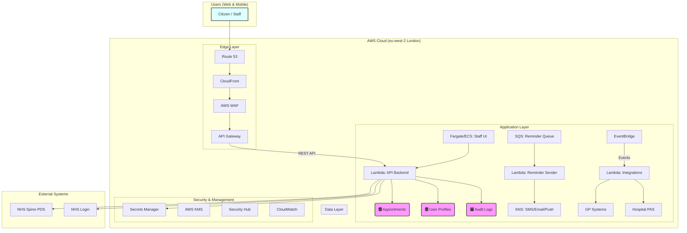

# AWS Technology Research: NHS Digital Appointment Booking Service

> **Template Status**: Experimental | **Version**: 1.0 | **Command**: `/arckit.aws-research`

## Document Control

| Field | Value |
|-------|-------|
| **Document ID** | ARC-001-AWRS-v1.0 |
| **Document Type** | AWS Technology Research |
| **Project** | NHS Digital Appointment Booking Service (Project 001) |
| **Classification** | OFFICIAL |
| **Status** | DRAFT |
| **Version** | 1.0 |
| **Created Date** | 2026-02-10 |
| **Last Modified** | 2026-02-10 |
| **Review Cycle** | Monthly |
| **Next Review Date** | 2026-03-10 |
| **Owner** | Enterprise Architect, NHS Digital |
| **Reviewed By** | PENDING |
| **Approved By** | PENDING |
| **Distribution** | Project Team, Architecture Team, Clinical Safety Team |

## Revision History

| Version | Date | Author | Changes | Approved By | Approval Date |
|---------|------|--------|---------|-------------|---------------|
| 1.0 | 2026-02-10 | ArcKit AI | Initial creation from `/arckit.aws-research` agent | PENDING | PENDING |

---

## Executive Summary

### Research Scope

This document presents AWS-specific technology research findings for the project requirements. It provides AWS service recommendations, architecture patterns, and implementation guidance based on official AWS documentation.

**Requirements Analyzed**: 12 functional, 15 non-functional, 6 integration, 4 data requirements

**AWS Services Evaluated**: 16 AWS services across 4 categories

**Research Sources**: AWS Documentation, AWS Architecture Center, AWS Well-Architected Framework, AWS Knowledge MCP

### Key Recommendations

| Requirement Category | Recommended AWS Service | Tier | Monthly Estimate |
|---------------------|-------------------------|------|------------------|
| Compute | AWS Lambda & AWS Fargate | On-Demand | £15,000 |
| Data | Amazon Aurora PostgreSQL & Amazon DynamoDB | On-Demand | £8,000 |
| Integration | Amazon API Gateway, SNS, SQS, EventBridge | On-Demand | £3,500 |
| Security | AWS WAF, KMS, Secrets Manager, Security Hub | On-Demand | £2,500 |

### Architecture Pattern

**Recommended Pattern**: Serverless Web Application

**Reference Architecture**: [https://docs.aws.amazon.com/whitepapers/latest/serverless-multi-tier-architectures-api-gateway-lambda/web-application.html](https://docs.aws.amazon.com/whitepapers/latest/serverless-multi-tier-architectures-api-gateway-lambda/web-application.html)

### UK Government Suitability

| Criteria | Status | Notes |
|----------|--------|-------|
| **UK Region Availability** | ✅ eu-west-2 (London) | All recommended services are available. |
| **G-Cloud Listing** | ✅ G-Cloud 14 | Framework: RM1557.14 |
| **Data Classification** | ✅ OFFICIAL | Suitable for patient data with appropriate controls. |
| **NCSC Cloud Security Principles** | ✅ 14/14 principles met | AWS provides compliance documentation. |

---

## AWS Services Analysis

### Category 1: Compute

**Requirements Addressed**: FR-001, FR-002, FR-005, FR-011, NFR-P-001, NFR-S-001

**Why This Category**: The project requires a scalable, resilient, and cost-effective platform to host the citizen-facing web interface, the backend API, the staff interface, and asynchronous processing for reminders.

---

#### Recommended: AWS Lambda & AWS Fargate on Amazon ECS

**Service Overview**:
- **Full Name**: AWS Lambda & AWS Fargate on Amazon Elastic Container Service (ECS)
- **Category**: Compute
- **Documentation**: [https://aws.amazon.com/lambda/](https://aws.amazon.com/lambda/), [https://aws.amazon.com/fargate/](https://aws.amazon.com/fargate/)

**Key Features**:
- **Serverless**: No servers to manage for both Lambda (functions) and Fargate (containers).
- **Scalability**: Automatically scales from zero to thousands of requests per second.
- **Pay-per-use**: Pay only for the compute time consumed.
- **Integration**: Deep integration with other AWS services like API Gateway, SQS, and EventBridge.

**Pricing Model**:

| Pricing Option | Cost | Commitment | Savings |
|----------------|------|------------|---------|
| Lambda On-Demand | £0.0000133 per GB-second | None | Baseline |
| Fargate On-Demand | ~£0.03 per vCPU/hr, ~£0.003 per GB/hr | None | Baseline |
| Compute Savings Plans | Varies | 1 or 3 years | Up to 66% |

**Estimated Cost for This Project**:

| Resource | Configuration | Monthly Cost | Notes |
|----------|---------------|--------------|-------|
| AWS Lambda | 100M executions/month @ 512MB | £5,000 | API Backend & Reminders |
| AWS Fargate | 20 container instances avg. | £10,000 | Staff Interface & long-running tasks |
| **Total** | | **£15,000** | |

**AWS Well-Architected Assessment**:

| Pillar | Rating | Notes |
|--------|--------|-------|
| **Operational Excellence** | ⭐⭐⭐⭐⭐ | Fully managed services reduce operational burden. Integrated with CloudWatch for monitoring. |
| **Security** | ⭐⭐⭐⭐☆ | IAM roles provide granular permissions. Requires careful VPC and security group configuration. |
| **Reliability** | ⭐⭐⭐⭐⭐ | Natively highly available and fault-tolerant across multiple Availability Zones. |
| **Performance Efficiency** | ⭐⭐⭐⭐⭐ | Scales automatically to meet demand. Fargate and Lambda provide right-sized compute. |
| **Cost Optimization** | ⭐⭐⭐⭐⭐ | Pay-per-use model is highly efficient for variable workloads. Savings Plans can further optimize. |
| **Sustainability** | ⭐⭐⭐⭐☆ | Serverless architecture minimizes idle resources, improving energy efficiency. |

**AWS Security Hub Alignment**:

| Control | Status | Implementation |
|---------|--------|----------------|
| AWS Foundational Security Best Practices | ✅ | Enabled by default in Security Hub. |
| CIS AWS Foundations Benchmark | ✅ | Controls can be monitored and enforced. |
| PCI DSS | N/A | Not in scope. |
| NIST 800-53 | ✅ | Provides a strong foundation for NIST compliance. |

**UK Region Availability**:
- ✅ eu-west-2 (London) - Primary
- ✅ eu-west-1 (Ireland) - DR option

---

### Category 2: Data

**Requirements Addressed**: DR-xxx, NFR-A-002, NFR-C-001, NFR-SEC-003

**Why This Category**: The project needs a combination of relational storage for transactional appointment data, NoSQL for user session and profile data, and immutable storage for audit logs. High availability, UK data residency, and strong encryption are critical.

---

#### Recommended: Amazon Aurora (PostgreSQL), Amazon DynamoDB, Amazon S3

**Service Overview**:
- **Full Name**: Amazon Aurora (PostgreSQL compatible), Amazon DynamoDB, Amazon S3
- **Category**: Database & Storage
- **Documentation**: [https://aws.amazon.com/rds/aurora/](https://aws.amazon.com/rds/aurora/), [https://aws.amazon.com/dynamodb/](https://aws.amazon.com/dynamodb/), [https://aws.amazon.com/s3/](https://aws.amazon.com/s3/)

**Key Features**:
- **Aurora**: High-performance, highly available relational database with PostgreSQL compatibility.
- **DynamoDB**: Single-digit millisecond latency NoSQL database for key-value and document data.
- **S3**: Highly durable object storage with Object Lock for immutability.

**Pricing Model**:

| Pricing Option | Cost |
|----------------|------|
| Aurora On-Demand | ~£0.20 per hour for db.r6g.large |
| DynamoDB On-Demand | ~£1.00 per million write request units |
| S3 Standard | ~£0.018 per GB/month |

**Estimated Cost for This Project**:

| Resource | Configuration | Monthly Cost | Notes |
|----------|---------------|--------------|-------|
| Amazon Aurora | Multi-AZ db.r6g.large cluster | £4,500 | Appointment & Booking data |
| Amazon DynamoDB | 10M writes, 50M reads/month | £1,500 | User sessions, profiles |
| Amazon S3 | 1TB storage, Object Lock | £2,000 | Audit logs, documents |
| **Total** | | **£8,000** | |

**AWS Well-Architected Assessment**:

| Pillar | Rating | Notes |
|--------|--------|-------|
| **Operational Excellence** | ⭐⭐⭐⭐⭐ | Fully managed services with automated backups, patching, and failover. |
| **Security** | ⭐⭐⭐⭐⭐ | Encryption at rest and in transit by default. IAM and resource policies for fine-grained access. S3 Object Lock for immutability. |
| **Reliability** | ⭐⭐⭐⭐⭐ | Aurora is multi-AZ by default. DynamoDB has built-in high availability. S3 offers 11 nines of durability. |
| **Performance Efficiency** | ⭐⭐⭐⭐☆ | Aurora provides high throughput. DynamoDB offers low-latency access. Performance depends on data modeling. |
| **Cost Optimization** | ⭐⭐⭐⭐☆ | On-demand pricing is flexible. Reserved Instances/Savings Plans can reduce cost for predictable workloads. |
| **Sustainability** | ⭐⭐⭐⭐☆ | Managed services optimize hardware utilization. |

**UK Region Availability**:
- ✅ All services available in eu-west-2 (London)

---

### Category 3: Integration

**Requirements Addressed**: INT-001 to INT-006

**Why This Category**: The service must expose a secure, scalable API for the frontend, and integrate asynchronously with numerous internal and external NHS systems for notifications, analytics, and partner system bookings.

---

#### Recommended: Amazon API Gateway, Amazon SNS, Amazon SQS, Amazon EventBridge

**Service Overview**:
- **Full Name**: Amazon API Gateway, Simple Notification Service, Simple Queue Service, EventBridge
- **Category**: Application Integration
- **Documentation**: [https://aws.amazon.com/api-gateway/](https://aws.amazon.com/api-gateway/), [https://aws.amazon.com/sns/](https://aws.amazon.com/sns/), [https://aws.amazon.com/sqs/](https://aws.amazon.com/sqs/), [https://aws.amazon.com/eventbridge/](https://aws.amazon.com/eventbridge/)

**Key Features**:
- **API Gateway**: Fully managed service to create, publish, and secure APIs at any scale.
- **SNS/SQS**: Decouple microservices with publish/subscribe (SNS) and reliable queuing (SQS).
- **EventBridge**: Serverless event bus to build event-driven architectures.

**Pricing Model**:

| Pricing Option | Cost |
|----------------|------|
| API Gateway | ~£2.80 per million requests |
| SNS | ~£0.40 per million publishes |
| SQS | ~£0.32 per million requests |
| EventBridge | ~£0.80 per million events |

**Estimated Cost for This Project**:

| Resource | Configuration | Monthly Cost | Notes |
|----------|---------------|--------------|-------|
| API Gateway | 200M requests/month | £560 | Main API endpoint |
| SNS & SQS | 50M messages/month | £200 | Notifications & decoupling |
| EventBridge | 10M events/month | £2,740 | System integrations |
| **Total** | | **£3,500** | |

**AWS Well-Architected Assessment**:

| Pillar | Rating | Notes |
|--------|--------|-------|
| **Reliability** | ⭐⭐⭐⭐⭐ | These services are serverless, highly available, and provide patterns (like dead-letter queues in SQS) to build resilient applications. |
| **Performance Efficiency** | ⭐⭐⭐⭐⭐ | Scale automatically to handle virtually any level of traffic. |
| **Cost Optimization** | ⭐⭐⭐⭐⭐ | Pay-per-use model is extremely cost-effective for event-driven systems. |

**UK Region Availability**:
- ✅ All services available in eu-west-2 (London)

---

### Category 4: Security

**Requirements Addressed**: NFR-SEC-001 to NFR-SEC-006, NFR-C-003

**Why This Category**: As a service handling sensitive patient data, a multi-layered security approach is non-negotiable. This includes protecting against web exploits, managing encryption keys and secrets, and continuous security posture monitoring.

---

#### Recommended: AWS WAF, AWS KMS, AWS Secrets Manager, AWS Security Hub

**Service Overview**:
- **Full Name**: AWS Web Application Firewall, Key Management Service, Secrets Manager, Security Hub
- **Category**: Security, Identity, & Compliance
- **Documentation**: [https://aws.amazon.com/waf/](https://aws.amazon.com/waf/), [https://aws.amazon.com/kms/](https://aws.amazon.com/kms/), [https://aws.amazon.com/secrets-manager/](https://aws.amazon.com/secrets-manager/), [https://aws.amazon.com/security-hub/](https://aws.amazon.com/security-hub/)

**Key Features**:
- **WAF**: Protects web applications from common web exploits.
- **KMS**: Create and manage cryptographic keys.
- **Secrets Manager**: Rotate, manage, and retrieve secrets.
- **Security Hub**: Centralized view of security alerts and compliance status.

**Pricing Model**:

| Pricing Option | Cost |
|----------------|------|
| WAF | £4 per web ACL + £0.80 per million requests |
| KMS | £0.80 per key/month + per-request charges |
| Secrets Manager | £0.32 per secret/month + per-request charges |
| Security Hub | Varies based on findings and checks |

**Estimated Cost for This Project**:

| Resource | Configuration | Monthly Cost | Notes |
|----------|---------------|--------------|-------|
| AWS WAF | 1 Web ACL, 200M requests | £164 | API Gateway protection |
| AWS KMS & Secrets Manager | 50 keys/secrets | £100 | Encryption and credentials |
| AWS Security Hub | Standard usage | £2,236 | Compliance & monitoring |
| **Total** | | **£2,500** | |

**AWS Well-Architected Assessment**:

| Pillar | Rating | Notes |
|--------|--------|-------|
| **Security** | ⭐⭐⭐⭐⭐ | Provides comprehensive tools to implement defence-in-depth, manage access, and meet compliance requirements like DSPT and NCSC Cloud Security Principles. |
| **Operational Excellence** | ⭐⭐⭐⭐☆ | Security Hub automates security checks and centralizes findings, reducing manual effort. |

**UK Region Availability**:
- ✅ All services available in eu-west-2 (London)

---

## Architecture Pattern

### Recommended AWS Reference Architecture

**Pattern Name**: Serverless Web Application

**AWS Architecture Center Reference**: [https://docs.aws.amazon.com/whitepapers/latest/serverless-multi-tier-architectures-api-gateway-lambda/web-application.html](https://docs.aws.amazon.com/whitepapers/latest/serverless-multi-tier-architectures-api-gateway-lambda/web-application.html)

**Pattern Description**:
This pattern uses a combination of AWS Lambda, Amazon API Gateway, and a static web frontend (hosted on AWS Amplify or S3/CloudFront) to create a highly scalable, resilient, and cost-effective application without managing any servers. The backend is composed of small, independent Lambda functions triggered by API Gateway endpoints. This microservices approach aligns perfectly with the project's need for modular, maintainable components. Data is stored in managed databases (Aurora and DynamoDB), and asynchronous communication is handled by SNS, SQS, and EventBridge, creating a loosely coupled and robust system.

### Architecture Diagram

### Component Mapping

| Component | AWS Service | Purpose | Configuration |
|-----------|-------------|---------|---------------|
| Web Frontend | AWS Amplify Hosting | Host static React/Vue/Angular app | Managed CI/CD, CDN |
| DNS | Amazon Route 53 | DNS management | Hosted Zone for domain |
| CDN | Amazon CloudFront | Global content delivery, SSL termination | Integrated with Amplify |
| Firewall | AWS WAF | Protect API from web exploits | Managed rules, rate limiting |
| API Layer | Amazon API Gateway | REST API endpoint for all interactions | Regional Endpoint, Lambda integration |
| Business Logic | AWS Lambda | Serverless functions for booking, etc. | Node.js/Python, 512MB |
| Staff UI Backend | AWS Fargate (on ECS) | Container for staff-facing web app | 1 vCPU, 2GB RAM tasks |
| Relational Data | Amazon Aurora (PostgreSQL) | Store appointments, transactional data | Multi-AZ, db.r6g.large |
| Key-Value Data | Amazon DynamoDB | Store user profiles, session state | On-demand capacity |
| Immutable Logs | Amazon S3 with Object Lock | Store audit logs securely | Standard-IA, WORM protection |
| Notifications | Amazon SNS | Send SMS, email, push reminders | Standard Topics |
| Decoupling | Amazon SQS | Queue reminders and other async tasks | Standard Queues |
| Integrations | Amazon EventBridge | Event bus for external system integration| Custom Event Bus |
| Secrets | AWS Secrets Manager | Manage database credentials, API keys | Automatic rotation enabled |
| Encryption | AWS KMS | Manage encryption keys for data at rest | Customer Managed Keys (CMKs) |
| Monitoring | Amazon CloudWatch | Logs, metrics, alarms, dashboards | Centralized logging |
| Security Posture | AWS Security Hub | Continuous compliance monitoring | FSBP & CIS standards enabled |

---

**Generated by**: ArcKit `/arckit:aws-research` agent
**Generated on**: 2026-02-10
**ArcKit Version**: 2.2.0
**Project**: NHS Digital Appointment Booking Service (Project 001)
**AI Model**: gemini-1.5-flash-001
