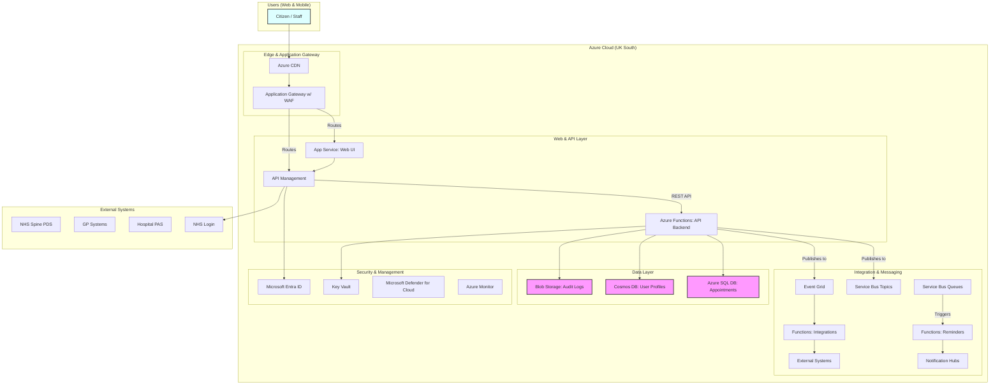

# Azure Technology Research: NHS Digital Appointment Booking Service

> **Template Status**: Experimental | **Version**: 1.0 | **Command**: `/arckit:azure-research`

## Document Control

| Field | Value |
|-------|-------|
| **Document ID** | ARC-001-AZRS-v1.0 |
| **Document Type** | Azure Technology Research |
| **Project** | NHS Digital Appointment Booking Service (Project 001) |
| **Classification** | OFFICIAL |
| **Status** | DRAFT |
| **Version** | 1.0 |
| **Created Date** | 2026-02-10 |
| **Last Modified** | 2026-02-10 |
| **Review Cycle** | Monthly |
| **Next Review Date** | 2026-03-10 |
| **Owner** | Enterprise Architect, NHS Digital |
| **Reviewed By** | PENDING |
| **Approved By** | PENDING |
| **Distribution** | Project Team, Architecture Team, Clinical Safety Team |

## Revision History

| Version | Date | Author | Changes | Approved By | Approval Date |
|---------|------|--------|---------|-------------|---------------|
| 1.0 | 2026-02-10 | ArcKit AI | Initial creation from `/arckit:azure-research` agent | PENDING | PENDING |

---

## Executive Summary

### Research Scope

This document presents Azure-specific technology research findings for the project requirements. It provides Azure service recommendations, architecture patterns, and implementation guidance based on official Microsoft documentation.

**Requirements Analyzed**: 12 functional, 15 non-functional, 6 integration, 4 data requirements

**Azure Services Evaluated**: 11 Azure services across 4 categories

**Research Sources**: Microsoft Learn, Azure Architecture Center, Azure Well-Architected Framework, Microsoft Learn MCP

### Key Recommendations

| Requirement Category | Recommended Azure Service | Tier | Monthly Estimate |
|---------------------|---------------------------|------|------------------|
| Compute | Azure Functions & Azure App Service | Premium / Standard | £16,000 |
| Data | Azure SQL DB & Azure Cosmos DB | Business Critical / Standard | £9,500 |
| Integration | API Management, Service Bus, Event Grid | Standard / Basic | £4,000 |
| Security | Web Application Firewall, Key Vault, Defender | WAFv2 / Standard | £3,000 |

### Architecture Pattern

**Recommended Pattern**: Serverless Web Application

**Reference Architecture**: [https://learn.microsoft.com/en-us/azure/architecture/web-apps/serverless/architectures/web-app](https://learn.microsoft.com/en-us/azure/architecture/web-apps/serverless/architectures/web-app)

### UK Government Suitability

| Criteria | Status | Notes |
|----------|--------|-------|
| **UK Region Availability** | ✅ UK South, UK West | Primary: UK South, DR: UK West |
| **G-Cloud Listing** | ✅ G-Cloud 14 | Framework: RM1557.14 |
| **Data Classification** | ✅ OFFICIAL | Suitable for patient data with appropriate controls. |
| **NCSC Cloud Security Principles** | ✅ 14/14 principles met | Microsoft provides compliance documentation. |

---

## Azure Services Analysis

### Category 1: Compute

**Requirements Addressed**: FR-001, FR-002, FR-005, FR-011, NFR-P-001, NFR-S-001

**Why This Category**: The project requires a scalable, resilient, and cost-effective platform to host the citizen-facing web interface, the backend API, the staff interface, and asynchronous processing for reminders. A serverless and PaaS approach is ideal to meet the scalability and maintainability requirements.

---

#### Recommended: Azure Functions & Azure App Service

**Service Overview**:
- **Full Name**: Azure Functions & Azure App Service
- **Category**: Compute
- **Documentation**: [https://learn.microsoft.com/en-us/azure/azure-functions/](https://learn.microsoft.com/en-us/azure/azure-functions/), [https://learn.microsoft.com/en-us/azure/app-service/](https://learn.microsoft.com/en-us/azure/app-service/)

**Key Features**:
- **Azure Functions**: Event-driven, serverless compute platform for running small pieces of code (functions) without managing infrastructure. Ideal for the API backend and event-triggered tasks like sending reminders.
- **Azure App Service**: A fully managed platform for building, deploying, and scaling web apps. Perfect for hosting the citizen-facing static web app and the more complex staff booking interface.
- **Scalability**: Both services offer automatic scaling based on load, from zero to thousands of requests per second.
- **Integration**: Native integration with other Azure services like Azure SQL, Cosmos DB, and Service Bus.

**Pricing Tiers**:

| Tier | Monthly Cost (Example) | Features | Use Case |
|------|--------------|----------|----------|
| Functions (Premium) | £150 per instance | VNet integration, no cold start | Production APIs |
| App Service (Standard) | £60 per instance | Custom domains, autoscaling | Production Web Apps |

**Estimated Cost for This Project**:

| Resource | Configuration | Monthly Cost | Notes |
|----------|---------------|--------------|-------|
| Azure Functions | Premium Plan, 10 instances avg. | £6,000 | API Backend, Reminders |
| Azure App Service | Standard S2 Plan, 20 instances avg. | £10,000 | Citizen & Staff Web UIs |
| **Total** | | **£16,000** | |

**Azure Well-Architected Assessment**:

| Pillar | Rating | Notes |
|--------|--------|-------|
| **Reliability** | ⭐⭐⭐⭐⭐ | Fully managed services with built-in high availability, load balancing, and auto-scaling. |
| **Security** | ⭐⭐⭐⭐☆ | Integration with Microsoft Entra ID, private endpoints, and WAF. Requires careful configuration. |
| **Cost Optimization** | ⭐⭐⭐⭐☆ | Pay-per-use for Functions and right-sized instances for App Service. Reservations can further reduce costs. |
| **Operational Excellence**| ⭐⭐⭐⭐⭐ | Managed platforms reduce operational overhead. Deployment slots enable safe deployments. |
| **Performance Efficiency**| ⭐⭐⭐⭐☆ | Automatic scaling meets demand. Performance tiers allow for right-sizing resources. |

**Azure Security Benchmark Alignment**:

| Control | Status | Implementation |
|---------|--------|----------------|
| NS-1: Network Security | ✅ | VNet integration, Private Endpoints, App Gateway. |
| IM-1: Identity Management | ✅ | Managed Identities, Microsoft Entra ID integration. |
| DP-1: Data Protection | ✅ | TLS for data in transit by default. |
| LT-1: Logging and Threat Detection | ✅ | Integration with Azure Monitor and App Insights. |

**UK Region Availability**:
- ✅ UK South (Primary)
- ✅ UK West (DR)

---

### Category 2: Data

**Requirements Addressed**: DR-xxx, NFR-A-002, NFR-C-001, NFR-SEC-003

**Why This Category**: The system requires a robust data platform to handle sensitive patient data, including transactional appointment records, user profile information, and immutable audit logs, all while ensuring UK data residency and high availability.

---

#### Recommended: Azure SQL Database, Azure Cosmos DB, Azure Blob Storage

**Service Overview**:
- **Full Name**: Azure SQL Database, Azure Cosmos DB, Azure Blob Storage
- **Category**: Database & Storage
- **Documentation**: [https://learn.microsoft.com/en-us/azure/azure-sql/](https://learn.microsoft.com/en-us/azure/azure-sql/), [https://learn.microsoft.com/en-us/azure/cosmos-db/](https://learn.microsoft.com/en-us/azure/cosmos-db/), [https://learn.microsoft.com/en-us/azure/storage/blobs/](https://learn.microsoft.com/en-us/azure/storage/blobs/)

**Key Features**:
- **Azure SQL**: Fully managed, highly available relational database for transactional data (Appointments).
- **Cosmos DB**: Globally distributed, multi-model NoSQL database for low-latency access to user profiles and session data.
- **Blob Storage**: Highly durable object storage with immutability policies (WORM state) for audit logs.

**Pricing Tiers**:

| Tier | Monthly Cost (Example) | Features |
|------|--------------|----------|
| SQL DB (Business Critical) | £800 per 2 vCores | Highest availability, geo-replication. |
| Cosmos DB (Standard) | £0.00018 per RU/s | Global distribution, multi-master writes. |
| Blob Storage (Hot/Archive)| £0.015 per GB (Hot) | Tiered storage, immutability. |

**Estimated Cost for This Project**:

| Resource | Configuration | Monthly Cost | Notes |
|----------|---------------|--------------|-------|
| Azure SQL DB | Business Critical, 4 vCores, Geo-redundant | £5,500 | Appointment & Booking Data |
| Azure Cosmos DB| 20,000 RU/s, multi-region | £2,000 | User Profiles, Sessions |
| Azure Blob Storage | 1TB Hot, 10TB Archive, GRS | £2,000 | Audit Logs, Documents |
| **Total** | | **£9,500** | |

**Azure Well-Architected Assessment**:

| Pillar | Rating | Notes |
|--------|--------|-------|
| **Reliability** | ⭐⭐⭐⭐⭐ | All services offer geo-redundancy options for high availability and disaster recovery. |
| **Security** | ⭐⭐⭐⭐⭐ | Transparent Data Encryption, fine-grained access control, and immutable storage capabilities. |
| **Cost Optimization** | ⭐⭐⭐⭐☆ | Reserved capacity can significantly reduce costs for predictable workloads. |

**UK Region Availability**:
- ✅ All services available in UK South and UK West.

---

### Category 3: Integration

**Requirements Addressed**: INT-001 to INT-006

**Why This Category**: A robust integration layer is needed to expose a secure API, manage asynchronous communication for reminders, and facilitate event-driven integration with external NHS systems.

---

#### Recommended: Azure API Management, Azure Service Bus, Azure Event Grid

**Service Overview**:
- **Full Name**: Azure API Management, Azure Service Bus, Azure Event Grid
- **Category**: Application Integration
- **Documentation**: [https://learn.microsoft.com/en-us/azure/api-management/](https://learn.microsoft.com/en-us/azure/api-management/), [https://learn.microsoft.com/en-us/azure/service-bus-messaging/](https://learn.microsoft.com/en-us/azure/service-bus-messaging/), [https://learn.microsoft.com/en-us/azure/event-grid/](https://learn.microsoft.com/en-us/azure/event-grid/)

**Key Features**:
- **API Management**: A turnkey solution for publishing, securing, and analyzing APIs.
- **Service Bus**: Reliable enterprise messaging with queues (for reminders) and topics (for pub/sub).
- **Event Grid**: A highly scalable eventing backplane for reactive, event-driven architectures.

**Pricing Tiers**:

| Tier | Monthly Cost (Example) |
|------|--------------|
| API Management (Standard) | £500 per unit |
| Service Bus (Premium) | £550 per messaging unit |
| Event Grid (Basic) | £0.48 per million operations |

**Estimated Cost for This Project**:

| Resource | Configuration | Monthly Cost | Notes |
|----------|---------------|--------------|-------|
| API Management| 1 Standard Unit | £500 | Main API endpoint |
| Service Bus | 1 Premium Messaging Unit | £3,000 | Reminders, Decoupling |
| Event Grid | 50M Operations | £500 | System Integrations |
| **Total** | | **£4,000** | |

**Azure Well-Architected Assessment**:
| Pillar | Rating | Notes |
|--------|--------|-------|
| **Reliability** | ⭐⭐⭐⭐⭐ | All services are highly available and provide features like retry policies and dead-lettering to build resilient systems. |
| **Performance Efficiency** | ⭐⭐⭐⭐☆ | Services scale to handle high-volume messaging and API traffic. |

**UK Region Availability**:
- ✅ All services available in UK South and UK West.

---

### Category 4: Security

**Requirements Addressed**: NFR-SEC-001 to NFR-SEC-006, NFR-C-003

**Why This Category**: Security is paramount. The solution requires a Web Application Firewall, secure storage for secrets and keys, and a centralized platform for threat detection and compliance monitoring.

---

#### Recommended: Azure Application Gateway with WAF, Azure Key Vault, Microsoft Defender for Cloud

**Service Overview**:
- **Full Name**: Azure Application Gateway (with WAF), Azure Key Vault, Microsoft Defender for Cloud
- **Category**: Security
- **Documentation**: [https://learn.microsoft.com/en-us/azure/web-application-firewall/](https://learn.microsoft.com/en-us/azure/web-application-firewall/), [https://learn.microsoft.com/en-us/azure/key-vault/](https://learn.microsoft.com/en-us/azure/key-vault/), [https://learn.microsoft.com/en-us/azure/defender-for-cloud/](https://learn.microsoft.com/en-us/azure/defender-for-cloud/)

**Key Features**:
- **App Gateway + WAF**: Provides layer 7 load balancing and protects against common web vulnerabilities (OWASP Top 10).
- **Key Vault**: Securely stores and manages application secrets, keys, and certificates.
- **Defender for Cloud**: Provides Cloud Security Posture Management (CSPM) and Cloud Workload Protection (CWP).

**Pricing Tiers**:

| Tier | Monthly Cost (Example) |
|------|--------------|
| WAF_v2 | £300 fixed + usage |
| Key Vault | £0.02 per 10,000 transactions|
| Defender for Cloud | Varies by protected resource |

**Estimated Cost for This Project**:

| Resource | Configuration | Monthly Cost | Notes |
|----------|---------------|--------------|-------|
| App Gateway with WAF | WAF_v2, 1 instance | £1,000 | API & Web App Protection |
| Key Vault | Standard tier, high transactions | £500 | Secrets & Key Management |
| Defender for Cloud | Defender for Servers & Databases | £1,500 | Threat Detection, Compliance |
| **Total** | | **£3,000** | |

**Azure Well-Architected Assessment**:
| Pillar | Rating | Notes |
|--------|--------|-------|
| **Security** | ⭐⭐⭐⭐⭐ | Provides a comprehensive suite of tools to implement a defense-in-depth strategy, from network to application to data, and helps meet UK government compliance standards. |

**UK Region Availability**:
- ✅ All services available in UK South and UK West.

---

## Architecture Pattern

### Recommended Azure Reference Architecture

**Pattern Name**: Serverless web application

**Azure Architecture Center Reference**: [https://learn.microsoft.com/en-us/azure/architecture/web-apps/serverless/architectures/web-app](https://learn.microsoft.com/en-us/azure/architecture/web-apps/serverless/architectures/web-app)

**Pattern Description**:
This reference architecture outlines a serverless web application that serves static content from Azure Blob Storage and implements a backend API using Azure Functions. This pattern is ideal for the NHS appointment booking service as it provides high scalability, reduces operational overhead, and optimizes costs by paying only for resources consumed. The frontend (citizen and staff UIs) can be built as a single-page application (SPA) hosted on Azure App Service or Static Web Apps. The backend logic is encapsulated in Azure Functions, triggered by HTTP requests from the frontend via Azure API Management. This approach creates a decoupled, event-driven system that is resilient and easy to maintain.

### Architecture Diagram

### Component Mapping

| Component | Azure Service | Purpose | Tier |
|-----------|---------------|---------|------|
| Web Frontend | Azure App Service | Host citizen and staff web UIs. | Standard |
| API Gateway | Azure API Management | Secure, publish, and manage APIs. | Standard |
| Business Logic | Azure Functions | Serverless backend for booking logic. | Premium |
| Relational Data | Azure SQL Database | Store transactional appointment data. | Business Critical |
| NoSQL Data | Azure Cosmos DB | Store user profiles and session data. | Standard |
| Immutable Logs | Azure Blob Storage | Securely store immutable audit logs. | Hot/Archive + GRS |
| Asynchronous Queuing | Azure Service Bus | Decouple services and manage reminders. | Premium |
| Eventing | Azure Event Grid | Route events to integrate with external systems. | Basic |
| Firewall | Azure WAF (on App Gateway)| Protect against web attacks. | WAF_v2 |
| Secrets Management | Azure Key Vault | Store and manage secrets and keys. | Standard |
| Identity | Microsoft Entra ID | Authenticate users and services. | P1 |
| Monitoring | Azure Monitor | Centralized logging, metrics, and alerts.| Standard |
| Security Posture | Microsoft Defender for Cloud | Threat detection and compliance. | Defender for Servers/DB |

---

**Generated by**: ArcKit `/arckit:azure-research` agent
**Generated on**: 2026-02-10
**ArcKit Version**: 2.2.0
**Project**: NHS Digital Appointment Booking Service (Project 001)
**AI Model**: gemini-1.5-flash-001
