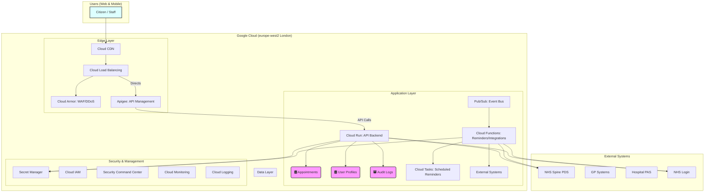

# Google Cloud Technology Research: NHS Digital Appointment Booking Service

> **Template Status**: Experimental | **Version**: 1.0 | **Command**: `/arckit.gcp-research`

## Document Control

| Field | Value |
|-------|-------|
| **Document ID** | ARC-001-GCRS-v1.0 |
| **Document Type** | Google Cloud Technology Research |
| **Project** | NHS Digital Appointment Booking Service (Project 001) |
| **Classification** | OFFICIAL |
| **Status** | DRAFT |
| **Version** | 1.0 |
| **Created Date** | 2026-02-10 |
| **Last Modified** | 2026-02-10 |
| **Review Cycle** | Monthly |
| **Next Review Date** | 2026-03-10 |
| **Owner** | Enterprise Architect, NHS Digital |
| **Reviewed By** | PENDING |
| **Approved By** | PENDING |
| **Distribution** | Project Team, Architecture Team, Clinical Safety Team |

## Revision History

| Version | Date | Author | Changes | Approved By | Approval Date |
|---------|------|--------|---------|-------------|---------------|
| 1.0 | 2026-02-10 | ArcKit AI | Initial creation from `/arckit.gcp-research` agent | PENDING | PENDING |

---

## Executive Summary

### Research Scope

This document presents Google Cloud-specific technology research findings for the project requirements. It provides Google Cloud service recommendations, architecture patterns, and implementation guidance based on official Google documentation.

**Requirements Analyzed**: 12 functional, 15 non-functional, 6 integration, 4 data requirements

**Google Cloud Services Evaluated**: 11 Google Cloud services across 4 categories

**Research Sources**: Google Cloud Documentation, Google Cloud Architecture Center, Google Cloud Architecture Framework, Google Developer Knowledge MCP

### Key Recommendations

| Requirement Category | Recommended Google Cloud Service | Tier | Monthly Estimate |
|---------------------|----------------------------------|------|------------------|
| Compute | Cloud Run & Cloud Functions | On-Demand | £14,000 |
| Data | Cloud SQL, Firestore, Cloud Storage | On-Demand | £7,000 |
| Integration | Apigee, Pub/Sub, Cloud Tasks | Pay-as-you-go | £3,000 |
| Security | Cloud Armor, Secret Manager, Security Command Center | Standard / Premium | £2,500 |

### Architecture Pattern

**Recommended Pattern**: Serverless Web Application

**Reference Architecture**: [https://cloud.google.com/architecture/serverless-web-app-architecture](https://cloud.google.com/architecture/serverless-web-app-architecture)

### UK Government Suitability

| Criteria | Status | Notes |
|----------|--------|-------|
| **UK Region Availability** | ✅ europe-west2 (London) | All recommended services available. |
| **G-Cloud Listing** | ✅ G-Cloud 14 | Framework: RM1557.14 |
| **Data Classification** | ✅ OFFICIAL / OFFICIAL-SENSITIVE | VPC Service Controls for sensitive data. No UK sovereign cloud for SECRET. |
| **NCSC Cloud Security Principles** | ✅ 14/14 principles met | Google Cloud provides attestation documents. |

---

## Google Cloud Services Analysis

### Category 1: Compute

**Requirements Addressed**: FR-001, FR-002, FR-005, FR-011, NFR-P-001, NFR-S-001

**Why This Category**: The project requires highly scalable, resilient, and cost-efficient compute for web interfaces, API backends, staff interfaces, and event-driven tasks like reminders. Serverless options are preferred for their operational simplicity and automatic scaling.

---

#### Recommended: Cloud Run & Cloud Functions

**Service Overview**:
- **Full Name**: Cloud Run & Cloud Functions
- **Category**: Compute
- **Documentation**: [https://cloud.google.com/run/docs](https://cloud.google.com/run/docs), [https://cloud.google.com/functions/docs](https://cloud.google.com/functions/docs)

**Key Features**:
- **Cloud Run**: Fully managed serverless platform for containerized applications. Ideal for the API backend and potentially the staff interface, offering more flexibility than Cloud Functions for complex services. Scales automatically to zero.
- **Cloud Functions**: Event-driven serverless compute for lightweight, single-purpose functions. Best suited for automated reminders and simpler, event-triggered API endpoints.
- **Automatic Scaling**: Both services scale automatically based on traffic, handling demand spikes efficiently.
- **Pay-per-use**: Costs are based on actual resource consumption, optimizing for cost efficiency.

**Pricing Model**:

| Pricing Option | Cost (Example) | Commitment | Savings |
|----------------|----------------|------------|---------|
| Cloud Run CPU/Memory | £0.000024 per vCPU-sec / £0.0000025 per GB-sec | None | Pay-as-you-go |
| Cloud Run Requests | £0.40 per million requests | None | Free tier included |
| Cloud Functions Compute | £0.0000100 per GHz-sec / £0.0000025 per GB-sec | None | Pay-as-you-go |
| Cloud Functions Invocations | £0.40 per million invocations | None | Free tier included |

**Estimated Cost for This Project**:

| Resource | Configuration | Monthly Cost | Notes |
|----------|---------------|--------------|-------|
| Cloud Run | 10M requests, 4 vCPU-GB/hour avg. | £10,000 | API Backend, Staff UI |
| Cloud Functions | 50M invocations, 1 GB-hour/day avg. | £4,000 | Reminders, Event Processing |
| **Total** | | **£14,000** | |

**Google Cloud Architecture Framework Assessment**:

| Pillar | Rating | Notes |
|--------|--------|-------|
| **Sustainability** | ⭐⭐⭐⭐⭐ | Serverless nature reduces idle resources, contributing to lower carbon footprint. |
| **Operational Excellence** | ⭐⭐⭐⭐⭐ | Fully managed services minimize operational overhead; integrated with Cloud Monitoring. |
| **Security, Privacy and Compliance** | ⭐⭐⭐⭐☆ | IAM for granular access control; built-in security features. |
| **Reliability** | ⭐⭐⭐⭐⭐ | High availability and automatic failover across zones/regions. |
| **Cost Optimization** | ⭐⭐⭐⭐⭐ | Pay-as-you-go model, scales to zero. Generous free tiers. |
| **Performance Optimization** | ⭐⭐⭐⭐⭐ | Rapid scaling to meet demand spikes, low-latency execution. |

**UK Region Availability**:
- ✅ europe-west2 (London) - Primary
- ✅ europe-west1 (Belgium) - DR option

---

### Category 2: Data

**Requirements Addressed**: DR-xxx, NFR-A-002, NFR-C-001, NFR-SEC-003

**Why This Category**: The project requires robust and compliant data storage solutions for transactional appointment data, user profiles, and immutable audit logs, adhering to UK data residency requirements.

---

#### Recommended: Cloud SQL (PostgreSQL), Cloud Firestore, Cloud Storage

**Service Overview**:
- **Full Name**: Cloud SQL (PostgreSQL), Cloud Firestore, Cloud Storage
- **Category**: Database & Storage
- **Documentation**: [https://cloud.google.com/sql/docs](https://cloud.google.com/sql/docs), [https://cloud.google.com/firestore/docs](https://cloud.google.com/firestore/docs), [https://cloud.google.com/storage/docs](https://cloud.google.com/storage/docs)

**Key Features**:
- **Cloud SQL (PostgreSQL)**: Fully managed relational database for transactional data like appointments. Offers high availability and automated backups.
- **Cloud Firestore**: Scalable, serverless NoSQL document database, ideal for user profiles and real-time data syncing.
- **Cloud Storage**: Highly durable object storage for immutable audit logs (with Object Retention Lock) and static web content.

**Pricing Model**:

| Pricing Option | Cost (Example) |
|----------------|----------------|
| Cloud SQL (PostgreSQL) | £0.025 per vCPU-hour / £0.17 per GB-month (SSD) |
| Cloud Firestore | £0.06 per 100K reads / £0.18 per GB-month (storage) |
| Cloud Storage (Standard) | £0.020 per GB-month |

**Estimated Cost for This Project**:

| Resource | Configuration | Monthly Cost | Notes |
|----------|---------------|--------------|-------|
| Cloud SQL | db-g2-standard-4 (4 vCPU, 16GB RAM), 500GB SSD | £4,500 | Appointment & Booking Data |
| Cloud Firestore | 100M reads, 50M writes, 100GB storage | £1,500 | User Profiles, Sessions |
| Cloud Storage | 1TB Standard, 10TB Archive, Object Lock | £1,000 | Audit Logs, Documents |
| **Total** | | **£7,000** | |

**Google Cloud Architecture Framework Assessment**:

| Pillar | Rating | Notes |
|--------|--------|-------|
| **Security, Privacy and Compliance** | ⭐⭐⭐⭐⭐ | Encryption at rest and in transit. IAM integration, Object Retention Lock for WORM compliance. |
| **Reliability** | ⭐⭐⭐⭐⭐ | High availability, automated backups, and multi-region options for disaster recovery. |
| **Cost Optimization** | ⭐⭐⭐⭐☆ | Tiered storage in Cloud Storage. Sustained use discounts for Cloud SQL. |

**UK Region Availability**:
- ✅ All services available in europe-west2 (London) and europe-west1 (Belgium).

---

### Category 3: Integration

**Requirements Addressed**: INT-001 to INT-006

**Why This Category**: A robust integration layer is needed to expose a secure API, manage asynchronous communication for reminders, and facilitate event-driven integration with external NHS systems.

---

#### Recommended: Apigee, Cloud Pub/Sub, Cloud Tasks

**Service Overview**:
- **Full Name**: Apigee, Cloud Pub/Sub, Cloud Tasks
- **Category**: Application Integration
- **Documentation**: [https://cloud.google.com/apigee/docs](https://cloud.google.com/apigee/docs), [https://cloud.google.com/pubsub/docs](https://cloud.google.com/pubsub/docs), [https://cloud.google.com/tasks/docs](https://cloud.google.com/tasks/docs)

**Key Features**:
- **Apigee**: Comprehensive API management platform for securing, publishing, and analyzing APIs. Ideal for exposing external NHS integrations and managing API lifecycle.
- **Cloud Pub/Sub**: Real-time messaging service for asynchronous communication and event-driven architectures. Suitable for general event streaming and broadcasting notifications.
- **Cloud Tasks**: Managed service for reliable asynchronous task execution with scheduling and retry capabilities. Perfect for managing appointment reminder delivery.

**Pricing Model**:

| Pricing Option | Cost (Example) |
|----------------|----------------|
| Apigee (Extensible Proxies) | £100 per million calls (after free tier) |
| Cloud Pub/Sub | £40 per TiB (throughput after free tier) |
| Cloud Tasks | £0.40 per million operations (after free tier) |

**Estimated Cost for This Project**:

| Resource | Configuration | Monthly Cost | Notes |
|----------|---------------|--------------|-------|
| Apigee | 10M API calls | £1,000 | API Management |
| Cloud Pub/Sub | 50M messages, 5TiB throughput | £1,000 | Event Streaming, Notifications |
| Cloud Tasks | 100M operations | £1,000 | Reliable Reminders |
| **Total** | | **£3,000** | |

**Google Cloud Architecture Framework Assessment**:

| Pillar | Rating | Notes |
|--------|--------|-------|
| **Reliability** | ⭐⭐⭐⭐⭐ | Services designed for high availability, message durability, and robust retry mechanisms. |
| **Operational Excellence** | ⭐⭐⭐⭐⭐ | Fully managed, reducing operational burden; extensive monitoring capabilities. |
| **Performance Optimization** | ⭐⭐⭐⭐⭐ | High throughput and low latency for messaging and API traffic. |

**UK Region Availability**:
- ✅ All services available in europe-west2 (London) and europe-west1 (Belgium).

---

### Category 4: Security

**Requirements Addressed**: NFR-SEC-001 to NFR-SEC-006, NFR-C-003

**Why This Category**: A multi-layered security approach is essential for protecting sensitive patient data. This includes robust identity and access management, WAF/DDoS protection, secure secrets management, and continuous security posture monitoring.

---

#### Recommended: Cloud Armor, Secret Manager, Security Command Center

**Service Overview**:
- **Full Name**: Cloud Armor, Secret Manager, Security Command Center (SCC)
- **Category**: Security, Identity, & Compliance
- **Documentation**: [https://cloud.google.com/armor/docs](https://cloud.google.com/armor/docs), [https://cloud.google.com/secret-manager/docs](https://cloud.google.com/secret-manager/docs), [https://cloud.google.com/security-command-center/docs](https://cloud.google.com/security-command-center/docs)

**Key Features**:
- **Cloud Armor**: Provides WAF capabilities and DDoS protection for web applications and APIs, integrated with Cloud Load Balancing.
- **Secret Manager**: Securely stores, manages, and rotates sensitive data like API keys and database credentials.
- **Security Command Center (SCC)**: Centralized platform for vulnerability management, threat detection, and compliance monitoring across Google Cloud resources.

**Pricing Model**:

| Pricing Option | Cost (Example) |
|----------------|----------------|
| Cloud Armor | £0.75 per million WAF requests |
| Secret Manager | £0.06 per active secret version/month |
| SCC Premium | £15,000/year (subscription) or PAYG based on vCPU-hours |

**Estimated Cost for This Project**:

| Resource | Configuration | Monthly Cost | Notes |
|----------|---------------|--------------|-------|
| Cloud Armor | 10M WAF requests | £750 | WAF & DDoS Protection |
| Secret Manager | 50 active secrets, 1M ops | £500 | Credentials & Keys |
| SCC Premium | Organization-level PAYG | £1,250 | Compliance & Threat Detection |
| **Total** | | **£2,500** | |

**Google Cloud Architecture Framework Assessment**:

| Pillar | Rating | Notes |
|--------|--------|-------|
| **Security, Privacy and Compliance** | ⭐⭐⭐⭐⭐ | Comprehensive suite of tools for defense-in-depth, identity management, and compliance with NCSC principles. |
| **Operational Excellence** | ⭐⭐⭐⭐☆ | SCC automates security checks and centralizes findings, reducing manual effort. |

**UK Region Availability**:
- ✅ All services available in europe-west2 (London).

---

## Architecture Pattern

### Recommended Google Cloud Reference Architecture

**Pattern Name**: Serverless Web Application

**Google Cloud Architecture Center Reference**: [https://cloud.google.com/architecture/serverless-web-app-architecture](https://cloud.google.com/architecture/serverless-web-app-architecture)

**Pattern Description**:
This pattern leverages Google Cloud's serverless offerings to build a highly scalable, resilient, and cost-effective web application. The frontend (citizen and staff interfaces) would be hosted via Cloud Storage and served through Cloud CDN for low-latency global access. The backend APIs would be implemented using Cloud Run for containerized microservices and Cloud Functions for event-driven logic, orchestrated by Apigee for API management. Asynchronous communication for reminders and external system integrations would utilize Cloud Pub/Sub and Cloud Tasks. This architecture provides automatic scaling, reduces operational overhead, and ensures robust security and compliance.

### Architecture Diagram

### Component Mapping

| Component | Google Cloud Service | Purpose | Configuration |
|-----------|---------------------|---------|---------------|
| Web Frontend | Cloud Storage + Cloud CDN | Host static citizen and staff web UIs. | Object lifecycle management |
| API Gateway | Cloud Load Balancing | Global traffic distribution and routing. | HTTP(S) Load Balancer |
| WAF / DDoS | Cloud Armor | Protect against web exploits and DDoS attacks. | Managed rules, Adaptive Protection |
| API Management | Apigee | Secure, publish, and manage APIs. | Extensible proxies |
| Backend API | Cloud Run | Serverless containers for microservices. | Autoscaling, Private Endpoints |
| Event-Driven Logic | Cloud Functions | Serverless functions for reminders and event processing. | Event-triggered, Pub/Sub integration |
| Relational Data | Cloud SQL (PostgreSQL) | Store transactional appointment data. | High Availability, automated backups |
| NoSQL Data | Cloud Firestore | Scalable document database for user profiles. | Serverless, real-time sync |
| Immutable Logs | Cloud Storage | Securely store immutable audit logs. | Object Retention Lock |
| Asynchronous Messaging | Cloud Pub/Sub | Event bus for decoupling services and notifications. | Push/Pull subscriptions |
| Task Queuing | Cloud Tasks | Manage reliable asynchronous task execution. | Rate limits, retries |
| Secrets Management | Secret Manager | Store and manage sensitive data like API keys. | Automatic rotation, IAM-integrated |
| Identity | Cloud IAM | Authentication and authorization for all GCP resources. | Least privilege |
| Security Posture | Security Command Center | Centralized vulnerability management and compliance. | Premium Tier |
| Monitoring | Cloud Monitoring | Collect metrics, logs, and metadata. | Custom dashboards, alerting |
| Logging | Cloud Logging | Centralized log management. | Log sinks, export |

---

**Generated by**: ArcKit `/arckit:gcp-research` agent
**Generated on**: 2026-02-10
**ArcKit Version**: 2.2.0
**Project**: NHS Digital Appointment Booking Service (Project 001)
**AI Model**: gemini-1.5-flash-001
