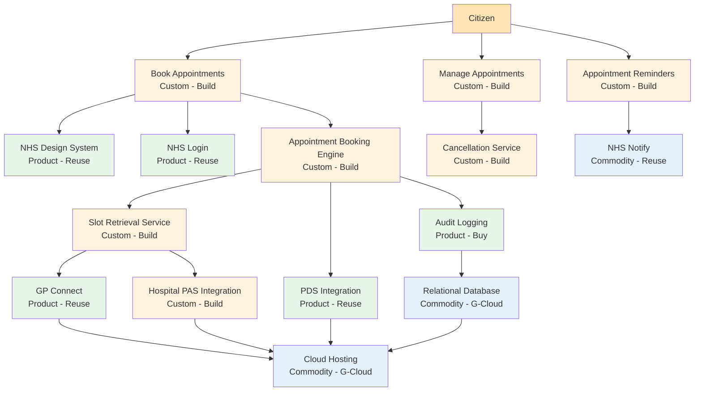

# Wardley Map: NHS Digital Appointment Booking Service - Current State & Procurement Strategy

> **Template Status**: Experimental | **Version**: 2.4.0 | **Command**: `/arckit:wardley`

## Document Control

| Field | Value |
|-------|-------|
| **Document ID** | ARC-001-WARD-001-v1.1 |
| **Document Type** | Wardley Map |
| **Project** | NHS Digital Appointment Booking Service (Project 001) |
| **Classification** | OFFICIAL |
| **Status** | DRAFT |
| **Version** | 1.1 |
| **Created Date** | 2026-02-10 |
| **Last Modified** | 2026-02-12 |
| **Review Cycle** | Quarterly |
| **Next Review Date** | 2026-05-10 |
| **Owner** | Enterprise Architecture Team |
| **Reviewed By** | [PENDING] |
| **Approved By** | [PENDING] |
| **Distribution** | Project Team, Architecture Team |

## Revision History

| Version | Date | Author | Changes | Approved By | Approval Date |
|---------|------|--------|---------|-------------|---------------|
| 1.0 | 2026-02-10 | ArcKit AI | Initial creation from `/arckit:wardley` command | [PENDING] | [PENDING] |
| 1.1 | 2026-02-12 | ArcKit AI | Enhanced with Wardley Mapping knowledge base (Pinecone MCP) — deeper doctrine assessment using Phase I-IV framework, healthcare-specific inertia analysis, enriched climatic patterns and gameplay citations | [PENDING] | [PENDING] |

---

## Map Visualization

**View this map**: Paste the map code below into [https://create.wardleymaps.ai](https://create.wardleymaps.ai)

```wardley
title NHS Digital Appointment Booking Service - Current State & Procurement Strategy

anchor Citizen [0.97, 0.58]

annotation 1 [0.38, 0.22] Build custom - NHS domain-specific, competitive advantage
annotation 2 [0.82, 0.88] Use NHS/GOV.UK platform services - don't build
annotation 3 [0.18, 0.88] Commodity cloud - procure via G-Cloud
note Phased delivery: GP MVP first, then Hospital [0.92, 0.15]

component Citizen [0.97, 0.58]
component Book Appointments [0.93, 0.30]
component Manage Appointments [0.90, 0.35]
component Appointment Reminders [0.87, 0.42]
component Staff Booking Interface [0.84, 0.38]

component NHS Design System [0.78, 0.75]
component NHS Login [0.72, 0.70]
component Appointment Booking Engine [0.68, 0.32]
component Slot Retrieval Service [0.64, 0.35]
component Cancellation Service [0.62, 0.40]
component Waitlist Manager [0.58, 0.25]
component Proxy Booking [0.56, 0.30]

component GP Connect Integration [0.50, 0.55]
component Hospital PAS Integration [0.48, 0.35]
component PDS Integration [0.46, 0.60]
component NHS Notify [0.44, 0.92]
component Analytics Platform [0.40, 0.50]

component RBAC and Authorisation [0.38, 0.68]
component Audit Logging [0.36, 0.55]
component Encryption Service [0.34, 0.80]
component Secrets Management [0.32, 0.85]

component Relational Database [0.26, 0.90]
component Message Queue [0.24, 0.88]
component Cloud Hosting [0.20, 0.95]
component CDN [0.18, 0.92]
component Container Platform [0.16, 0.88]

Citizen -> Book Appointments
Citizen -> Manage Appointments
Citizen -> Appointment Reminders

Book Appointments -> NHS Design System
Book Appointments -> NHS Login
Book Appointments -> Appointment Booking Engine
Manage Appointments -> Cancellation Service
Manage Appointments -> NHS Login
Appointment Reminders -> NHS Notify
Staff Booking Interface -> Appointment Booking Engine
Staff Booking Interface -> RBAC and Authorisation

Appointment Booking Engine -> Slot Retrieval Service
Appointment Booking Engine -> PDS Integration
Appointment Booking Engine -> Audit Logging
Slot Retrieval Service -> GP Connect Integration
Slot Retrieval Service -> Hospital PAS Integration
Cancellation Service -> GP Connect Integration
Cancellation Service -> Hospital PAS Integration
Waitlist Manager -> Slot Retrieval Service
Proxy Booking -> PDS Integration
Proxy Booking -> Appointment Booking Engine

GP Connect Integration -> Cloud Hosting
Hospital PAS Integration -> Cloud Hosting
PDS Integration -> Cloud Hosting
Analytics Platform -> Message Queue
NHS Notify -> Cloud Hosting

RBAC and Authorisation -> Cloud Hosting
Audit Logging -> Relational Database
Encryption Service -> Cloud Hosting
Secrets Management -> Cloud Hosting

Relational Database -> Cloud Hosting
Message Queue -> Cloud Hosting
CDN -> Cloud Hosting
Container Platform -> Cloud Hosting

evolve Hospital PAS Integration 0.55 label Standardising via FHIR
evolve Waitlist Manager 0.45 label Maturing in 12m
evolve Analytics Platform 0.70 label Moving to product

style wardley
```

---

## Evolution Stages Reference

| Stage | Maturity | Characteristics | Strategic Actions |
|-------|----------|-----------------|-------------------|
| **Genesis** (0.00 - 0.25) | Novel, uncertain, rapidly changing | - Unique and rare<br>- Poorly understood<br>- Rapid change<br>- High uncertainty<br>- Future value uncertain | - R&D focus<br>- Accept failure<br>- Explore and experiment<br>- Build in-house if strategic |
| **Custom** (0.25 - 0.50) | Emerging, growing understanding | - Bespoke solutions<br>- Artisanal development<br>- Competitive advantage<br>- Requires significant skill<br>- Still evolving rapidly | - Invest in differentiation<br>- Build custom if competitive advantage<br>- Patent/protect IP<br>- Hire specialists |
| **Product** (0.50 - 0.75) | Maturing, good/rental services | - Products with feature differentiation<br>- Rental models<br>- Slower evolution<br>- Defined practices<br>- Training available | - Buy products<br>- Compare features<br>- Use market leaders<br>- Standardize where possible |
| **Commodity** (0.75 - 1.00) | Industrialized, utility | - Standardized<br>- Volume operations<br>- Cost of deviation high<br>- Utility services<br>- Highly evolved | - Use commodity/utility<br>- Cloud services<br>- Outsource/procure<br>- Focus on cost efficiency |

---

## Component Inventory

### User Needs (Top of Map - High Visibility)

| Component | Visibility | Evolution | Stage | Description | Strategic Notes |
|-----------|-----------|-----------|-------|-------------|-----------------|
| Citizen | 0.97 | 0.58 | Product | NHS patients needing appointment management | Anchor: serves 30M+ users by Year 3 |
| Book Appointments | 0.93 | 0.30 | Custom | Citizen books GP/hospital/community appointments | Core user need; GP-first MVP (BR-001) |
| Manage Appointments | 0.90 | 0.35 | Custom | View, reschedule, cancel existing appointments | Key to DNA reduction (BR-002) |
| Appointment Reminders | 0.87 | 0.42 | Custom | Automated multi-channel reminders at 7d/48h/2h | Directly drives 25% DNA rate reduction (BR-002) |
| Staff Booking Interface | 0.84 | 0.38 | Custom | Assisted digital booking for NHS staff | Supports digital inclusion (BR-004, FR-011) |

### Supporting Capabilities (Mid-Level Visibility)

| Component | Visibility | Evolution | Stage | Description | Strategic Notes |
|-----------|-----------|-----------|-------|-------------|-----------------|
| NHS Design System | 0.78 | 0.75 | Product | NHS.UK frontend components; WCAG 2.2 AA | Reuse mandatory; accessibility compliance (NFR-U-002) |
| NHS Login | 0.72 | 0.70 | Product | OAuth2/OIDC citizen authentication (P5/P9) | NHS platform service; no alternative permitted (FR-001, TC-003) |
| Appointment Booking Engine | 0.68 | 0.32 | Custom | Core booking logic: slot reservation, confirmation, rules | Strategic IP; domain-specific business logic; build custom |
| Slot Retrieval Service | 0.64 | 0.35 | Custom | Real-time slot queries from GP/hospital systems | Must meet <2s p95 SLA (NFR-P-002); resilience critical |
| Cancellation Service | 0.62 | 0.40 | Custom | Cancellation within policy windows, slot release | <3s processing; immediate slot recycling (FR-004) |
| Waitlist Manager | 0.58 | 0.25 | Genesis | Queue citizens when no slots available; notify on release | Novel for NHS; no existing product (FR-009) |
| Proxy Booking | 0.56 | 0.30 | Custom | Carer/parent booking on behalf of dependent | PDS proxy service integration required (FR-008) |
| GP Connect Integration | 0.50 | 0.55 | Product | FHIR REST API for GP appointment slots | NHS Digital managed; production-ready (INT-001) |
| Hospital PAS Integration | 0.48 | 0.35 | Custom | Adapters for diverse hospital PAS systems (10+ vendors) | Highest risk; phased delivery; evolving toward FHIR (INT-002) |
| PDS Integration | 0.46 | 0.60 | Product | Patient demographics via NHS Spine FHIR API | Mature NHS service; 99.9% SLA (INT-003) |
| NHS Notify | 0.44 | 0.92 | Commodity | SMS/email/letter notifications via GDS platform | Government utility; always reuse (INT-004) |
| Analytics Platform | 0.40 | 0.50 | Product | Operational analytics, booking metrics, DNA tracking | Event-streaming based; anonymised data (INT-006) |
| RBAC and Authorisation | 0.38 | 0.68 | Product | Role-based access control for citizens and staff | Standard patterns; citizen/staff/admin roles (NFR-SEC-002) |
| Audit Logging | 0.36 | 0.55 | Product | Immutable audit trail; 8-year retention; tamper-evident | NHS compliance mandatory; structured logs (NFR-C-003) |
| Encryption Service | 0.34 | 0.80 | Commodity | AES-256 at rest, TLS 1.2+ in transit, field-level encryption | Cloud-native KMS; standard patterns (NFR-SEC-003) |
| Secrets Management | 0.32 | 0.85 | Commodity | Secure vault with auto-rotation (30/90/365 day cycles) | Cloud-native service; never build custom (NFR-SEC-004) |

### Infrastructure Components (Low Visibility)

| Component | Visibility | Evolution | Stage | Description | Strategic Notes |
|-----------|-----------|-----------|-------|-------------|-----------------|
| Relational Database | 0.26 | 0.90 | Commodity | PostgreSQL-compatible managed DB; 100M records by Y3 | Aurora/Cloud SQL/Azure SQL; G-Cloud procurement |
| Message Queue | 0.24 | 0.88 | Commodity | Async messaging for notifications, events, dead-letter | SQS/Service Bus/Pub-Sub; commodity cloud service |
| Cloud Hosting | 0.20 | 0.95 | Commodity | UK-region cloud (eu-west-2/UK South/europe-west2) | AWS/Azure/GCP via G-Cloud; UK data residency mandatory |
| CDN | 0.18 | 0.92 | Commodity | Content delivery for static assets | CloudFront/Azure CDN/Cloud CDN |
| Container Platform | 0.16 | 0.88 | Commodity | Serverless containers (Fargate/Cloud Run/Container Apps) | Commodity compute; auto-scaling to 50K concurrent |

---

## Evolution Analysis

### Components in Genesis (0.00 - 0.25)
**Novel, unproven, high uncertainty**

| Component | Current Position | Risk | Opportunity | Action |
|-----------|------------------|------|-------------|--------|
| Waitlist Manager | 0.25 | No existing NHS waitlist product; novel user flow | First-mover in NHS digital waitlisting; significant DNA reduction | Build in-house; COULD_HAVE priority; iterate with user research |

**Strategic Recommendations**:
- [x] Accept high iteration rate on waitlist design
- [x] Invest in user research to validate approach
- [x] Build in-house as potential strategic differentiator
- [x] Plan for rapid change during Alpha/Beta
- [x] Consider phasing to post-MVP (COULD_HAVE priority per FR-009)

### Components in Custom (0.25 - 0.50)
**Emerging practices, competitive advantage**

| Component | Current Position | Competitive Advantage? | Action |
|-----------|------------------|------------------------|--------|
| Book Appointments | 0.30 | Yes - core user need; unified cross-provider booking is novel at national scale | Build custom; invest heavily |
| Manage Appointments | 0.35 | Yes - self-service management drives DNA reduction and efficiency | Build custom; tight integration with booking engine |
| Appointment Reminders | 0.42 | Yes - intelligent multi-channel reminders are differentiating | Build custom logic; use NHS Notify for delivery |
| Staff Booking Interface | 0.38 | Yes - assisted digital pathway for inclusion | Build custom; NHS Smartcard auth |
| Appointment Booking Engine | 0.32 | Yes - core domain logic; booking rules, slot reservation, confirmation | Build custom; strategic IP; domain expertise required |
| Slot Retrieval Service | 0.35 | Yes - real-time aggregation across GP/hospital systems | Build custom; performance-critical (<2s p95) |
| Cancellation Service | 0.40 | Partial - standard patterns but NHS-specific rules | Build custom; clinical review flagging |
| Proxy Booking | 0.30 | Yes - carer/parent booking with PDS proxy integration | Build custom; complex authorisation model |
| Hospital PAS Integration | 0.35 | No - integration adapters, not strategic IP | Build custom adapters; evolve toward standard FHIR; highest risk area |

**Strategic Recommendations**:
- [x] Build all custom components in-house (or via DOS Outcomes)
- [x] Invest in NHS healthcare domain specialists
- [x] Booking Engine and Slot Retrieval are strategic IP - protect and invest
- [x] Hospital PAS integration is custom but NOT strategic - minimise cost, push for FHIR adoption
- [x] Monitor evolution: reminders and cancellation may move to product stage in 18-24 months

### Components in Product (0.50 - 0.75)
**Maturing market, feature differentiation**

| Component | Current Position | Market Options | Action |
|-----------|------------------|----------------|--------|
| NHS Design System | 0.75 | NHS.UK Design System (mandated) | Reuse; no alternatives; accessibility compliance |
| NHS Login | 0.70 | NHS Login (mandated) | Reuse; no alternatives; OAuth2/OIDC integration |
| GP Connect Integration | 0.55 | GP Connect APIs (NHS Digital managed) | Reuse; standard NHS integration; production-ready |
| PDS Integration | 0.60 | PDS FHIR API (NHS Digital managed) | Reuse; standard NHS integration; 99.9% SLA |
| Analytics Platform | 0.50 | AWS QuickSight, Azure Power BI, GCP Looker, open-source (Grafana) | Buy/build hybrid; event streaming custom, dashboards product |
| RBAC and Authorisation | 0.68 | Cloud-native IAM + custom RBAC layer | Buy cloud IAM; build NHS-specific role model |
| Audit Logging | 0.55 | Cloud-native logging + immutable storage | Buy logging platform; configure for NHS 8-year retention |

**Strategic Recommendations**:
- [x] Reuse all NHS platform services (NHS Login, Design System, GP Connect, PDS)
- [x] Procure analytics tooling via G-Cloud
- [x] Use cloud-native RBAC/IAM; extend with NHS role model
- [x] Configure audit logging for NHS compliance (8-year immutable)

### Components in Commodity (0.75 - 1.00)
**Industrialized, utility services**

| Component | Current Position | Commodity Provider | Action |
|-----------|------------------|-------------------|--------|
| NHS Notify | 0.92 | GDS/NHS Notify (government utility) | Reuse; mandatory for government services |
| Encryption Service | 0.80 | AWS KMS / Azure Key Vault / Cloud KMS | G-Cloud procurement; standard cloud service |
| Secrets Management | 0.85 | AWS Secrets Manager / Azure Key Vault / Secret Manager | G-Cloud procurement; auto-rotation |
| Relational Database | 0.90 | AWS Aurora / Azure SQL / Cloud SQL (PostgreSQL) | G-Cloud procurement; managed service |
| Message Queue | 0.88 | AWS SQS / Azure Service Bus / Cloud Pub/Sub | G-Cloud procurement; managed service |
| Cloud Hosting | 0.95 | AWS / Azure / GCP (UK regions) | G-Cloud procurement; UK data residency |
| CDN | 0.92 | AWS CloudFront / Azure CDN / Cloud CDN | G-Cloud procurement |
| Container Platform | 0.88 | AWS Fargate / Azure Container Apps / Cloud Run | G-Cloud procurement; serverless containers |

**Strategic Recommendations**:
- [x] Procure ALL commodity services via G-Cloud Digital Marketplace
- [x] Never build custom infrastructure - use cloud-native managed services
- [x] UK region deployment mandatory (eu-west-2, UK South, europe-west2)
- [x] Focus on cost optimisation, not feature differentiation

---

## Build vs Buy Analysis

> **Knowledge Base Source**: *Introduction to Wardley Mapping, The Evolution Axis* — "**Build vs Buy**: Custom-build for genesis and early custom stages, buy for product and commodity stages." Additionally: "**Investment decisions**: Invest in genesis and custom-built for potential advantage, focus on efficiency for commodities." And: "**Talent management**: Match skills (pioneers, settlers, town planners) to the evolutionary stage of components."

### Build (In-House Development)

**Candidates for Building**:

| Component | Evolution Stage | Rationale | Risk | Investment |
|-----------|----------------|-----------|------|------------|
| Book Appointments | Custom (0.30) | Core user need; no existing NHS-wide booking product | Medium - novel at national scale | HIGH |
| Manage Appointments | Custom (0.35) | Self-service management; key to DNA reduction | Medium - depends on integration stability | HIGH |
| Appointment Booking Engine | Custom (0.32) | Core domain logic; strategic IP | Medium - complex business rules | HIGH |
| Slot Retrieval Service | Custom (0.35) | Real-time aggregation; performance-critical | High - depends on external system reliability | HIGH |
| Appointment Reminders | Custom (0.42) | Intelligent scheduling logic (delivery via NHS Notify) | Low - proven patterns exist | MEDIUM |
| Cancellation Service | Custom (0.40) | NHS-specific cancellation rules and clinical flags | Low - well-understood domain | MEDIUM |
| Staff Booking Interface | Custom (0.38) | Assisted digital pathway; NHS Smartcard auth | Low - standard web application | MEDIUM |
| Hospital PAS Integration | Custom (0.35) | Adapters for 10+ PAS vendors | High - vendor diversity; phased delivery | HIGH |
| Waitlist Manager | Genesis (0.25) | Novel; no NHS waitlist product exists | High - unproven user need | LOW (COULD_HAVE) |
| Proxy Booking | Custom (0.30) | Complex authorisation; PDS proxy service | Medium - PDS proxy maturity | MEDIUM |

**Build Criteria Met**:
- Genesis/Custom stage (< 0.50 evolution)
- Provides competitive advantage (unified NHS booking)
- Core to NHS digital transformation differentiator
- No suitable market alternatives for NHS-specific booking
- Skills available via DOS Outcomes specialist procurement
- Strategic IP ownership important for NHS

### Buy (Procurement)

**Candidates for Buying**:

| Component | Evolution Stage | Market Options | Rationale | Procurement Route |
|-----------|----------------|----------------|-----------|-------------------|
| Analytics Platform | Product (0.50) | QuickSight, Power BI, Looker, Grafana | Not a differentiator; mature products | G-Cloud |
| RBAC and Authorisation | Product (0.68) | Cloud-native IAM services | Standard patterns; extend for NHS roles | G-Cloud (cloud IAM) |
| Audit Logging | Product (0.55) | CloudWatch, Azure Monitor, Cloud Logging | NHS retention rules configurable | G-Cloud |

### Rent/SaaS (Utility Services)

**Candidates for SaaS/Cloud**:

| Component | Evolution Stage | Provider | Rationale | Procurement Route |
|-----------|----------------|----------|-----------|-------------------|
| Cloud Hosting | Commodity (0.95) | AWS / Azure / GCP | Utility; UK regions available | G-Cloud |
| Relational Database | Commodity (0.90) | Aurora / Azure SQL / Cloud SQL | Managed PostgreSQL | G-Cloud |
| Message Queue | Commodity (0.88) | SQS / Service Bus / Pub/Sub | Managed messaging | G-Cloud |
| Container Platform | Commodity (0.88) | Fargate / Container Apps / Cloud Run | Serverless compute | G-Cloud |
| CDN | Commodity (0.92) | CloudFront / Azure CDN / Cloud CDN | Content delivery | G-Cloud |
| Encryption Service | Commodity (0.80) | KMS / Key Vault / Cloud KMS | Cloud-native encryption | G-Cloud |
| Secrets Management | Commodity (0.85) | Secrets Manager / Key Vault / Secret Manager | Auto-rotation vault | G-Cloud |

### Reuse (NHS/GOV.UK Platform Services)

| Component | Evolution Stage | Platform | Rationale | Procurement Route |
|-----------|----------------|----------|-----------|-------------------|
| NHS Login | Product (0.70) | NHS Digital | Mandated citizen auth; no alternative | NHS partnership |
| NHS Design System | Product (0.75) | NHS.UK | Mandated frontend; accessibility | Free/open-source |
| NHS Notify | Commodity (0.92) | GDS/NHS | Government notification utility | NHS partnership |
| GP Connect | Product (0.55) | NHS Digital | Standard GP integration API | NHS partnership |
| PDS | Product (0.60) | NHS Digital | National patient demographics | NHS partnership |

---

## Inertia and Barriers to Change

> **Knowledge Base Source**: *Wardley Inertia* — "The healthcare industry faces unique challenges in adopting digital health technologies due to inertia: **Data Security Concerns** (sensitivity of healthcare data creates resistance), **Resistance from Traditional Practices** (providers accustomed to face-to-face interactions), and **Lack of Competitive Pricing** (difficult to justify costs)." The COVID-19 pandemic demonstrated that external forcing functions can overcome healthcare inertia — providers who adapted to digital health were able to continue delivering care.

### Types of Inertia Affecting This Project

> **Knowledge Base Source**: *Wardley Inertia, Chapter 1* — "Inertia encompasses resistance to change within physical, social, financial, and political dimensions. It is the tendency of an organisation to maintain its current trajectory despite external pressures."

| Inertia Type | Source | Manifestation in NHS Booking | Severity |
|-------------|--------|------------------------------|----------|
| **Social Inertia** | Cultural norms, established practices | NHS reception staff with decades of phone-based booking workflows; "we've always done it this way" | HIGH |
| **Financial Inertia** | Sunk costs, budget allocation | Hospital trusts invested in existing PAS systems; switching costs perceived as prohibitive | HIGH |
| **Political Inertia** | Power dynamics, vested interests | PAS vendors (Cerner, Epic, System C) have contractual and commercial incentives to resist open FHIR adoption | MEDIUM |
| **Physical/Technical Inertia** | Legacy systems, skill sets | Legacy PAS APIs (proprietary); NHS IT teams skilled in existing integrations, not FHIR | MEDIUM |

### Component-Level Inertia Analysis

| Component | Current Evolution | Desired Evolution | Inertia Factor | Barrier Description | Mitigation Strategy |
|-----------|-------------------|-------------------|----------------|---------------------|---------------------|
| Hospital PAS Integration | Custom (0.35) | Product (0.55) | HIGH | 10+ PAS vendors with proprietary APIs; financial and political inertia from vendor lock-in; no universal FHIR adoption | Push for FHIR adoption via NHS England mandate; build vendor-neutral adapter layer; phase rollout trust-by-trust |
| GP System Vendors | Product (0.55) | Product (0.65) | MEDIUM | GP suppliers may resist extending GP Connect; past success with existing models breeds resistance | Escalate to NHS England; regulatory pressure via GP IT Futures contract |
| NHS Staff Processes | Custom (0.38) | Product (0.55) | MEDIUM | Social inertia: established phone-based workflows; fear of the unknown; comfort with status quo | Change management programme; engage staff in planning; demonstrate time savings; GP champions |
| Citizen Digital Skills | Custom (0.30) | Product (0.50) | MEDIUM | 20%+ of NHS users have low digital skills; elderly and vulnerable populations | Assisted digital pathway (FR-011); maintain phone booking; user testing with diverse groups |

### Overcoming Inertia: Strategies from the Knowledge Base

> **Knowledge Base Source**: *Wardley Inertia, Chapter 2* — "Overcoming social inertia requires: **Building a change-ready culture**, **engaging employees in the change process**, **effective communication** of the rationale for change, **leadership role modelling**, and **providing support and resources**."

**De-risking Strategies**:
- [x] **Phased rollout** starting with digitally-mature GP practices (reduces social inertia by demonstrating success)
- [x] **Parallel phone booking** channel maintained throughout (addresses fear of the unknown)
- [x] **Trust-by-trust hospital onboarding** with dedicated integration support (reduces technical inertia)
- [x] **NHS England mandate** for FHIR adoption to reduce PAS vendor political inertia
- [x] **Change management and training** for NHS reception staff (addresses social inertia directly)
- [x] **GP champions programme** — engage early adopters who model desired behaviours (leadership role modelling)
- [x] **Clear communication** of DNA cost savings (£250M/year) to build compelling rationale for change

> **Key Insight**: Per the knowledge base, *"it's not a lack of innovation that causes companies to fail but inertia caused by pre-existing business models"* (Blockbuster case study). The NHS Booking Service must actively manage inertia rather than assuming superior technology will drive adoption.

---

## Movement and Evolution Predictions

### Next 12 Months

| Component | Current | Predicted (12m) | Velocity | Impact | Action Required |
|-----------|---------|----------------|----------|--------|-----------------|
| Hospital PAS Integration | 0.35 | 0.45 | Medium | More trusts adopting FHIR; 3-5 trusts onboarded | Build adapter framework; prioritise FHIR-ready trusts |
| Waitlist Manager | 0.25 | 0.40 | Fast | User research validates approach; feature matures | Invest in user research; iterate rapidly in Beta |
| Analytics Platform | 0.50 | 0.60 | Medium | Event streaming matures; dashboards productised | Evaluate SaaS analytics tools for operational dashboards |
| GP Connect | 0.55 | 0.62 | Slow | Incremental API additions; stable foundation | Monitor for new booking capabilities |
| Appointment Reminders | 0.42 | 0.48 | Slow | Reminder patterns stabilise; multi-channel proven | Standardise reminder logic; consider open-sourcing |

### Next 24 Months

| Component | Current | Predicted (24m) | Velocity | Impact | Action Required |
|-----------|---------|----------------|----------|--------|-----------------|
| Hospital PAS Integration | 0.35 | 0.55 | Medium | FHIR adoption reaches critical mass; 15+ trusts | Transition from custom adapters to standard FHIR profiles |
| Booking Engine | 0.32 | 0.45 | Medium | Patterns mature; potential for NHS-wide reuse | Consider open-sourcing or making available as NHS platform service |
| Analytics Platform | 0.50 | 0.70 | Fast | Cloud analytics becoming commodity | Migrate to SaaS analytics; reduce custom build |
| Container Platform | 0.88 | 0.92 | Slow | Serverless containers fully commoditised | Optimise costs; consider reserved capacity discounts |

**Strategic Implications**:
- [x] Hospital PAS integration is the key evolution to watch - drives Phase 2 value
- [x] Booking Engine may become reusable NHS platform component (24m horizon)
- [x] Analytics moving fast toward commodity - avoid over-investing in custom
- [x] Infrastructure fully commoditised - focus procurement on cost efficiency

---

## UK Government Context

### NHS Platform Services Mapping

| NHS/GOV.UK Service | Evolution Stage | Usage in This Project | Rationale for Position |
|---------------------|----------------|----------------------|------------------------|
| NHS Login | Product (0.70) | Mandatory citizen authentication (FR-001) | Mature OAuth2/OIDC service; P5/P9 identity levels; some feature limitations |
| NHS Design System | Product (0.75) | Frontend components for all citizen-facing UI | Open-source; tested for accessibility; growing component library |
| NHS Notify | Commodity (0.92) | Appointment reminders - SMS, email, letter (INT-004) | Government utility; high reliability; well-documented API |
| GP Connect | Product (0.55) | GP appointment slot retrieval and booking (INT-001) | Production service; adoption growing; some feature gaps in booking API |
| PDS (FHIR) | Product (0.60) | Patient demographics and GP registration (INT-003) | Mature national service; 99.9% SLA; FHIR API well-documented |

**Reuse Opportunities**:
- [x] NHS Login for citizen authentication (mandatory - no alternatives)
- [x] NHS Design System for frontend (mandatory - accessibility compliance)
- [x] NHS Notify for all citizen notifications (avoid building custom notification)
- [x] GP Connect for GP appointment integration (standard NHS API)
- [x] PDS for patient demographics (single source of truth)

### Digital Marketplace Procurement Strategy

| Component | Evolution Stage | Framework | Lot | Rationale |
|-----------|----------------|-----------|-----|-----------|
| Custom Application Build | Custom (0.25-0.50) | DOS Outcomes | Digital Outcomes | Discovery, Alpha, Beta development; specialist skills |
| Cloud Hosting (AWS/Azure/GCP) | Commodity (0.95) | G-Cloud 14 | Cloud Hosting | UK region; OFFICIAL classification; NCSC compliant |
| Managed Database | Commodity (0.90) | G-Cloud 14 | Cloud Software | Managed PostgreSQL service |
| Analytics Tooling | Product (0.50) | G-Cloud 14 | Cloud Software | Operational dashboards and reporting |
| Security Tooling | Commodity (0.80-0.85) | G-Cloud 14 | Cloud Software | WAF, KMS, secrets management |

**Procurement Recommendations**:
- **Genesis/Custom** (< 0.50): DOS Outcomes for specialist development teams
- **Product** (0.50-0.75): G-Cloud for commercial analytics, monitoring, RBAC
- **Commodity** (> 0.75): G-Cloud for all cloud infrastructure services

### Technology Code of Practice Mapping

| TCoP Point | Related Components | Compliance Status | Gap Analysis |
|------------|-------------------|-------------------|--------------|
| 1. User Needs | Book/Manage Appointments, Reminders | Compliant | User personas defined; user research planned |
| 2. Accessibility | NHS Design System, Multi-Language | Compliant | WCAG 2.2 AA mandated (NFR-U-002); Welsh language (FR-010) |
| 3. Open Source | Booking Engine, Slot Retrieval | Partial | Consider open-sourcing booking patterns for NHS reuse |
| 4. Open Standards | GP Connect (FHIR), PDS (FHIR) | Compliant | HL7 FHIR for clinical data exchange; OpenAPI for APIs |
| 5. Cloud First | Cloud Hosting, Container Platform | Compliant | Serverless-first architecture on UK cloud |
| 6. Security | Encryption, Secrets, RBAC, Audit | Compliant | DSPT, Cyber Essentials Plus, NCSC principles |
| 7. Privacy | PDS, Audit Logging, Encryption | Compliant | UK GDPR; Caldicott Principles; DPIA required |
| 8. Share/Reuse | NHS Login, Notify, Design System, GP Connect | Compliant | All NHS platform services reused |
| 11. Contracts | G-Cloud, DOS procurement | Compliant | Digital Marketplace frameworks used |
| 12. Sustainability | Cloud Hosting, Serverless | Partial | Serverless reduces waste; further analysis needed |

---

## Dependencies and Value Chain



**Critical Path Analysis**:
- **Critical Path**: Citizen -> Book Appointments -> Booking Engine -> Slot Retrieval -> GP Connect -> Cloud Hosting
- **Highest Risk**: Hospital PAS Integration (diverse vendors, custom adapters, phased delivery)
- **Single Points of Failure**: NHS Login (mandated, no fallback), PDS (demographics source of truth)
- **Inertia Bottleneck**: Hospital PAS vendor adoption of FHIR standard

---

## Strategic Gameplay

> **Knowledge Base Source**: *Introduction to Wardley Mapping Gameplays* — "Gameplays are context-specific patterns of strategic action that organisations can employ to influence their competitive landscape. These plays are not universal solutions but rather tactical approaches that can be applied based on the specific context revealed by a Wardley Map."

### Gameplay Patterns Identified

**Tower and Moat** (protect competitive advantage):
> Per the KB: *"Building a strong central position (tower) and surrounding it with complementary components or services (moat) to protect and reinforce your position... Develop a core offering and surround it with complementary products or services."* Key considerations include maintaining openness and interoperability to avoid negative lock-in effects.

- [x] **Tower**: Appointment Booking Engine — core domain logic; NHS-specific business rules create strategic IP
- [x] **Moat**: Slot Retrieval Service, Cancellation Service, Proxy Booking — complementary components that reinforce the booking platform
- [x] **Openness balance**: Use open standards (FHIR, OpenAPI) and consider open-sourcing booking patterns to balance ecosystem control with openness (per KB: *"Focusing on creating genuine value through integration rather than just creating switching costs"*)

**Land and Expand** (phased market entry):
- [x] GP-first MVP: Launch with GP appointments (70% of volume), expand to hospitals in Phase 2
- [x] Regional pilots before national rollout (BC-001)
- [x] Per KB (AWS case study): *"Early entry allowed AWS to set industry standards, gain a vast number of customers, and create a substantial barrier to entry for competitors."* — similarly, early GP booking success creates adoption momentum

**Two-Factor Market** (serve both sides):
- [x] Citizen booking interface AND staff booking interface on same platform
- [x] Citizens self-serve; staff handle assisted digital — both benefit from same booking engine

**Ecosystem Play** (enable others to build):
> Per the KB: *"The more companies you have building on top of your utility (i.e. the larger your ecosystem) then the more things your 'outside' pioneers will be building."* The ILC (Innovate-Leverage-Commoditise) model applies: provide booking as a platform component for the wider NHS ecosystem.

- [x] Open-source booking patterns for NHS community reuse (24-month horizon)
- [x] Standard FHIR profiles enable other NHS services to integrate
- [x] API-first design allows third-party NHS applications to consume booking capabilities

**Accelerators** (speed up evolution):
> Per the KB: *"The evolution of a component can be accelerated by an open approach, whether open source or open data."* Open approaches promote transparency, collaboration, and shared value creation.

- [x] Push for FHIR standard adoption to commoditise hospital PAS integration (open standards accelerator)
- [x] NHS England mandate for GP Connect and PAS interoperability (regulatory accelerator)
- [x] Open-source NHS booking patterns to accelerate ecosystem adoption

**De-accelerators to Watch**:
> Per the KB: *"The evolution of a component can be slowed down through the use of fear, uncertainty and doubt when crossing an inertia barrier or through the use of patents to ring-fence a technology."*

- [x] PAS vendor FUD about FHIR reliability may slow hospital integration adoption
- [x] Proprietary PAS vendor APIs act as de facto ring-fencing of hospital integration

### Anti-Patterns to Avoid

- **Legacy Trap**: Do NOT build custom notification service — use NHS Notify (commodity)
- **Legacy Trap**: Do NOT build custom authentication — use NHS Login (product)
- **Legacy Trap**: Do NOT build custom cloud infrastructure — use G-Cloud managed services
- **Premature Innovation**: Do NOT apply fixed-scope contracts to Genesis components (Waitlist Manager)
- **Premature Innovation**: Do NOT outsource core booking logic via fixed-price vendor contract
- **One Size Fits All**: Do NOT use the same project methodology across all evolution stages (per KB: *"There is no single method that will fit all"*)

---

## Doctrine Assessment Summary

> **Knowledge Base Source**: *Introduction to Wardley Mapping Doctrine* — The four phases of doctrine (Phase I: Stop Self-Harm, Phase II: Becoming More Context Aware, Phase III: Better for Less, Phase IV: Continuously Evolving) provide the assessment framework. Each phase builds upon the previous one across six categories: Communication, Development, Operation, Learning, Leading, and Structure.

### Phase Maturity Assessment

| Phase | Focus | Project Maturity | Evidence |
|-------|-------|-----------------|----------|
| **Phase I: Stop Self-Harm** | Basic Awareness & Stabilisation | **Strong (4/5)** | Common language (FHIR, NHS Data Dictionary); user needs understood (4 personas); appropriate methods (GDS Agile); systematic learning partially adopted |
| **Phase II: Becoming More Context Aware** | Contextual Awareness & Optimisation | **Moderate (3/5)** | Bias towards open (open standards); manage inertia (identified but mitigation TBD); small teams planned; but strategy iteration and decentralised decision-making still emerging |
| **Phase III: Better for Less** | Continuous Improvement | **Emerging (2/5)** | Optimise flow (async patterns); but exceptional standards, innovation bias, and "do better with less" not yet demonstrated — project is pre-build |
| **Phase IV: Continuously Evolving** | Adaptability & Strategic Agility | **Not Yet (1/5)** | Ecosystem listening, landscape exploitation, and design for constant evolution are aspirational; no single culture not addressed |

### Detailed Doctrine Scoring

| Category | Area | Phase | Score | Evidence |
|----------|------|-------|-------|----------|
| **Communication** | Common Language | I | 4 | FHIR, NHS Data Dictionary, HL7, and OpenAPI provide shared vocabulary across teams |
| | Challenge Assumptions | I | 3 | Phased delivery (GP-first) challenges "big bang" assumption; user research planned |
| | Understand What is Being Considered | I | 4 | Wardley Map provides situational awareness; requirements well-documented |
| | Bias Towards Open | II | 3 | Open standards (FHIR, OAuth2, OpenAPI); NHS Design System open-source; but not yet publishing reusable components |
| **Development** | Know Your Users | I | 4 | Four user personas defined; user research embedded in Discovery/Alpha |
| | Focus on User Needs | I | 4 | Requirements prioritised by user value (MoSCoW); accessibility-first |
| | Remove Bias and Duplication | I | 3 | Reuse of NHS platform services avoids duplication; but bias testing limited |
| | Use Appropriate Methods | I | 3 | GDS Agile phases; but *"no single method fits all"* — need to match Agile (genesis), Lean (custom), Six Sigma (commodity) to evolution stage |
| | Focus on Outcome | II | 3 | Outcome-focused (DNA reduction, user satisfaction); but procurement still contract-focused |
| | Think FIRE | II | 3 | Serverless is elegant/efficient; but solution scope is broad for MVP |
| | Use Standards | II | 4 | FHIR, OAuth2, OpenAPI, WCAG 2.2 — strong standards adoption |
| **Operation** | Know the Details | I | 3 | Requirements detailed; some integration specifics TBD |
| | Manage Inertia | II | 3 | Hospital PAS and GP vendor inertia identified; mitigation planned but unproven |
| | Manage Failure | II | 4 | Circuit breakers, retry, graceful degradation defined in requirements |
| | Effectiveness over Efficiency | II | 3 | DNA reduction (effectiveness) prioritised; but cost optimisation not yet addressed |
| | Optimise Flow | III | 3 | Async patterns for non-real-time; event-driven for notifications |
| **Learning** | Systematic Learning (Bias Towards Data) | I | 2 | Analytics platform planned but no feedback loop for strategic learning yet |
| | Bias Towards Action | II | 3 | MVP approach; but procurement timelines may slow experimentation |
| | Bias Towards New | III | 2 | Focus on proven patterns; limited exploration of emerging approaches |
| **Leading** | Move Fast | II | 3 | MVP shows urgency; procurement may slow execution |
| | Strategy is Iterative | II | 3 | Phased delivery is iterative; Wardley Map enables strategic iteration |
| | Commit to Direction | III | 3 | GP-first strategy clear; hospital phase less defined |
| **Structure** | Think Small Teams | II | 3 | Small team structure planned (5-12 FTE); not yet implemented |
| | Distribute Power | II | 2 | Centralised decision-making currently; no evidence of empowered teams |
| | Think Aptitude and Attitude | II | 2 | Pioneers/settlers/town planners model not explicitly adopted |

**Overall Doctrine Score**: 3.0 / 5.0 (Phase I strong, Phase II moderate, Phase III-IV emerging)

**Key Weaknesses**:
1. **Systematic Learning (2/5)** — No strategic feedback loop; recommend quarterly Wardley Map reviews and post-phase retrospectives
2. **Distribute Power (2/5)** — Centralised decision-making; per doctrine Phase II, decentralise to empower delivery teams
3. **Aptitude and Attitude (2/5)** — No explicit pioneers/settlers/town planners model; match talent to evolution stage (pioneers for Waitlist Manager genesis, settlers for Booking Engine custom, town planners for cloud commodity)
4. **Appropriate Methods (3/5)** — Per the knowledge base: *"no single method fits all"* — use Agile for genesis (Waitlist Manager), Lean for custom (Booking Engine), Six Sigma/ITIL for commodity (cloud infrastructure)

---

## Climatic Pattern Analysis

> **Knowledge Base Source**: *Wardley Mapping Foundation Course, Climatic Patterns* — "Climatic patterns are those things which change the map regardless of your actions... You cannot stop climatic patterns from happening." These are aggregated market effects driven by supply and demand competition — they will occur whether or not we want them to.

| Pattern | Impact on Project | Timeframe | Action |
|---------|------------------|-----------|--------|
| **Everything Evolves** | Hospital PAS integrations will standardise on FHIR; booking patterns will commoditise. Per the KB: *"All components (activities, practices, mental models) move from the left to the right"* and *"No choice on evolution: things move to the right whether you want it or not."* | 24 months | Build with evolution in mind; modular adapters; prepare for transition to product/commodity |
| **Efficiency Enables Innovation** | Commodity cloud infrastructure enables focus on booking domain innovation. Per the KB: *"Standardisation lowers the cost of experimenting, which makes experimentation cheaper, so more experiments are conducted, and more new things are built."* Cloud commodity services (Container Platform 0.88, Database 0.90) free capital for genesis/custom booking components. | Immediate | Maximise use of managed cloud services to free budget for custom booking logic |
| **Co-Evolution** | FHIR adoption drives GP Connect and PAS integration maturity together. Per the KB: *"All components can co-evolve... commonly seen with the co-evolution of practice (how we do something) with the evolution of an activity (what we do) especially as we shift from products to more industrialised forms. DevOps is one such example."* Similarly, FHIR practice is co-evolving with clinical data exchange. | 12-24 months | Invest in FHIR expertise; contribute to NHS FHIR community |
| **Success Breeds Inertia** | NHS staff comfortable with phone-based booking; hospital trusts invested in existing PAS. Per the KB: *"Past success breeds inertia: everything you do will make changes in the future more difficult, especially if you are successful"* and *"it's not a lack of innovation that harmed companies such as Blockbuster and Kodak but instead inertia to change created by past success."* | Ongoing | Change management programme; demonstrate ROI; use GP success to motivate hospitals |
| **No One Size Fits All** | Different management methods required for different evolution stages. Per the KB: *"Exploration requires different approach than commodity market... Agile for the uncharted space, Lean for the transitional, Six Sigma/ITIL for the industrialised domain."* | Ongoing | Use Agile (Waitlist Manager genesis), Lean (Booking Engine custom), ITIL/Six Sigma (cloud commodity) |
| **Higher Order Systems** | Booking + Reminders + Analytics = Intelligent Capacity Management (new value). Per the KB: *"Higher order systems create new sources of worth"* — commodity booking components will enable genesis of capacity management intelligence. | 18-24 months | Plan for capacity management as emergent higher-order system |
| **Componentisation Increases** | Monolithic PAS systems being replaced by modular, API-driven services. Per the KB: *"As an activity becomes industrialised and provided as ever more standardised and commodity components, it allows for increasing speed of implementation and rapid change."* | 24-36 months | Design for composability; microservices architecture; standard interfaces |
| **Red Queen Effect** | Competitive pressure forces NHS trusts to adopt digital booking or fall behind. Per the KB: *"The pressure for adoption of a successful change increases as more adopt the change... Standing still guarantees you will be overtaken."* | 12-24 months | Use early GP success to create adoption pressure on hospitals; publicise DNA reduction metrics |

---

## Risk Analysis

### High-Risk Areas

| Risk | Component(s) Affected | Likelihood | Impact | Mitigation |
|------|----------------------|------------|--------|------------|
| **Hospital PAS vendor diversity** | Hospital PAS Integration | HIGH | HIGH | Build vendor-neutral adapter layer; phase delivery trust-by-trust; push FHIR adoption |
| **NHS Login dependency** | NHS Login, Book Appointments | LOW | CRITICAL | No mitigation possible (mandated); ensure graceful error handling; monitor SLA |
| **Performance at national scale** | Slot Retrieval, Booking Engine | MEDIUM | HIGH | Load testing at 3x capacity; auto-scaling; circuit breakers; phased regional rollout |
| **Low citizen adoption** | Book Appointments, Reminders | MEDIUM | HIGH | Marketing; GP promotion; assisted digital; user research |
| **GP vendor non-cooperation** | GP Connect Integration | MEDIUM | HIGH | NHS England escalation; regulatory pressure via GP IT Futures |
| **Clinical safety incident** | Booking Engine, Slot Retrieval | LOW | CRITICAL | DCB0129 compliance; hazard log; clinical safety testing; incident process |

### Opportunities

| Opportunity | Component(s) | Potential Value | Investment Required | Action Plan |
|-------------|--------------|-----------------|---------------------|-------------|
| NHS-wide booking platform | Booking Engine | Reusable platform for entire NHS | Medium | Open-source booking patterns in 24 months |
| Intelligent capacity management | Analytics, Reminders | Demand forecasting; resource optimisation | Low-Medium | Build event streaming now; add ML analytics later |
| Reduced DNA costs | Reminders, Manage Appointments | ~£250M/year NHS savings (25% of £1B DNA cost) | Included in project | Measure and report DNA reduction from Month 1 |
| Cross-government reuse | Booking Engine (generalised) | Appointment booking pattern for other departments | Low | Design with separation of NHS-specific rules |

---

## Traceability

### Requirements Mapping

| Requirement ID | Related Components | Evolution Stage | Build/Buy Decision |
|----------------|-------------------|-----------------|-------------------|
| BR-001 | Book Appointments, Slot Retrieval, GP Connect, Hospital PAS | Custom/Product | Build booking; Reuse GP Connect |
| BR-002 | Reminders, Cancellation, Manage Appointments | Custom | Build |
| BR-003 | Staff Booking Interface, Booking Engine | Custom | Build |
| BR-004 | NHS Design System, Multi-Language, Staff Interface | Product/Custom | Reuse design system; Build staff interface |
| BR-005 | Audit Logging, Booking Engine | Product/Custom | Buy logging; Build booking with safety rules |
| BR-006 | Analytics Platform | Product | Buy/Build hybrid |
| FR-001 | NHS Login | Product | Reuse |
| FR-002 | Slot Retrieval, GP Connect, Hospital PAS | Custom/Product | Build retrieval; Reuse GP Connect |
| FR-005 | Reminders, NHS Notify | Custom/Commodity | Build logic; Reuse delivery |
| NFR-P-001 | CDN, Container Platform, Cloud Hosting | Commodity | Buy via G-Cloud |
| NFR-SEC-001 | NHS Login, Encryption, Secrets | Product/Commodity | Reuse/Buy |
| NFR-A-001 | Cloud Hosting, Database, Container Platform | Commodity | Buy via G-Cloud |
| INT-001 | GP Connect Integration | Product | Reuse NHS API |
| INT-002 | Hospital PAS Integration | Custom | Build adapters |
| INT-003 | PDS Integration | Product | Reuse NHS API |
| INT-004 | NHS Notify | Commodity | Reuse government service |

### Architecture Principles Alignment

| Principle | Related Components | Compliance | Gap Analysis |
|-----------|-------------------|------------|--------------|
| 1. Scalability and Elasticity | Container Platform, Cloud Hosting, Booking Engine | Compliant | Serverless-first; auto-scaling; stateless design |
| 2. Resilience and Fault Tolerance | Slot Retrieval, GP Connect, Hospital PAS | Compliant | Circuit breakers, retry, graceful degradation defined |
| 3. Interoperability | GP Connect, PDS, Hospital PAS | Compliant | FHIR standard; versioned APIs; OpenAPI specs |
| 4. Security by Design | Encryption, Secrets, RBAC, Audit, NHS Login | Compliant | Zero-trust; defence-in-depth; DSPT compliance |
| 5. Observability | Analytics, Audit Logging | Compliant | Structured logs, metrics, traces; SLO-based alerting |
| 6. Data Sovereignty | Cloud Hosting (UK), Database (UK) | Compliant | UK-region only; no cross-border data transfer |
| 9. Loose Coupling | All services via APIs/events | Compliant | Microservices; async messaging; no shared databases |
| 11. Performance | Slot Retrieval (<2s), Booking (<5s), CDN | Compliant | Performance targets defined; load testing planned |
| 17. Inclusive Design | NHS Design System, Multi-Language, Staff Interface | Compliant | WCAG 2.2 AA; Welsh language; assisted digital |

---

## Recommendations

### Immediate Actions (0-3 months)

1. **Procure cloud hosting via G-Cloud**
   - **Component**: Cloud Hosting, Database, Container Platform
   - **Rationale**: Foundation infrastructure needed before any development
   - **Investment**: ~£25-35K/month (based on research documents)
   - **Owner**: Enterprise Architect
   - **Success Criteria**: UK-region cloud environment provisioned with IaC

2. **Begin DOS Outcomes procurement for development team**
   - **Component**: All Custom components (Booking Engine, Slot Retrieval, etc.)
   - **Rationale**: Specialist NHS digital skills needed for custom build
   - **Investment**: TBD via procurement
   - **Owner**: Programme Manager
   - **Success Criteria**: Development team contracted and onboarded

3. **Validate GP Connect booking API capabilities**
   - **Component**: GP Connect Integration, Slot Retrieval Service
   - **Rationale**: GP Connect is on critical path; must validate before build
   - **Investment**: Minimal (staff time)
   - **Owner**: Technical Lead
   - **Success Criteria**: GP Connect API tested; limitations documented

### Short-Term Actions (3-12 months)

1. **Build and launch GP appointment booking MVP**
   - **Component**: Booking Engine, Slot Retrieval, NHS Login integration
   - **Rationale**: GP appointments = 70% of volume; deliver value early
   - **Investment**: Primary development budget
   - **Owner**: Product Owner
   - **Success Criteria**: 3 GP practices live; 80% user satisfaction

2. **Begin hospital PAS integration adapters (Phase 2 preparation)**
   - **Component**: Hospital PAS Integration
   - **Rationale**: Longest lead-time item; start early to reduce risk
   - **Investment**: Dedicated integration team
   - **Owner**: Integration Lead
   - **Success Criteria**: 3 FHIR-ready trusts connected in private beta

3. **Implement analytics event streaming**
   - **Component**: Analytics Platform, Message Queue
   - **Rationale**: Foundation for operational dashboards and capacity management
   - **Investment**: Low (cloud-native services)
   - **Owner**: Technical Lead
   - **Success Criteria**: Booking events flowing to analytics; DNA dashboard live

### Long-Term Strategic Actions (12-24 months)

1. **Expand to hospital outpatient appointments (Phase 2)**
   - **Component**: Hospital PAS Integration, Slot Retrieval, Booking Engine
   - **Rationale**: Complete unified booking vision; address remaining 30% of appointments
   - **Investment**: Significant (trust-by-trust onboarding)
   - **Owner**: Programme Manager
   - **Success Criteria**: 15+ trusts connected; hospital bookings live

2. **Evaluate open-sourcing booking patterns for NHS reuse**
   - **Component**: Booking Engine (generalised)
   - **Rationale**: Enable other NHS services to adopt appointment booking
   - **Investment**: Low (documentation and abstraction)
   - **Owner**: Enterprise Architect
   - **Success Criteria**: Booking patterns published as NHS open-source component

3. **Build intelligent capacity management**
   - **Component**: Analytics Platform (evolved), Reminders
   - **Rationale**: Higher-order system emerging from booking + analytics + reminders data
   - **Investment**: Medium (ML/analytics capabilities)
   - **Owner**: Product Owner
   - **Success Criteria**: Demand forecasting accurate to within 10%; proactive capacity alerts

---

## Map Versioning

**Version History**:

| Version | Date | Author | Changes | Rationale |
|---------|------|--------|---------|-----------|
| v1.0 | 2026-02-10 | ArcKit AI | Initial current state and procurement strategy map | Baseline strategic analysis for project initiation |
| v1.1 | 2026-02-12 | ArcKit AI | Enhanced with Wardley Mapping knowledge base (Pinecone MCP) — deeper doctrine, inertia, climatic patterns, gameplay, and build vs buy citations | Ground strategic analysis in established Wardley Mapping theory |

**Next Review Date**: 2026-05-10

**Review Frequency**: Quarterly (align with phase gate reviews)

---

## Appendix: Wardley Mapping Primer

### What is a Wardley Map?

A Wardley Map is a visual representation of:
1. **Value Chain** (Visibility axis, top to bottom): User needs -> capabilities -> components
2. **Evolution** (Evolution axis, left to right): Genesis -> Custom -> Product -> Commodity
3. **Movement**: How components evolve over time
4. **Dependencies**: What depends on what

### How to Read This Map

- **Y-axis (Visibility)**: How visible the component is to the user
  - Top (0.95-1.0): Direct user needs
  - Middle (0.4-0.7): Supporting capabilities
  - Bottom (0.0-0.3): Infrastructure components

- **X-axis (Evolution)**: How industrialized/commoditized the component is
  - Left (0.0-0.25): Genesis - novel, unproven, uncertain
  - Custom (0.25-0.50): Bespoke, emerging practices
  - Product (0.50-0.75): Products with feature differentiation
  - Right (0.75-1.0): Commodity - utility, standardized

### Strategic Decision Rules

1. **Genesis** (0.0-0.25): Build only if strategic differentiator
2. **Custom** (0.25-0.50): Build vs Buy decision critical - evaluate competitive advantage
3. **Product** (0.50-0.75): Buy from market unless very specific needs
4. **Commodity** (0.75-1.0): Always use commodity/utility - never build

### Common Mistakes to Avoid

- Building custom solutions for commodity components (high cost, low value)
- Buying products for Genesis stage needs (no market solutions exist yet)
- Ignoring inertia (people, process, technology resistance to change)
- Not mapping dependencies (missing critical path risks)
- Static maps (not updating as components evolve)

---

## Additional Resources

- **Wardley Mapping**: https://learnwardleymapping.com/
- **Create Maps**: https://create.wardleymaps.ai
- **UK Government Digital Marketplace**: https://www.digitalmarketplace.service.gov.uk/
- **Technology Code of Practice**: https://www.gov.uk/guidance/the-technology-code-of-practice

## External References

| Document | Type | Source | Key Extractions | Path |
|----------|------|--------|-----------------|------|
| ARC-000-PRIN-v1.1 | Architecture Principles | ArcKit | 17 principles covering strategic, data, integration, quality, DevOps, accessibility | projects/000-global/ARC-000-PRIN-v1.1.md |
| ARC-001-REQ-v1.0 | Requirements | ArcKit | 6 BRs, 12 FRs, 15 NFRs, 6 INTs, 4 DRs | projects/001-nhs-appointment-booking/ARC-001-REQ-v1.0.md |
| ARC-001-AWRS-v1.0 | AWS Research | ArcKit | AWS service recommendations; ~£29K/month | projects/001-nhs-appointment-booking/research/ARC-001-AWRS-v1.0.md |
| ARC-001-AZRS-v1.0 | Azure Research | ArcKit | Azure service recommendations; ~£32.5K/month | projects/001-nhs-appointment-booking/research/ARC-001-AZRS-v1.0.md |
| ARC-001-GCRS-v1.2 | GCP Research | ArcKit | GCP service recommendations; ~£25-39K/month | projects/001-nhs-appointment-booking/research/ARC-001-GCRS-v1.2.md |

---

**Generated by**: ArcKit `/arckit:wardley` command
**Generated on**: 2026-02-12 (v1.1 update)
**ArcKit Version**: 2.4.0
**Project**: NHS Digital Appointment Booking Service (Project 001)
**AI Model**: claude-opus-4-6
**Generation Context**: v1.0 based on ARC-001-REQ-v1.0, ARC-000-PRIN-v1.1, ARC-001-AWRS-v1.0, ARC-001-AZRS-v1.0, ARC-001-GCRS-v1.2. v1.1 enhanced with Wardley Mapping Knowledge Base via Pinecone MCP (`wardleykb-integrated` index, 483 records) — doctrine Phase I-IV framework, healthcare inertia analysis, climatic pattern citations (everything evolves, efficiency enables innovation, co-evolution, Red Queen, no one size fits all), gameplay patterns (Tower and Moat, ILC ecosystem, open approaches, accelerators/de-accelerators), and evolution axis build vs buy principles.
